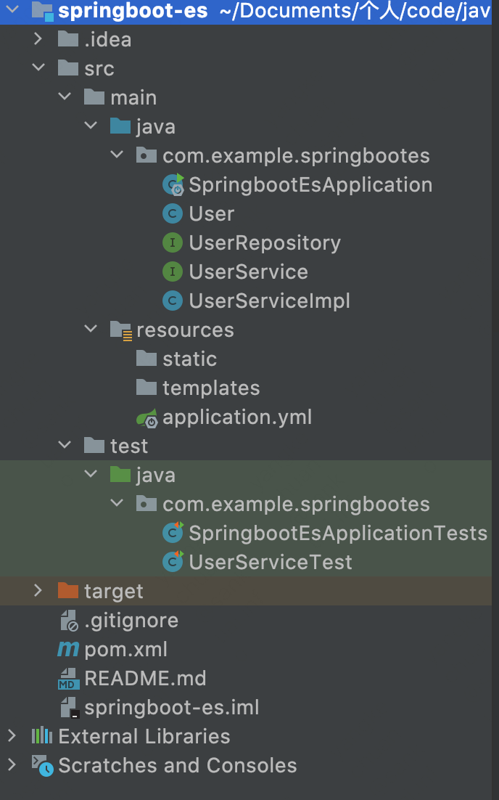

## springBoot 使用 es

---

            环境：
            
            MAC 系统 10.15.6
            Java Version ：1.8.0_202
            Docker 方式安装
            elasticsearch version:7.8.0
            springboot version: 2.4.1


---

### 1.创建 springboot 项目，并导入 es 依赖


**不同版本之间， api 可能会存在一定差异。需要注意版本**


主要 `pom.xml` 配置如下：

```xml
    <properties>
        <java.version>1.8</java.version>
        <project.build.sourceEncoding>UTF-8</project.build.sourceEncoding>
        <project.reporting.outputEncoding>UTF-8</project.reporting.outputEncoding>
        <spring-boot.version>2.4.1</spring-boot.version>
    </properties>

    <dependencies>
        <dependency>
            <groupId>org.springframework.boot</groupId>
            <artifactId>spring-boot-starter-data-elasticsearch</artifactId>
        </dependency>
        <dependency>
            <groupId>org.springframework.boot</groupId>
            <artifactId>spring-boot-starter-web</artifactId>
        </dependency>

        <dependency>
            <groupId>org.projectlombok</groupId>
            <artifactId>lombok</artifactId>
            <optional>true</optional>
        </dependency>
        <dependency>
            <groupId>org.springframework.boot</groupId>
            <artifactId>spring-boot-starter-test</artifactId>
            <scope>test</scope>
        </dependency>
    </dependencies>
```


然后配置 `application.yml`:

```yaml
spring:
  application:
    name: springboot-es
  # es
  elasticsearch:
    rest:
      uris: http://localhost:9200

server:
  port: 8080

# log

logging:
  level:
    com.example.springbootes: debug
```


### 2.编写逻辑代码

整体目录结构如下，逻辑验证部分都写到了 `UserserviceTest` 中：




`user.java`:

```java
package com.example.springbootes;

import lombok.Data;
import org.springframework.data.annotation.Id;
import org.springframework.data.elasticsearch.annotations.Document;
import org.springframework.data.elasticsearch.annotations.Field;
import org.springframework.data.elasticsearch.annotations.FieldType;

@Data
@Document(indexName = "user")
public class User {

    @Id
    private Long id;

    @Field(name = "name", type = FieldType.Text)
    private String name;

    @Field(name = "age")
    private Integer age;
}

```

`userRespostiry.java`:


```java
package com.example.springbootes;

import org.springframework.data.domain.Page;
import org.springframework.data.domain.Pageable;
import org.springframework.data.elasticsearch.repository.ElasticsearchRepository;
import org.springframework.stereotype.Repository;

@Repository
public interface UserRepository extends ElasticsearchRepository<User, Long> {

    /**
     * 分页查询
     * @param pageable pageable
     * @return Page<User>
     */
    Page<User> findAll(Pageable pageable);
}

```


`userService.java`:

```java
package com.example.springbootes;

import org.springframework.data.domain.Page;
import org.springframework.data.domain.Pageable;

import java.util.List;

public interface UserService {

    /**
     * 创建索引
     */
    void createIndex();

    /**
     * 删除索引
     * @param index 索引名称
     */
    void deleteIndex(String index);

    /**
     * 保存文档
     * @param userDoc 文档
     */
    void save(User userDoc);

    /**
     * 更新文档
     * @param userDoc 文档
     */
    void update(User userDoc);

    /**
     * 批量保存
     * @param userDocList userDoc 文档
     */
    void saveAll(List<User> userDocList);

    /**
     * 查询所有文档
     * @return {@link List<User> }
     */
    Iterable<User> findAll();


    /**
     * 分页查询
     * @param pageable pageable
     * @return {Page<User>}
     */
    Page<User> findAll(Pageable pageable);
}

```


`userServiceImpl.java`:


```java
package com.example.springbootes;

import org.springframework.beans.factory.annotation.Autowired;
import org.springframework.data.domain.Page;
import org.springframework.data.domain.Pageable;
import org.springframework.data.elasticsearch.core.ElasticsearchRestTemplate;
import org.springframework.stereotype.Service;

import java.util.List;

@Service
public class UserServiceImpl implements UserService{

    @Autowired
    private UserRepository userRepository;

    @Autowired
    private ElasticsearchRestTemplate restTemplate;

    @Override
    public void createIndex() {
        
        // spring 会根据当前项目下实体类对象 (user) 自动创建索引，不用手动去创建
        System.out.println("createIndex");
    }

    @Override
    public void deleteIndex(String index) {
        restTemplate.deleteIndex(index);
    }

    @Override
    public void save(User userDoc) {
        userRepository.save(userDoc);
    }

    @Override
    public void update(User userDoc) {
        userRepository.save(userDoc);
    }

    @Override
    public void saveAll(List<User> userDocList) {
        userRepository.saveAll(userDocList);
    }

    @Override
    public Iterable<User> findAll() {
        return userRepository.findAll();
    }

    @Override
    public Page<User> findAll(Pageable pageable) {
        return userRepository.findAll(pageable);
    }
}

```


`userServiceTest.java`:


```java
package com.example.springbootes;

import org.junit.jupiter.api.Test;
import org.springframework.beans.factory.annotation.Autowired;
import org.springframework.boot.test.context.SpringBootTest;
import org.springframework.data.domain.Page;
import org.springframework.data.domain.PageRequest;
import org.springframework.data.domain.Pageable;

import java.util.ArrayList;
import java.util.Iterator;
import java.util.List;

@SpringBootTest
class UserServiceTest {

    @Autowired
    private UserService userService;

    @Test
    void createIndex() {
        userService.createIndex();
    }

    @Test
    void deleteIndex() {
        String index = "user";
        userService.deleteIndex(index);
    }

    @Test
    void save() {
        User user = new User();
        user.setId(1L);
        user.setName("张三");
        user.setAge(10);
        userService.save(user);
    }

    @Test
    void update(){
        User user = new User();
        user.setId(1L);
        user.setName("张三");
        user.setAge(11);
        userService.save(user);
    }

    @Test
    void saveAll() {
        User u1 = new User();
        u1.setId(2L);
        u1.setName("李四");
        u1.setAge(20);

        User u2 = new User();
        u2.setId(3L);
        u2.setName("王五");
        u2.setAge(30);

        List<User> list = new ArrayList<>();
        list.add(u1);
        list.add(u2);

        userService.saveAll(list);
    }

    @Test
    void findAll() {
        Iterable<User> all = userService.findAll();
        Iterator<User> iterator = all.iterator();
        iterator.forEachRemaining(m -> System.out.println(m.toString()));
    }

    @Test
    void findAllByPage() {
        // 页码从 0 开始
        Pageable pageable = PageRequest.of(0, 1);

        Page<User> all = userService.findAll(pageable);
        List<User> list = all.getContent();
        list.forEach(m -> System.out.println(m.toString()));

    }
}
```


从上述代码可以发现，操作方式，与 `JPA` 基本一致，根据方法名，可以自定义查询条件。


---

以上。


