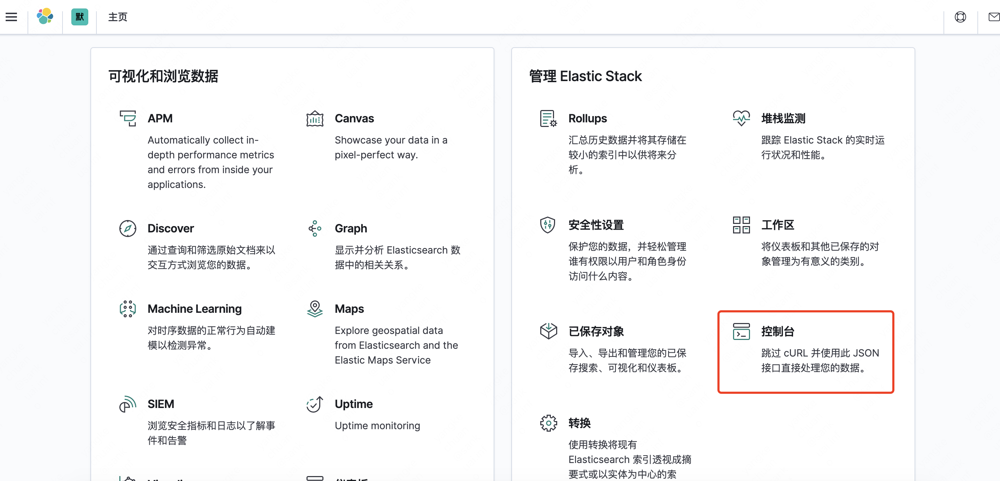
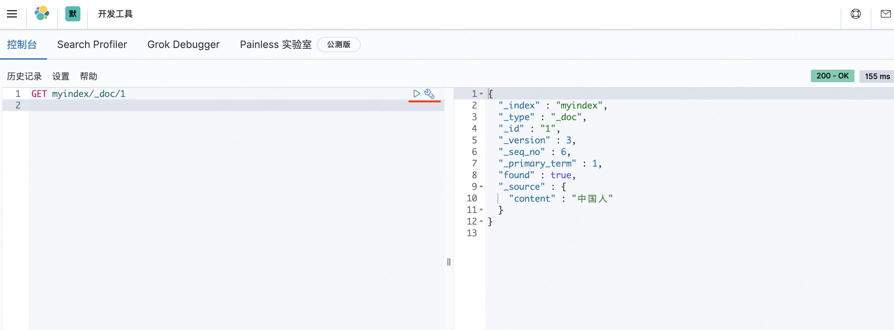

## kibana 安装和基本使用

---

            环境：
            
            MAC 系统 10.15.6
            Java Version ：1.8.0_202
            Docker 方式安装
            elasticsearch version:7.8.0
            kibana version:7.8.0

---

### 1.kibana 下载安装

直接使用 `docker` 安装： 

        docker pull kibana:7.8.0

然后查看下载好的镜像：

        ➜  ~ docker images
        REPOSITORY      TAG       IMAGE ID       CREATED         SIZE
        kibana          7.8.0     df0a0da46dd1   23 months ago   1.29GB
        elasticsearch   7.8.0     121454ddad72   23 months ago   810MB

### 2.kibana 配置启动

启动 `es` 镜像后，执行命令，启动 `kibana` 镜像：

        docker run -itd -p 5601:5601 --name kibana df0a0da46dd1

需要让 `kibana` 连接到 `es` 容器中，就需要先知道 `es` 容器的IP，执行命令，可以看到以下信息。需要注意的是，我这里需要链接容器的名称就叫 `es`：

        ➜  ~ docker inspect es | grep IPAddress
        "SecondaryIPAddresses": null,
        "IPAddress": "172.17.0.3",
        "IPAddress": "172.17.0.3",

通过上面信息可以知道， `es` 容器的 IP 为：`172.17.0.3`

然后等容器启动，登录 `kibana` 容器，在 `/usr/share/kibana/config` 目录下，打开 `kibana.yml` 文件，配置 `es` 信息：
    
        sh-4.2$ cat kibana.yml
        #
        # ** THIS IS AN AUTO-GENERATED FILE **
        #
        
        # Default Kibana configuration for docker target
        server.name: kibana
        server.host: "0"
        # kibana 端口
        server.port: 5601
        # es 的 ip 地址
        elasticsearch.hosts: [ "http://172.17.0.3:9200" ]
        monitoring.ui.container.elasticsearch.enabled: true 
        # i18n
        i18n.locale: "zh-CN"
        # index
        kibana.index: ".kibana"

**配置完成后，保存，并重启 `kibnan` 容器**

如果没有上述配置，或者配置有误，就会看到类似错误日志，说明没有正确连接到 `es`：

        Unable to revive connection: http://elasticsearch:9200 或者NO living connection”

启动正常后，访问地址：

        http://localhost:5601

即可看到 `kibana` 启动页：

然后选择【自己浏览】，并在后面的页面，找到【控制台】，点击进入

在控制台内，相当于一个 `postman` ，可以在该页面进行查询，并会有代码提示

---

以上。