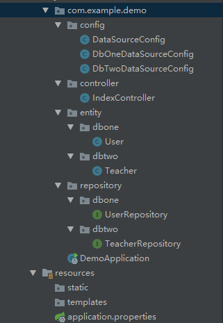

## springboot jpa two  dataSource

---
### 0.说明

springboot + jpa  实现多数据源

数据库和表：

    dbone
        |
        |______user
        
        
    dbtwo
        |
        |______teacher
        
        
DDL:
```sql
create table user
(
  id   int auto_increment
    primary key,
  name varchar(255) default '' not null
  comment '作者',
  age  int default '0'         null
  comment '年龄'
);


create table teacher
(
  id   int auto_increment
    primary key,
  name varchar(255) default '' not null,
  age  int default '0'         null
  comment '年龄'
);
```


分别从两个表中插入测试数据。


### 1. 新建项目

pom.xml:

```xml
    <dependencies>
        <dependency>
            <groupId>org.springframework.boot</groupId>
            <artifactId>spring-boot-starter-data-jpa</artifactId>
        </dependency>
        <dependency>
            <groupId>org.springframework.boot</groupId>
            <artifactId>spring-boot-starter-web</artifactId>
        </dependency>

        <dependency>
            <groupId>mysql</groupId>
            <artifactId>mysql-connector-java</artifactId>
            <scope>runtime</scope>
        </dependency>
        <dependency>
            <groupId>org.springframework.boot</groupId>
            <artifactId>spring-boot-starter-test</artifactId>
            <scope>test</scope>
        </dependency>


        <!--lombok-->
        <dependency>
            <groupId>org.projectlombok</groupId>
            <artifactId>lombok</artifactId>
            <version>1.18.2</version>
        </dependency>

    </dependencies>
```

目录结构如下：



项目比较简单，没有`service`层


### 2.文件详解


配置文件`application.properties`:

```properties
# log
logging.level.com.example.demo=debug
logging.file=./logs/demo.log


# dataSource
spring.datasource.dbone.driver-class-name=com.mysql.jdbc.Driver
spring.datasource.dbone.jdbc-url=jdbc:mysql://localhost/dbone?charsetEncoding=utf-8&useSSL=false
spring.datasource.dbone.username=root
spring.datasource.dbone.password=123456

spring.datasource.dbtwo.driver-class-name=com.mysql.jdbc.Driver
spring.datasource.dbtwo.jdbc-url=jdbc:mysql://localhost/dbtwo?charsetEncoding=utf-8&useSSL=false
spring.datasource.dbtwo.username=root
spring.datasource.dbtwo.password=123456

spring.jpa.properties.hibernate.format_sql=true
spring.jpa.properties.hibernate.show_sql=true
```

**数据库配置类：**

`DataSourceConfig.java`:

```java
package com.example.demo.config;

import org.springframework.beans.factory.annotation.Qualifier;
import org.springframework.boot.context.properties.ConfigurationProperties;
import org.springframework.boot.jdbc.DataSourceBuilder;
import org.springframework.context.annotation.Bean;
import org.springframework.context.annotation.Configuration;
import org.springframework.context.annotation.Primary;

import javax.sql.DataSource;

@Configuration
public class DataSourceConfig {

    private static final String PREIFX_DBONE_DATA_SOURCE = "spring.datasource.dbone";
    private static final String PREIFX_DBTWO_DATA_SOURCE = "spring.datasource.dbtwo";


    @Primary
    @Bean(name = "dbOneDataSource")
    @Qualifier("dbOneDataSource")
    @ConfigurationProperties(prefix = PREIFX_DBONE_DATA_SOURCE)
    public DataSource dbOneDataSource(){
        return DataSourceBuilder.create().build();
    }

    @Bean(name = "dbTwoDataSource")
    @Qualifier("dbTwoDataSource")
    @ConfigurationProperties(prefix = PREIFX_DBTWO_DATA_SOURCE)
    public DataSource dbTwoDataSource(){
        return DataSourceBuilder.create().build();
    }
}
```

`DbOneDataSourceConfig.java`:

```java
package com.example.demo.config;

import org.springframework.beans.factory.annotation.Autowired;
import org.springframework.beans.factory.annotation.Qualifier;
import org.springframework.boot.autoconfigure.orm.jpa.HibernateSettings;
import org.springframework.boot.autoconfigure.orm.jpa.JpaProperties;
import org.springframework.boot.orm.jpa.EntityManagerFactoryBuilder;
import org.springframework.context.annotation.Bean;
import org.springframework.context.annotation.Configuration;
import org.springframework.context.annotation.Primary;
import org.springframework.data.jpa.repository.config.EnableJpaRepositories;
import org.springframework.orm.jpa.JpaTransactionManager;
import org.springframework.orm.jpa.LocalContainerEntityManagerFactoryBean;
import org.springframework.transaction.PlatformTransactionManager;
import org.springframework.transaction.annotation.EnableTransactionManagement;

import javax.persistence.EntityManager;
import javax.sql.DataSource;
import java.util.Map;


@Configuration
@EnableTransactionManagement
@EnableJpaRepositories(
        entityManagerFactoryRef = "entityManagerFactoryDbOne",
        transactionManagerRef = "transactionManagerDbOne",
        basePackages = {"com.example.demo.repository.dbone"}
)
public class DbOneDataSourceConfig {

    @Autowired
    @Qualifier("dbOneDataSource")
    private DataSource dbOneDataSource;


    @Primary
    @Bean(name = "entityManagerDbOne")
    public EntityManager entityManager(EntityManagerFactoryBuilder builder){
        return entityManagerFactoryPrimary(builder).getObject().createEntityManager();
    }


    @Primary
    @Bean(name = "entityManagerFactoryDbOne")
    public LocalContainerEntityManagerFactoryBean entityManagerFactoryPrimary(EntityManagerFactoryBuilder builder){
        return builder
                .dataSource(dbOneDataSource)
                .properties(getVendorProperties())
                .packages("com.example.demo.entity.dbone")
                .persistenceUnit("dbOnepersistenceUnit")
                .build();
    }

    @Autowired
    private JpaProperties jpaProperties;

    private Map<String, Object> getVendorProperties() {
        return jpaProperties.getHibernateProperties(new HibernateSettings());
    }

    @Bean(name = "transactionManagerDbOne")
    public PlatformTransactionManager transactionManagerPrimary(EntityManagerFactoryBuilder builder) {
        return new JpaTransactionManager(entityManagerFactoryPrimary(builder).getObject());
    }
}

```


`DbTwoDataSourceConfig.java`:

```java
package com.example.demo.config;

import org.springframework.beans.factory.annotation.Autowired;
import org.springframework.beans.factory.annotation.Qualifier;
import org.springframework.boot.autoconfigure.orm.jpa.HibernateSettings;
import org.springframework.boot.autoconfigure.orm.jpa.JpaProperties;
import org.springframework.boot.context.properties.ConfigurationProperties;
import org.springframework.boot.orm.jpa.EntityManagerFactoryBuilder;
import org.springframework.context.annotation.Bean;
import org.springframework.context.annotation.Configuration;
import org.springframework.data.jpa.repository.config.EnableJpaRepositories;
import org.springframework.orm.jpa.JpaTransactionManager;
import org.springframework.orm.jpa.LocalContainerEntityManagerFactoryBean;
import org.springframework.transaction.PlatformTransactionManager;
import org.springframework.transaction.annotation.EnableTransactionManagement;

import javax.persistence.EntityManager;
import javax.sql.DataSource;
import java.util.Map;

@Configuration
@EnableTransactionManagement
@EnableJpaRepositories(
        entityManagerFactoryRef = "entityManagerFactoryDbTwo",
        transactionManagerRef = "transactionManagerDbTwo",
        basePackages = {"com.example.demo.repository.dbtwo"}
)
public class DbTwoDataSourceConfig {

    @Autowired
    @Qualifier("dbTwoDataSource")
    private DataSource dbTwoDataSource;


    @Bean(name = "entityManagerDbTwo")
    public EntityManager entityManager(EntityManagerFactoryBuilder builder){
        return entityManagerFactoryPrimary(builder).getObject().createEntityManager();
    }


    @Bean(name = "entityManagerFactoryDbTwo")
    public LocalContainerEntityManagerFactoryBean entityManagerFactoryPrimary(EntityManagerFactoryBuilder builder){
        return builder
                .dataSource(dbTwoDataSource)
                .properties(getVendorProperties())
                .packages("com.example.demo.entity.dbtwo")
                .persistenceUnit("dbtwopersistenceUnit")
                .build();
    }

    @Autowired
    private JpaProperties jpaProperties;

    private Map<String, Object> getVendorProperties() {
        return jpaProperties.getHibernateProperties(new HibernateSettings());
    }

    @Bean(name = "transactionManagerDbTwo")
    public PlatformTransactionManager transactionManagerPrimary(EntityManagerFactoryBuilder builder) {
        return new JpaTransactionManager(entityManagerFactoryPrimary(builder).getObject());
    }
}

```


**实体类相关：**


`User.java`

```java
package com.example.demo.entity.dbone;

import lombok.Data;


import javax.persistence.Entity;
import javax.persistence.GeneratedValue;
import javax.persistence.Id;
import javax.persistence.Table;
import java.io.Serializable;

@Entity
@Data
@Table(name = "user")
public class User implements Serializable {

    private static final long serialVersionUID = -6710426744529375539L;

    @Id
    @GeneratedValue
    private Integer id;

    private String name;

    private Integer age;

}

```


`Teacher.java`

```java
package com.example.demo.entity.dbtwo;

import lombok.Data;
import lombok.Getter;
import lombok.Setter;

import javax.persistence.Entity;
import javax.persistence.GeneratedValue;
import javax.persistence.Id;
import javax.persistence.Table;
import java.io.Serializable;


@Entity
@Data
@Table(name = "teacher")
public class Teacher implements Serializable {

    private static final long serialVersionUID = 7843127533157662960L;

    @Id
    @GeneratedValue
    private Integer id;

    private String name;

    private Integer age;

}

```

**repository相关：**

`UserRepository.java`

```java
package com.example.demo.repository.dbone;

import com.example.demo.entity.dbone.User;
import org.springframework.data.jpa.repository.JpaRepository;
import org.springframework.stereotype.Repository;


@Repository
public interface UserRepository extends JpaRepository<User, Integer> {
}

```

`TeacherRepository.java`


```java
package com.example.demo.repository.dbtwo;

import com.example.demo.entity.dbtwo.Teacher;
import org.springframework.data.jpa.repository.JpaRepository;
import org.springframework.stereotype.Repository;


@Repository
public interface TeacherRepository extends JpaRepository<Teacher, Integer> {
}

```

最后，写一个`controller`来验证：


`IndexController.java`


```java
package com.example.demo.controller;

import com.example.demo.entity.dbone.User;
import com.example.demo.entity.dbtwo.Teacher;
import com.example.demo.repository.dbone.UserRepository;
import com.example.demo.repository.dbtwo.TeacherRepository;
import lombok.extern.slf4j.Slf4j;
import org.springframework.beans.factory.annotation.Autowired;
import org.springframework.web.bind.annotation.GetMapping;
import org.springframework.web.bind.annotation.PathVariable;
import org.springframework.web.bind.annotation.RestController;

import java.util.Optional;

@Slf4j
@RestController
public class IndexController {

    @Autowired
    private UserRepository userRepository;

    @Autowired
    private TeacherRepository teacherRepository;

    @GetMapping("/user/{id}")
    public User userFindById(@PathVariable Integer id){
        Optional<User> user = userRepository.findById(id);
        log.debug(user.toString());

        if (!user.isPresent()){
            User result = new User();
            return result;
        }
        return user.get();

    }

    @GetMapping("/teacher/{id}")
    public Teacher teacherFindById(@PathVariable Integer id){
        Optional<Teacher> teacher =  teacherRepository.findById(id);
        log.debug(teacher.toString());

        if (!teacher.isPresent()){
            Teacher result = new Teacher();
            return result;
        }
        return teacher.get();

    }
}

```


分别调用接口：

        http://localhost:8080/user/1
        http://localhost:8080/teacher/1


接口正常返回，查看日志：

```log
Hibernate: 
    select
        user0_.id as id1_0_0_,
        user0_.age as age2_0_0_,
        user0_.name as name3_0_0_ 
    from
        user user0_ 
    where
        user0_.id=?
2019-01-14 11:21:41.233 DEBUG 15028 --- [nio-8080-exec-1] c.e.demo.controller.IndexController      : Optional[User(id=1, name=user1, age=10)]
Hibernate: 
    select
        teacher0_.id as id1_0_0_,
        teacher0_.age as age2_0_0_,
        teacher0_.name as name3_0_0_ 
    from
        teacher teacher0_ 
    where
        teacher0_.id=?
2019-01-14 11:21:44.733 DEBUG 15028 --- [nio-8080-exec-2] c.e.demo.controller.IndexController      : Optional[Teacher(id=1, name=teacher1, age=10)]

```

说明正常。


---


以上。

