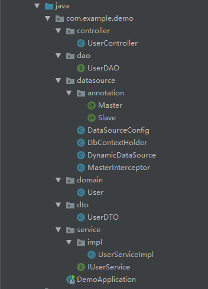
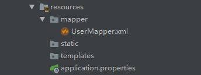

## springboot master slave dataSource

--- 0.说明

springboot + mybatis 读写分离

实现方式，通过注解 `@Master` 、 `@Slave` 注解方式，对`DAO`层或者`Service`层注解，进行读写分离。通过AOP,扫描注解，然后切换数据源

数据库和表：

    master
        |
        |______java
                   |
                   |______user
        
    slave
        |
        |______java
                   |
                   |______user
                   
                   
                   
DDL:
```sql
create table user
(
  id   int auto_increment
    primary key,
  name varchar(255) default '' not null
  comment '作者',
  age  int default '0'         null
  comment '年龄'
);
```


`master` 和 `slave` 需要先配置好主从复制，并插入部分测试数据。


### 1. 新建项目

`pom.xml`:


```xml
<dependencies>
        <dependency>
            <groupId>org.springframework.boot</groupId>
            <artifactId>spring-boot-starter-web</artifactId>
        </dependency>
        <dependency>
            <groupId>org.mybatis.spring.boot</groupId>
            <artifactId>mybatis-spring-boot-starter</artifactId>
            <version>2.0.0</version>
        </dependency>
        <dependency>
            <groupId>mysql</groupId>
            <artifactId>mysql-connector-java</artifactId>
            <scope>runtime</scope>
        </dependency>
        <dependency>
            <groupId>org.projectlombok</groupId>
            <artifactId>lombok</artifactId>
            <optional>true</optional>
        </dependency>

        <dependency>
            <groupId>org.springframework.boot</groupId>
            <artifactId>spring-boot-starter-aop</artifactId>
        </dependency>

        <dependency>
            <groupId>org.springframework.boot</groupId>
            <artifactId>spring-boot-starter-test</artifactId>
            <scope>test</scope>
        </dependency>
</dependencies>
```


目录结果如下：





### 2.文件详解


1)首先，是配置文件：

`application.properties`

```properties
# log
logging.level.com.example.demo=debug

# master
spring.datasource.master.driver-class-name=com.mysql.jdbc.Driver
spring.datasource.master.jdbc-url=jdbc:mysql://localhost:3310/java?charsetEncoding=utf-8&useSSL=false
spring.datasource.master.username=root
spring.datasource.master.password=123456

# slave
spring.datasource.slave.driver-class-name=com.mysql.jdbc.Driver
spring.datasource.slave.jdbc-url=jdbc:mysql://localhost:3311/java?charsetEncoding=utf-8&useSSL=false
spring.datasource.slave.username=root
spring.datasource.slave.password=123456

# mybatis
mybatis.mapper-locations=classpath:mapper/*.xml
mybatis.config-location=classpath:mybatis-config.xml
mybatis.type-aliases-package=com.example.demo.domain
```


**数据库配置**


2)新建`DbContextHolder`类，作为切换数据源的方法


```java
package com.example.demo.datasource;

public class DbContextHolder {

    public enum DbType{
        /**db类型**/
        MASTER,
        SLAVE
    }

    private static  ThreadLocal<DbType> contextHolder = new ThreadLocal<>();

    public static void setDbType(DbType dbType){
        if (dbType == null){
            throw new NullPointerException();
        }
        contextHolder.set(dbType);
    }
    public static DbType getDbType(){
        return contextHolder.get() == null ? DbType.MASTER : contextHolder.get();
    }

    public static void clearDbType(){
        contextHolder.remove();
    }
}
```


3)创建一个动态数据源`DynamicDataSource`，通过继成`AbstractRoutingDataSource`获取当前数据源

```java
package com.example.demo.datasource;

import lombok.extern.slf4j.Slf4j;
import org.springframework.jdbc.datasource.lookup.AbstractRoutingDataSource;

@Slf4j
public class DynamicDataSource extends AbstractRoutingDataSource {

    @Override
    protected Object determineCurrentLookupKey() {
        log.debug("当前数据源为：{}", DbContextHolder.getDbType());
        return DbContextHolder.getDbType();
    }
}

```

4)上面只是配置了数据源的标识，接下来，才开始配置数据源

`DataSourceConfig`：

```java
package com.example.demo.datasource;

import org.apache.ibatis.session.SqlSessionFactory;
import org.mybatis.spring.SqlSessionFactoryBean;
import org.springframework.boot.context.properties.ConfigurationProperties;
import org.springframework.boot.jdbc.DataSourceBuilder;
import org.springframework.context.annotation.Bean;
import org.springframework.context.annotation.Configuration;
import org.springframework.context.annotation.Primary;
import org.springframework.core.io.support.PathMatchingResourcePatternResolver;
import org.springframework.jdbc.datasource.DataSourceTransactionManager;
import org.springframework.transaction.PlatformTransactionManager;

import javax.sql.DataSource;
import java.util.HashMap;
import java.util.Map;


@Configuration
public class DataSourceConfig {

    @Primary
    @Bean(name = "masterDataSource")
    @ConfigurationProperties(prefix = "spring.datasource.master")
    public DataSource masterDataSource() {
        return DataSourceBuilder.create().build();
    }

    @Bean(name = "slaveDataSource")
    @ConfigurationProperties(prefix = "spring.datasource.slave")
    public DataSource slaveDataSource() {
        return DataSourceBuilder.create().build();
    }

    @Primary
    @Bean(name = "dynamicDataSource")
    public DataSource dynamicDataSource() {
        DynamicDataSource dynamicDataSource = new DynamicDataSource();

        /*
         * 设置默认数据源
         */
        dynamicDataSource.setDefaultTargetDataSource(masterDataSource());

        /*
         *  这里需要注意放入的Key值
         *  需要和DynamicDataSource类中的determineCurrentLookupKey返回值相对应
         *  不然可能会获取不到数据源
         */
        Map<Object, Object> dataSourceMap = new HashMap<>(2);
        dataSourceMap.put(DbContextHolder.DbType.MASTER, masterDataSource());
        dataSourceMap.put(DbContextHolder.DbType.SLAVE, slaveDataSource());

        dynamicDataSource.setTargetDataSources(dataSourceMap);
        return dynamicDataSource;
    }


    /**
     * 配置mybatis的sqlSessionFactory
     * @return SqlSessionFactory
     */
    @Bean
    public SqlSessionFactory sqlSessionFactory() throws Exception {
        SqlSessionFactoryBean sqlSessionFactoryBean = new SqlSessionFactoryBean();
        sqlSessionFactoryBean.setDataSource(dynamicDataSource());
        sqlSessionFactoryBean.setMapperLocations(new PathMatchingResourcePatternResolver().getResources("classpath:mapper/*.xml"));
        return sqlSessionFactoryBean.getObject();
    }

    /**
     * 事务配置
     */
    @Bean
    public PlatformTransactionManager transactionManager() {
        return new DataSourceTransactionManager(dynamicDataSource());
    }
}
```

以上类需要注意以下几点：

- `SqlSessionFactory` 和 `PlatformTransactionManager` 两个`@Bean`不一定在`DataSourceConfig`类中，可以新建一个类（例如`MybatisConfig.java`）去管理
- `dynamicDataSource()`方法中`dataSourceMap`放置的`key`需要和`DynamicDataSource`类中的`determineCurrentLookupKey`返回值相对应
- `SqlSessionFactory` 一定要有，不然启动报错


5)新建`@Master` 、 `@Slave` 注解

`@Master`:

```java
package com.example.demo.datasource.annotation;

import java.lang.annotation.ElementType;
import java.lang.annotation.Retention;
import java.lang.annotation.RetentionPolicy;
import java.lang.annotation.Target;


@Target({ElementType.METHOD, ElementType.TYPE})
@Retention(RetentionPolicy.RUNTIME)
public @interface Master {
}

```

`@Slave`:

```java
package com.example.demo.datasource.annotation;

import java.lang.annotation.ElementType;
import java.lang.annotation.Retention;
import java.lang.annotation.RetentionPolicy;
import java.lang.annotation.Target;


@Target({ElementType.METHOD, ElementType.TYPE})
@Retention(RetentionPolicy.RUNTIME)
public @interface Slave {
}
```


6)新建切面类`MasterInterceptor`

动态切换数据源


```java
package com.example.demo.datasource;

import lombok.extern.slf4j.Slf4j;
import org.aspectj.lang.annotation.After;
import org.aspectj.lang.annotation.Aspect;
import org.aspectj.lang.annotation.Before;
import org.aspectj.lang.annotation.Pointcut;
import org.springframework.stereotype.Component;


@Slf4j
@Aspect
@Component
public class MasterInterceptor {

    @Pointcut("@annotation(com.example.demo.datasource.annotation.Master)")
    private void master(){}

    @Pointcut("@annotation(com.example.demo.datasource.annotation.Slave)")
    private void slave(){}

    @Before("master()")
    public void beforeMaster() {
        log.debug("set dataSource to master");
        DbContextHolder.setDbType(DbContextHolder.DbType.MASTER);
    }

    @After("master()")
    public void afterMaster() {
        log.debug("clear Master dataSource");
        DbContextHolder.clearDbType();
    }

    @Before("slave()")
    public void beforeSlave() {
        log.debug("set dataSource to slave");
        DbContextHolder.setDbType(DbContextHolder.DbType.SLAVE);

    }

    @After("slave()")
    public void afterSlave(){
        log.debug("clear Slave dataSource");
        DbContextHolder.clearDbType();
    }
}

```


当前数据库相关配置基本完成。

开始编写业务逻辑，对User类进行增删改查操作。

`User.java`:

```java
package com.example.demo.domain;


import lombok.Data;

@Data
public class User {

    private Integer id;

    private String name;

    private Integer age;
}
```

`UserDTO.java`:

```java
package com.example.demo.dto;

import lombok.Data;

@Data
public class UserDTO {

    private String name;
    private Integer age;
}

```


`UserDAO.java`:

在`DAO`层添加`@Master`、 `@Slave`注解

```java
package com.example.demo.dao;

import com.example.demo.datasource.annotation.Master;
import com.example.demo.datasource.annotation.Slave;
import com.example.demo.domain.User;
import org.springframework.stereotype.Repository;

import java.util.List;

@Repository
public interface UserDAO {

    @Master
    int deleteByPrimaryKey(Integer id);

    @Master
    int insert(User record);

    @Slave
    User selectByPrimaryKey(Integer id);

    @Slave
    List<User> selectAll();

    @Master
    int updateByPrimaryKey(User record);
}
```


`UserMapper.xml`:


```xml
<?xml version="1.0" encoding="UTF-8"?>
<!DOCTYPE mapper PUBLIC "-//mybatis.org//DTD Mapper 3.0//EN" "http://mybatis.org/dtd/mybatis-3-mapper.dtd">
<mapper namespace="com.example.demo.dao.UserDAO">
  <resultMap id="BaseResultMap" type="com.example.demo.domain.User">
    <id column="id" jdbcType="INTEGER" property="id" />
    <result column="name" jdbcType="VARCHAR" property="name" />
    <result column="age" jdbcType="INTEGER" property="age" />
  </resultMap>

  <delete id="deleteByPrimaryKey" parameterType="java.lang.Integer">

    delete from user
    where id = #{id,jdbcType=INTEGER}
  </delete>

  <insert id="insert" parameterType="com.example.demo.domain.User" useGeneratedKeys="true" keyProperty="id">

    insert into user ( name, age
      )
    values (#{name,jdbcType=VARCHAR}, #{age,jdbcType=INTEGER}
      )
  </insert>

  <update id="updateByPrimaryKey" parameterType="com.example.demo.domain.User">

    update user
    set name = #{name,jdbcType=VARCHAR},
      age = #{age,jdbcType=INTEGER}
    where id = #{id,jdbcType=INTEGER}
  </update>

  <select id="selectByPrimaryKey" parameterType="java.lang.Integer" resultMap="BaseResultMap">

    select id, name, age
    from user
    where id = #{id,jdbcType=INTEGER}
  </select>

  <select id="selectAll" resultMap="BaseResultMap">

    select id, name, age
    from user
  </select>
</mapper>
```


`Service`层：

`IUserService.java`:

```java
package com.example.demo.service;

import com.example.demo.domain.User;
import com.example.demo.dto.UserDTO;

import java.util.List;

public interface IUserService {

    /**根据主键查询**/
    User selectByPrimaryKey(Integer id);

    /**查询所有**/
    List<User> selectAll();

    /**添加User**/
    User save(UserDTO userDTO);

    /**更新User**/
    User updateByPrimaryKey(User user);

    /**删除**/
    void deleteByPrimaryKey(Integer id);
}

```

`UserServiceImpl.java`

```java
package com.example.demo.service.impl;

import com.example.demo.dao.UserDAO;
import com.example.demo.datasource.annotation.Slave;
import com.example.demo.domain.User;
import com.example.demo.dto.UserDTO;
import com.example.demo.service.IUserService;
import org.springframework.beans.BeanUtils;
import org.springframework.beans.factory.annotation.Autowired;
import org.springframework.stereotype.Service;
import org.springframework.transaction.annotation.Transactional;

import java.util.List;

@Service
public class UserServiceImpl implements IUserService {

    @Autowired
    private UserDAO userDAO;

    @Slave
    @Override
    public User selectByPrimaryKey(Integer id) {
        return userDAO.selectByPrimaryKey(id);
    }

    @Override
    public List<User> selectAll() {
        return userDAO.selectAll();
    }

    @Override
    @Transactional(rollbackFor = Exception.class)
    public User save(UserDTO userDTO) {
        /*
         * 在service层设置事务时，如果有多次数据库读写操作，切换数据源会失败。
         * 查看日志会发现，虽然切面类会有DbContextHolder.setDbType()操作，
         * 但是DynamicDataSource类没有执行determineCurrentLookupKey()
         * 方法去获取最新数据源。
         *
         * 去掉事务注解后，切换数据源正常。
         */
        User user = new User();
        BeanUtils.copyProperties(userDTO, user);
        userDAO.insert(user);
        User result = userDAO.selectByPrimaryKey(user.getId());
        return result;
    }

    @Override
    @Transactional(rollbackFor = Exception.class)
    public User updateByPrimaryKey(User user) {
        userDAO.updateByPrimaryKey(user);
        return user;
    }

    @Override
    @Transactional(rollbackFor = Exception.class)
    public void deleteByPrimaryKey(Integer id) {
        userDAO.deleteByPrimaryKey(id);
    }
}

```


`Controller`层：


`UserController.java`:


```java
package com.example.demo.controller;

import com.example.demo.domain.User;
import com.example.demo.dto.UserDTO;
import com.example.demo.service.IUserService;
import org.springframework.beans.factory.annotation.Autowired;
import org.springframework.web.bind.annotation.*;

import java.util.List;


@RestController
@RequestMapping("user")
public class UserController {

    @Autowired
    private IUserService userService;

    @GetMapping("/id/{id}")
    public User getUserById(@PathVariable Integer id){
        return userService.selectByPrimaryKey(id);
    }

    @GetMapping("/all")
    public List<User> userAll(){
        return userService.selectAll();
    }

    @PostMapping("/save")
    public User save(@RequestBody UserDTO userDTO){
        return userService.save(userDTO);
    }

    @PostMapping("/update")
    public User update(@RequestBody User user){
        return userService.updateByPrimaryKey(user);
    }

    @GetMapping("/delete/id/{id}")
    public String delete(@PathVariable Integer id){
        userService.deleteByPrimaryKey(id);
        return "SUCCESS";
    }
}

```


业务代码略多，关键点在`UserServiceImpl` 和 `UserDAO`

### **3.解析**

`@Master`和`@Slave`注解可以注解到`Service`,也可以注解到`DAO`，同时在`Service`层涉及到事务问题。

**注意** ：在测试查询数据时，最好将`Master` 、 `Slave`库的测试数据设置为不同值，根据返回值判断读取库是否正确，日志只能作为参考。


**接下来针对各种情况开始分析。**


1） 不加注解

不管是`UserServiceImpl`还是`UserDAO`的`selectByPrimaryKey`方法，都不加注解。

由于`DbContextHolder`类中的`getDbType()`方法：

```java
return contextHolder.get() == null ? DbType.MASTER : contextHolder.get();
```
没有注解时，`contextHolder.get()`应为`null`，`getDbType()`方法返回`DbType.MASTER`,数据库连接的是`Master`.

启动服务，访问

    http://localhost:8080/user/id/1

查看日志：

```log
2019-01-25 18:03:00.072 DEBUG 6724 --- [nio-8080-exec-1] c.e.demo.datasource.DynamicDataSource    : 当前数据源为：MASTER
2019-01-25 18:03:00.073  INFO 6724 --- [nio-8080-exec-1] com.zaxxer.hikari.HikariDataSource       : HikariPool-1 - Starting...
2019-01-25 18:03:00.221  INFO 6724 --- [nio-8080-exec-1] com.zaxxer.hikari.HikariDataSource       : HikariPool-1 - Start completed.
2019-01-25 18:03:00.226 DEBUG 6724 --- [nio-8080-exec-1] c.e.demo.dao.UserDAO.selectByPrimaryKey  : ==>  Preparing: select id, name, age from user where id = ? 
2019-01-25 18:03:00.239 DEBUG 6724 --- [nio-8080-exec-1] c.e.demo.dao.UserDAO.selectByPrimaryKey  : ==> Parameters: 1(Integer)
2019-01-25 18:03:00.285 DEBUG 6724 --- [nio-8080-exec-1] c.e.demo.dao.UserDAO.selectByPrimaryKey  : <==      Total: 1
```

说明没注解时，访问的是`Master`。


2） 在`Service`层添加注解

只给`UserServiceImpl`的 `selectByPrimaryKey` 方法添加`@Slave`注解，`UserDAO`的`selectByPrimaryKey`不加注解。

启动服务，访问

    http://localhost:8080/user/id/1


接口正常返回后，查看日志并分析，找到关键日志如下：

```log
2019-01-25 16:46:02.907 DEBUG 10332 --- [nio-8080-exec-1] c.e.demo.datasource.MasterInterceptor    : set dataSource to slave
2019-01-25 16:46:02.923 DEBUG 10332 --- [nio-8080-exec-1] c.e.demo.datasource.DynamicDataSource    : 当前数据源为：SLAVE
2019-01-25 16:46:02.924  INFO 10332 --- [nio-8080-exec-1] com.zaxxer.hikari.HikariDataSource       : HikariPool-1 - Starting...
2019-01-25 16:46:03.089  INFO 10332 --- [nio-8080-exec-1] com.zaxxer.hikari.HikariDataSource       : HikariPool-1 - Start completed.
2019-01-25 16:46:03.094 DEBUG 10332 --- [nio-8080-exec-1] c.e.demo.dao.UserDAO.selectByPrimaryKey  : ==>  Preparing: select id, name, age from user where id = ? 
2019-01-25 16:46:03.109 DEBUG 10332 --- [nio-8080-exec-1] c.e.demo.dao.UserDAO.selectByPrimaryKey  : ==> Parameters: 1(Integer)
2019-01-25 16:46:03.151 DEBUG 10332 --- [nio-8080-exec-1] c.e.demo.dao.UserDAO.selectByPrimaryKey  : <==      Total: 1
2019-01-25 16:46:03.153 DEBUG 10332 --- [nio-8080-exec-1] c.e.demo.datasource.MasterInterceptor    : clear Slave dataSource
```

`当前数据源为：SLAVE`这行日志，说明了请求时数据源为`Slave`


3） 在`DAO`层添加注解

只给`UserDAO`的 `selectByPrimaryKey` 方法添加`@Slave`注解，`UserServiceImpl`的`selectByPrimaryKey`不加注解。

启动服务，访问

    http://localhost:8080/user/id/1


查看日志:

```log
2019-01-25 18:10:44.047 DEBUG 16036 --- [nio-8080-exec-1] c.e.demo.datasource.MasterInterceptor    : set dataSource to slave
2019-01-25 18:10:44.059 DEBUG 16036 --- [nio-8080-exec-1] c.e.demo.datasource.DynamicDataSource    : 当前数据源为：SLAVE
2019-01-25 18:10:44.060  INFO 16036 --- [nio-8080-exec-1] com.zaxxer.hikari.HikariDataSource       : HikariPool-1 - Starting...
2019-01-25 18:10:44.193  INFO 16036 --- [nio-8080-exec-1] com.zaxxer.hikari.HikariDataSource       : HikariPool-1 - Start completed.
2019-01-25 18:10:44.199 DEBUG 16036 --- [nio-8080-exec-1] c.e.demo.dao.UserDAO.selectByPrimaryKey  : ==>  Preparing: select id, name, age from user where id = ? 
2019-01-25 18:10:44.215 DEBUG 16036 --- [nio-8080-exec-1] c.e.demo.dao.UserDAO.selectByPrimaryKey  : ==> Parameters: 1(Integer)
2019-01-25 18:10:44.239 DEBUG 16036 --- [nio-8080-exec-1] c.e.demo.dao.UserDAO.selectByPrimaryKey  : <==      Total: 1
2019-01-25 18:10:44.240 DEBUG 16036 --- [nio-8080-exec-1] c.e.demo.datasource.MasterInterceptor    : clear Slave dataSource
```

`当前数据源为：SLAVE`这行日志，说明了请求时数据源为`Slave`


4） 在`Service`层添加注解，同时在`DAO`层添加注解

`UserDAO`的 `selectByPrimaryKey` 方法添加`@Slave`注解，`UserServiceImpl`的 `selectByPrimaryKey` 方法添加`@Master`注解

启动服务，访问

    http://localhost:8080/user/id/1


查看日志:


```log
2019-01-25 18:17:04.043 DEBUG 20100 --- [nio-8080-exec-1] c.e.demo.datasource.DynamicDataSource    : 当前数据源为：SLAVE
2019-01-25 18:17:04.043  INFO 20100 --- [nio-8080-exec-1] com.zaxxer.hikari.HikariDataSource       : HikariPool-1 - Starting...
2019-01-25 18:17:04.206  INFO 20100 --- [nio-8080-exec-1] com.zaxxer.hikari.HikariDataSource       : HikariPool-1 - Start completed.
2019-01-25 18:17:04.213 DEBUG 20100 --- [nio-8080-exec-1] c.e.demo.dao.UserDAO.selectByPrimaryKey  : ==>  Preparing: select id, name, age from user where id = ? 
2019-01-25 18:17:04.232 DEBUG 20100 --- [nio-8080-exec-1] c.e.demo.dao.UserDAO.selectByPrimaryKey  : ==> Parameters: 1(Integer)
2019-01-25 18:17:04.248 DEBUG 20100 --- [nio-8080-exec-1] c.e.demo.dao.UserDAO.selectByPrimaryKey  : <==      Total: 1
2019-01-25 18:17:04.251 DEBUG 20100 --- [nio-8080-exec-1] c.e.demo.datasource.MasterInterceptor    : clear Slave dataSource
2019-01-25 18:17:04.251 DEBUG 20100 --- [nio-8080-exec-1] c.e.demo.datasource.MasterInterceptor    : clear Master dataSource
```

`当前数据源为：SLAVE`这行日志，说明了请求时数据源为`Slave`


第二种情况：`UserDAO`的 `selectByPrimaryKey` 方法添加`@Master`注解，`UserServiceImpl`的 `selectByPrimaryKey` 方法添加`@Slave`注解


启动服务，访问

    http://localhost:8080/user/id/1


查看日志:

```log
2019-01-25 18:18:56.761 DEBUG 15860 --- [nio-8080-exec-1] c.e.demo.datasource.MasterInterceptor    : set dataSource to slave
2019-01-25 18:18:56.766 DEBUG 15860 --- [nio-8080-exec-1] c.e.demo.datasource.MasterInterceptor    : set dataSource to master
2019-01-25 18:18:56.777 DEBUG 15860 --- [nio-8080-exec-1] c.e.demo.datasource.DynamicDataSource    : 当前数据源为：MASTER
2019-01-25 18:18:56.777  INFO 15860 --- [nio-8080-exec-1] com.zaxxer.hikari.HikariDataSource       : HikariPool-1 - Starting...
2019-01-25 18:18:56.903  INFO 15860 --- [nio-8080-exec-1] com.zaxxer.hikari.HikariDataSource       : HikariPool-1 - Start completed.
2019-01-25 18:18:56.908 DEBUG 15860 --- [nio-8080-exec-1] c.e.demo.dao.UserDAO.selectByPrimaryKey  : ==>  Preparing: select id, name, age from user where id = ? 
2019-01-25 18:18:56.922 DEBUG 15860 --- [nio-8080-exec-1] c.e.demo.dao.UserDAO.selectByPrimaryKey  : ==> Parameters: 1(Integer)
2019-01-25 18:18:56.934 DEBUG 15860 --- [nio-8080-exec-1] c.e.demo.dao.UserDAO.selectByPrimaryKey  : <==      Total: 1
2019-01-25 18:18:56.936 DEBUG 15860 --- [nio-8080-exec-1] c.e.demo.datasource.MasterInterceptor    : clear Master dataSource
2019-01-25 18:18:56.936 DEBUG 15860 --- [nio-8080-exec-1] c.e.demo.datasource.MasterInterceptor    : clear Slave dataSource
```

说明访问的是`Master`数据源

由此说明，`DAO`层在`Service`层之后执行，所以，最终执行的是`DAO`层注解。


5）事务


`Service`层不加数据源注解，只加事务，`Service`层同时有读写操作。


在`UserServiceImpl`的`save()`方法上添加事务：``@Transactional(rollbackFor = Exception.class)``

```java
    @Override
    @Transactional(rollbackFor = Exception.class)
    public User save(UserDTO userDTO) {
        /*
         * 在service层设置事务时，如果有多次数据库读写操作，切换数据源会失败。
         * 查看日志会发现，虽然切面类会有DbContextHolder.setDbType()操作，
         * 但是DynamicDataSource类没有执行determineCurrentLookupKey()
         * 方法去获取最新数据源。
         *
         * 去掉事务注解后，切换数据源正常。
         */
        User user = new User();
        BeanUtils.copyProperties(userDTO, user);
        userDAO.insert(user);
        User result = userDAO.selectByPrimaryKey(user.getId());
        return result;
    }
```

`UserDAO`的 `selectByPrimaryKey` 方法添加`@Slave`注解，`UserDAO`的 `insert()` 方法添加`@Master`注解


启动服务，访问

    http://localhost:8080/user/save
    
    method: post
    params:
            {
            	"name":"test110",
            	"age":110
            }


查看日志:

```log
2019-01-25 18:28:36.501 DEBUG 17280 --- [nio-8080-exec-1] c.e.demo.datasource.DynamicDataSource    : 当前数据源为：MASTER
2019-01-25 18:28:36.502  INFO 17280 --- [nio-8080-exec-1] com.zaxxer.hikari.HikariDataSource       : HikariPool-1 - Starting...
2019-01-25 18:28:36.716  INFO 17280 --- [nio-8080-exec-1] com.zaxxer.hikari.HikariDataSource       : HikariPool-1 - Start completed.
2019-01-25 18:28:36.740 DEBUG 17280 --- [nio-8080-exec-1] c.e.demo.datasource.MasterInterceptor    : set dataSource to master
2019-01-25 18:28:36.760 DEBUG 17280 --- [nio-8080-exec-1] com.example.demo.dao.UserDAO.insert      : ==>  Preparing: insert into user ( name, age ) values (?, ? ) 
2019-01-25 18:28:36.786 DEBUG 17280 --- [nio-8080-exec-1] com.example.demo.dao.UserDAO.insert      : ==> Parameters: test110(String), 110(Integer)
2019-01-25 18:28:36.812 DEBUG 17280 --- [nio-8080-exec-1] com.example.demo.dao.UserDAO.insert      : <==    Updates: 1
2019-01-25 18:28:36.816 DEBUG 17280 --- [nio-8080-exec-1] c.e.demo.datasource.MasterInterceptor    : clear Master dataSource
2019-01-25 18:28:36.818 DEBUG 17280 --- [nio-8080-exec-1] c.e.demo.datasource.MasterInterceptor    : set dataSource to slave
2019-01-25 18:28:36.821 DEBUG 17280 --- [nio-8080-exec-1] c.e.demo.dao.UserDAO.selectByPrimaryKey  : ==>  Preparing: select id, name, age from user where id = ? 
2019-01-25 18:28:36.821 DEBUG 17280 --- [nio-8080-exec-1] c.e.demo.dao.UserDAO.selectByPrimaryKey  : ==> Parameters: 14(Integer)
2019-01-25 18:28:36.833 DEBUG 17280 --- [nio-8080-exec-1] c.e.demo.dao.UserDAO.selectByPrimaryKey  : <==      Total: 1
2019-01-25 18:28:36.834 DEBUG 17280 --- [nio-8080-exec-1] c.e.demo.datasource.MasterInterceptor    : clear Slave dataSource
```


`当前数据源为：MASTER`,说明当前是使用的`Master库`。

**虽然**，`set dataSource to slave`这句日志说明了有设置数据库为`Slave`,但是只能说明执行了`MasterInterceptor`类中的`DbContextHolder.setDbType(DbContextHolder.DbType.SLAVE);`。

`DynamicDataSource`类中的`determineCurrentLookupKey()`方法并未执行，数据源一直是`Master`。

`当前数据源为：MASTER`这句日志在最开始，然后是`set dataSource to master`。

根据日志分析，添加事务后，首先会选择一个数据源，这一步要优先于切面选择数据源。同时，事务中只会有一个数据源，即使有多个`@Master` 、`@Slave`注解


第二种情况，在`Service`层添加数据源注解和事务：

在`UserServiceImpl`的`save()`方法上添加事务，同时添加`@Master`注解。`UserDAO`的 `selectByPrimaryKey` 方法添加`@Slave`注解，`insert()` 方法不加注解。


启动服务，访问

    http://localhost:8080/user/save
    
    method: post
    params:
            {
            	"name":"test114",
            	"age":114
            }


查看日志:

```log
2019-01-25 19:00:38.838 DEBUG 15688 --- [nio-8080-exec-2] c.e.demo.datasource.MasterInterceptor    : set dataSource to master
2019-01-25 19:00:38.845 DEBUG 15688 --- [nio-8080-exec-2] c.e.demo.datasource.DynamicDataSource    : 当前数据源为：MASTER
2019-01-25 19:00:38.846  INFO 15688 --- [nio-8080-exec-2] com.zaxxer.hikari.HikariDataSource       : HikariPool-1 - Starting...
2019-01-25 19:00:39.026  INFO 15688 --- [nio-8080-exec-2] com.zaxxer.hikari.HikariDataSource       : HikariPool-1 - Start completed.
2019-01-25 19:00:39.053 DEBUG 15688 --- [nio-8080-exec-2] com.example.demo.dao.UserDAO.insert      : ==>  Preparing: insert into user ( name, age ) values (?, ? ) 
2019-01-25 19:00:39.072 DEBUG 15688 --- [nio-8080-exec-2] com.example.demo.dao.UserDAO.insert      : ==> Parameters: test114(String), 114(Integer)
2019-01-25 19:00:39.075 DEBUG 15688 --- [nio-8080-exec-2] com.example.demo.dao.UserDAO.insert      : <==    Updates: 1
2019-01-25 19:00:39.080 DEBUG 15688 --- [nio-8080-exec-2] c.e.demo.datasource.MasterInterceptor    : set dataSource to slave
2019-01-25 19:00:39.082 DEBUG 15688 --- [nio-8080-exec-2] c.e.demo.dao.UserDAO.selectByPrimaryKey  : ==>  Preparing: select id, name, age from user where id = ? 
2019-01-25 19:00:39.082 DEBUG 15688 --- [nio-8080-exec-2] c.e.demo.dao.UserDAO.selectByPrimaryKey  : ==> Parameters: 22(Integer)
2019-01-25 19:00:39.091 DEBUG 15688 --- [nio-8080-exec-2] c.e.demo.dao.UserDAO.selectByPrimaryKey  : <==      Total: 1
2019-01-25 19:00:39.091 DEBUG 15688 --- [nio-8080-exec-2] c.e.demo.datasource.MasterInterceptor    : clear Slave dataSource
2019-01-25 19:00:39.098 DEBUG 15688 --- [nio-8080-exec-2] c.e.demo.datasource.MasterInterceptor    : clear Master dataSource
```

根据日志分析，在`Service`层添加事务和`@Master`注解后，会先执行`@Master`注解，选择`Master`数据源，同时事务当中，不会切换数据源。

**虽然**，两种事务方式都不会切换数据源，但是`set dataSource to master`,`set dataSource to slave`，`clear Slave dataSource`,`clear Master dataSource`，这四个日志的执行时间与顺序，却不一致，需要关注。


---

以上。

