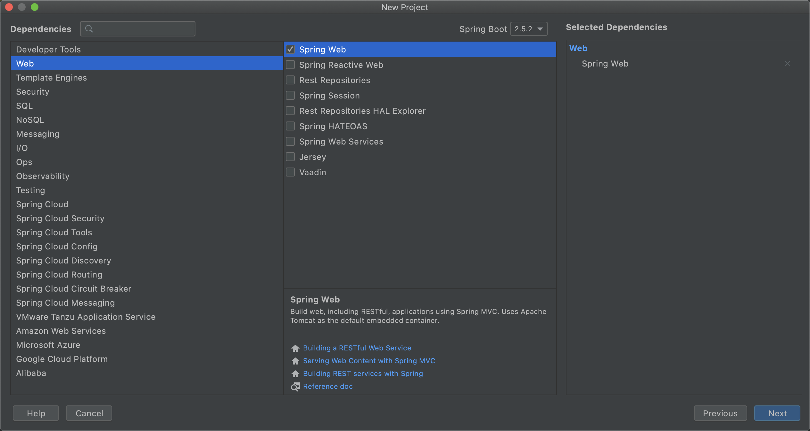

## springboot 多模块打包

----

    本文章主要记录一下 springboot 项目，如何操作多模板打包

    环境：
    Mac 环境
    java version: 1.8
    springboot version: 2.5.2

### 1.新建项目

新建一个 springboot 项目, 只需要导入 `spring-boot-starter-web` 一个依赖。

同时，父目录还未有业务代码，删除父目录 `src` 文件夹以及一些 `mvn` 相关无用文件。把所有代码写到子模块中。





### 2.新建子模块


预期该项目有三个子模块：
    
    模型层：model
    持久层：persistence
    表示层：web


在父项目跟目录下，右键选择新建，新建 `module`，作为一个新项目，不需要选择任何任何依赖。`artifactId` 填写 `web`。


重复以上操作，把其余 `model` 、 `persistence` 也创建完成，同时删除无用文件。

`web` 作为启动项目，只在 `web` 项目中保留启动类。


此时，项目结构如下：


### 3.修改 pom 文件

*注意*：每次修改 pom 文件后，需要重新导入项目。

- 只有作为启动项的 `web` 需要配置 `spring-boot-maven-plugin`。其余项目不能配置，否则打包会报错
- `web` 项目如果使用 `@Autowired` 等 `springboot` 注解导入 `persistence` 层，需要在启动类配置 `@SpringBootApplication(scanBasePackages = "com.example")`
- 父项目 `springboot` 的默认 `packaging` 类型为 `jar` 。需要修改成 `pom` 类型。
- 在父项目中，需要导入各个子模块

父项目 `pom.xml` 主要配置:


```xml
<?xml version="1.0" encoding="UTF-8"?>
<project xmlns="http://maven.apache.org/POM/4.0.0" xmlns:xsi="http://www.w3.org/2001/XMLSchema-instance"
         xsi:schemaLocation="http://maven.apache.org/POM/4.0.0 https://maven.apache.org/xsd/maven-4.0.0.xsd">
    <modelVersion>4.0.0</modelVersion>
    <parent>
        <groupId>org.springframework.boot</groupId>
        <artifactId>spring-boot-starter-parent</artifactId>
        <version>2.5.2</version>
        <relativePath/> <!-- lookup parent from repository -->
    </parent>

    <groupId>com.example</groupId>
    <artifactId>springboot_modules_demo</artifactId>
    <version>0.0.1-SNAPSHOT</version>
    <name>springboot_modules_demo</name>

    <description>Demo project for Spring Boot</description>
    <properties>
        <java.version>1.8</java.version>
    </properties>

    <modules>
        <module>model</module>
        <module>persistence</module>
        <module>web</module>
    </modules>
    <packaging>pom</packaging>

    <dependencies>
        <dependency>
            <groupId>org.springframework.boot</groupId>
            <artifactId>spring-boot-starter-web</artifactId>
        </dependency>

        <dependency>
            <groupId>org.springframework.boot</groupId>
            <artifactId>spring-boot-starter-test</artifactId>
            <scope>test</scope>
        </dependency>
    </dependencies>

</project>

```


对于各子模块，正常业务下，应该需要有以下依赖关系，同时需要依赖于父项目：

    web 依赖于 persistence
    persistence 依赖于 model
    
即 `web` 需要使用 `persistence` 层代码， `persistence` 需要使用 `model` 层代码。


web 项目 pom.xml 主要配置:

```xml
<?xml version="1.0" encoding="UTF-8"?>
<project xmlns="http://maven.apache.org/POM/4.0.0" xmlns:xsi="http://www.w3.org/2001/XMLSchema-instance"
         xsi:schemaLocation="http://maven.apache.org/POM/4.0.0 https://maven.apache.org/xsd/maven-4.0.0.xsd">
    <modelVersion>4.0.0</modelVersion>
    <parent>
        <groupId>com.example</groupId>
        <artifactId>springboot_modules_demo</artifactId>
        <version>0.0.1-SNAPSHOT</version>
    </parent>

    <artifactId>web</artifactId>
    <version>0.0.1-SNAPSHOT</version>
    <name>web</name>

    <description>Demo project for Spring Boot</description>
    <properties>
        <java.version>1.8</java.version>
    </properties>
    <dependencies>
        <dependency>
            <groupId>com.example</groupId>
            <artifactId>persistence</artifactId>
            <version>0.0.1-SNAPSHOT</version>
        </dependency>
    </dependencies>

    <build>
        <plugins>
            <plugin>
                <groupId>org.springframework.boot</groupId>
                <artifactId>spring-boot-maven-plugin</artifactId>
            </plugin>
        </plugins>
    </build>

</project>


```

persistence 项目 pom.xml 主要配置:

```xml
<?xml version="1.0" encoding="UTF-8"?>
<project xmlns="http://maven.apache.org/POM/4.0.0" xmlns:xsi="http://www.w3.org/2001/XMLSchema-instance"
         xsi:schemaLocation="http://maven.apache.org/POM/4.0.0 https://maven.apache.org/xsd/maven-4.0.0.xsd">
    <modelVersion>4.0.0</modelVersion>
    <parent>
        <groupId>com.example</groupId>
        <artifactId>springboot_modules_demo</artifactId>
        <version>0.0.1-SNAPSHOT</version>
    </parent>

    <artifactId>persistence</artifactId>
    <version>0.0.1-SNAPSHOT</version>
    <name>persistence</name>

    <description>Demo project for Spring Boot</description>
    <properties>
        <java.version>1.8</java.version>
    </properties>
    <dependencies>
        <dependency>
            <groupId>com.example</groupId>
            <artifactId>model</artifactId>
            <version>0.0.1-SNAPSHOT</version>
        </dependency>
    </dependencies>

</project>


```


model 项目 pom.xml 主要配置:


```xml
<?xml version="1.0" encoding="UTF-8"?>
<project xmlns="http://maven.apache.org/POM/4.0.0" xmlns:xsi="http://www.w3.org/2001/XMLSchema-instance"
         xsi:schemaLocation="http://maven.apache.org/POM/4.0.0 https://maven.apache.org/xsd/maven-4.0.0.xsd">
    <modelVersion>4.0.0</modelVersion>
    <parent>
        <groupId>com.example</groupId>
        <artifactId>springboot_modules_demo</artifactId>
        <version>0.0.1-SNAPSHOT</version>
    </parent>

    <artifactId>persistence</artifactId>
    <version>0.0.1-SNAPSHOT</version>
    <name>persistence</name>

    <description>Demo project for Spring Boot</description>
    <properties>
        <java.version>1.8</java.version>
    </properties>
    <dependencies>
        <dependency>
            <groupId>com.example</groupId>
            <artifactId>model</artifactId>
            <version>0.0.1-SNAPSHOT</version>
        </dependency>
    </dependencies>

</project>


```


### 4.编写业务代码测试

`model` 层新增文件：

```java
package com.example.model.domain;

import lombok.Data;

/**
 * @author yangkechuan
 * 2021/7/3  10:44 下午
 */
@Data
public class User {

    /**
     * 姓名
     */
    private String name;

    /**
     * 年龄
     */
    private Integer age;


    public User(String name, Integer age) {
        this.name = name;
        this.age = age;
    }
}


```


`persistence` 层新增文件：

```java
package com.example.persistence.repository;

import com.example.model.domain.User;
import org.springframework.stereotype.Repository;


/**
 * 2021/7/3  10:48 下午
 */
@Repository
public class UserRepository {
    
    /**
     *  查找 User
     * @return {@link com.example.model.domain.User}
     */
    public User findUser(){
        return new User("张三", 10);
    }
}

```

`web` 层新增文件：

```java
package com.example.web.controller;

import com.example.model.domain.User;
import com.example.persistence.repository.UserRepository;
import org.springframework.beans.factory.annotation.Autowired;
import org.springframework.web.bind.annotation.GetMapping;
import org.springframework.web.bind.annotation.RestController;

/**
 * 2021/7/3  10:56 下午
 */
@RestController
public class UserController {

    @Autowired
    private UserRepository userRepository;
    

    @GetMapping("/findUser")
    public User findUser(){
        return userRepository.findUser();
    }
}
```

`web` 启动类：

```java
package com.example.web;

import org.springframework.boot.SpringApplication;
import org.springframework.boot.autoconfigure.SpringBootApplication;

@SpringBootApplication(scanBasePackages = "com.example")
public class WebApplication {

    public static void main(String[] args) {
        SpringApplication.run(WebApplication.class, args);
    }

}

```

### 5.打包运行

然后执行 web 项目的启动类，可以看到启动正常。再请求：

    http://localhost:8080/findUser
    
    
    {
        "name": "张三",
        "age": 10
    }
    
说明服务正常启动。

使用 `idea` 工具进行 `maven` 打包，在右侧 选择 `spring_modules_demo` --> `Lifecycle` --> `clean & package`。

先 `clean` 然后 `package`，可以看到大概如下日志：

    [INFO] springboot_modules_demo ............................ SUCCESS [  0.215 s]
    [INFO] model .............................................. SUCCESS [  0.017 s]
    [INFO] persistence ........................................ SUCCESS [  0.010 s]
    [INFO] web ................................................ SUCCESS [  0.030 s]
    [INFO] ------------------------------------------------------------------------
    [INFO] BUILD SUCCESS
    [INFO] ------------------------------------------------------------------------
    [INFO] Total time:  0.561 s
    [INFO] Finished at: 2021-07-06T00:04:36+08:00
    [INFO] ------------------------------------------------------------------------


说明打包也正常。


---


以上。


