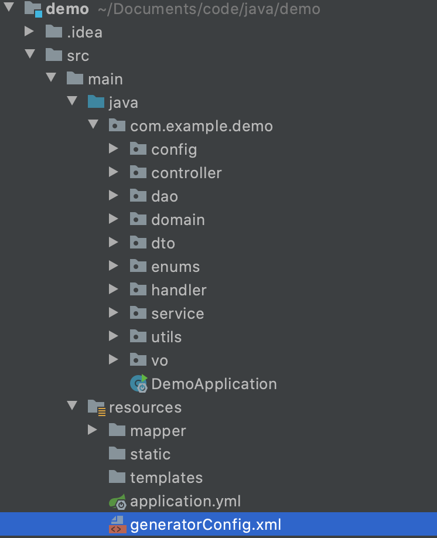
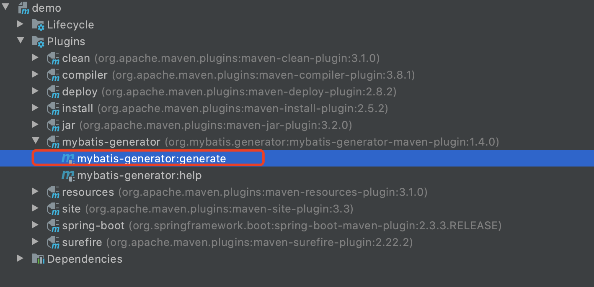

## springboot + mybatis-generator

---
    
    主要记录，如果使用 springboot + mybatis-generator 自动生成代码
    
    环境信息：
    Mac 环境
    java version: 1.8
    springboot version: 2.5.2
    mysql version： 5.7.30


### 1.新建项目

新建一个 springboot 项目, 项目名为 ： `demo`, 路径为：`com.example.demo`，


然后，在 `pom.xml` 文件中， 导入 `mysql` 依赖：

        <dependency>
            <groupId>mysql</groupId>
            <artifactId>mysql-connector-java</artifactId>
            <scope>runtime</scope>
        </dependency>
        
        
        
并增加 `mybatis-generator` plugin：

    <build>
        <plugins>
            <plugin>
                <groupId>org.springframework.boot</groupId>
                <artifactId>spring-boot-maven-plugin</artifactId>
            </plugin>
            <plugin>
                <groupId>org.mybatis.generator</groupId>
                <artifactId>mybatis-generator-maven-plugin</artifactId>
                <version>1.4.0</version>
            </plugin>
        </plugins>
    </build>


在 `com.example.demo` 路径下，创建 `domain` 、 `dao` 包。

在 `resources` 下，创建 `mapper` 文件夹。

目录信息如下所示，只需关注本次新增文件即可：




### 2.配置 mysql


可以提前创建好数据库：`java` :

```sql
    create database if not exists `java`;
```

然后建表：

```sql
    create table user
    (
        id   int auto_increment
            primary key,
        name varchar(20)  not null comment '姓名',
        age  int unsigned not null comment '年龄'
    );
```
    
删除 `application.properties` , 创建 `application.yml`，然后配置 `mybatis` 相关：

数据库信息根据个人情况填写配置，需要提前有一个 `mysql` 服务。

```yaml
spring:
  application:
    name: demo
  # dataSource
  datasource:
    url: jdbc:mysql://localhost:3306/java?charsetEncoding=utf-8&useSSL=false
    driver-class-name: com.mysql.cj.jdbc.Driver
    username: root
    password: 123456

# mybatis
mybatis:
  mapper-locations: classpath:mapper/*.xml
  type-aliases-package: com.example.demo.entity
```


### 2.配置 mybatis-generator

*该步为最重要一步*


在 `resources` 下新建 `generatorConfig.xml`：

```xml
<?xml version="1.0" encoding="UTF-8"?>
<!DOCTYPE generatorConfiguration
        PUBLIC "-//mybatis.org//DTD MyBatis Generator Configuration 1.0//EN"
        "http://mybatis.org/dtd/mybatis-generator-config_1_0.dtd">

<generatorConfiguration>
    <!-- 配置mysql 驱动jar包路径.用了绝对路径, 这里根据自己情况，自行修改 -->
    <classPathEntry location="your/path/.m2/repository/mysql/mysql-connector-java/5.1.46/mysql-connector-java-5.1.46.jar" />

    <context id="mysql_tables" targetRuntime="MyBatis3">
        <!-- 防止生成的代码中有很多注释，加入下面的配置控制 -->
        <commentGenerator>
            <property name="suppressAllComments" value="true" />
            <property name="suppressDate" value="true" />
        </commentGenerator>

        <!-- 数据库连接 -->
        <jdbcConnection driverClass="com.mysql.jdbc.Driver"
                        connectionURL="jdbc:mysql://127.0.0.1:3306/java?charsetEncoding=utf-8;useSSL=false"
                        userId="root"
                        password="123456">
        </jdbcConnection>

        <javaTypeResolver >
            <property name="forceBigDecimals" value="false" />
        </javaTypeResolver>

        <!-- entity -->
        <javaModelGenerator targetPackage="com.example.demo.domain" targetProject="src/main/java">
            <property name="enableSubPackages" value="true" />
            <property name="trimStrings" value="true" />
        </javaModelGenerator>

        <!-- mapper -->
        <sqlMapGenerator targetPackage="mapper" targetProject="src/main/resources">
            <property name="enableSubPackages" value="true" />
        </sqlMapGenerator>

        <!-- dao -->
        <javaClientGenerator type="XMLMAPPER" targetPackage="com.example.demo.dao" targetProject="src/main/java">
            <property name="enableSubPackages" value="true" />
        </javaClientGenerator>

        <!-- 数据表进行生成操作 schema:相当于库名; tableName:表名; domainObjectName:对应的DO -->
        <table schema="java" tableName="user" domainObjectName="User"
               enableCountByExample="false" enableUpdateByExample="false"
               enableDeleteByExample="false" enableSelectByExample="false"
               selectByExampleQueryId="false">
        </table>

    </context>
</generatorConfiguration>
```

然后，在 `idea` 右侧点击 `maven` 中的 `mybatis-generator:generate`，开始根据配置自动生成代码。

会发现对应的 `dao`、`domain`、`mapper` 中已经自动生成代码。

如果需要新增其他表数据，只需要修改 `generatorConfig.xml` 最后的 `<table>` 数据。

点击位置如下：




---

以上。


