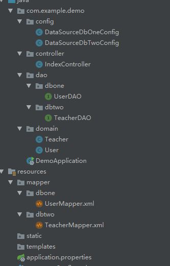

## springboot mybatis two  dataSource

---
### 0.说明

springboot + mybatis  实现多数据源

数据库和表：

    dbone
        |
        |______user
        
        
    dbtwo
        |
        |______teacher
        
        
DDL:
```sql
create table user
(
  id   int auto_increment
    primary key,
  name varchar(255) default '' not null
  comment '作者',
  age  int default '0'         null
  comment '年龄'
);


create table teacher
(
  id   int auto_increment
    primary key,
  name varchar(255) default '' not null,
  age  int default '0'         null
  comment '年龄'
);
```


分别从两个表中插入测试数据。


### 1. 新建项目

`pom.xml`:


```xml
    <dependencies>
        <dependency>
            <groupId>org.springframework.boot</groupId>
            <artifactId>spring-boot-starter-web</artifactId>
        </dependency>
        <dependency>
            <groupId>org.mybatis.spring.boot</groupId>
            <artifactId>mybatis-spring-boot-starter</artifactId>
            <version>1.3.2</version>
        </dependency>

        <dependency>
            <groupId>mysql</groupId>
            <artifactId>mysql-connector-java</artifactId>
            <scope>runtime</scope>
        </dependency>
        <dependency>
            <groupId>org.projectlombok</groupId>
            <artifactId>lombok</artifactId>
            <optional>true</optional>
        </dependency>
        <dependency>
            <groupId>org.springframework.boot</groupId>
            <artifactId>spring-boot-starter-test</artifactId>
            <scope>test</scope>
        </dependency>
    </dependencies>
```


目录结构如下：




项目比较简单，没有`service`层


### 2.文件详解


配置文件`application.properties`:


```properties
# log
logging.level.com.example.demo=debug
logging.file=./logs/demo.log


# dataSource
spring.datasource.dbone.driver-class-name=com.mysql.jdbc.Driver
spring.datasource.dbone.jdbc-url=jdbc:mysql://localhost/dbone?charsetEncoding=utf-8&useSSL=false
spring.datasource.dbone.username=root
spring.datasource.dbone.password=123456

spring.datasource.dbtwo.driver-class-name=com.mysql.jdbc.Driver
spring.datasource.dbtwo.jdbc-url=jdbc:mysql://localhost/dbtwo?charsetEncoding=utf-8&useSSL=false
spring.datasource.dbtwo.username=root
spring.datasource.dbtwo.password=123456


# mybatis
mybatis.mapper-locations=classpath:mapper/*.xml
mybatis.type-aliases-package=com.example.demo.domain
```


**数据库配置类：**


`DataSourceDbOneConfig.java`:

```java
package com.example.demo.config;


import org.apache.ibatis.session.SqlSessionFactory;
import org.mybatis.spring.SqlSessionFactoryBean;
import org.mybatis.spring.SqlSessionTemplate;
import org.mybatis.spring.annotation.MapperScan;
import org.springframework.beans.factory.annotation.Qualifier;
import org.springframework.boot.context.properties.ConfigurationProperties;
import org.springframework.boot.jdbc.DataSourceBuilder;
import org.springframework.context.annotation.Bean;
import org.springframework.context.annotation.Configuration;
import org.springframework.context.annotation.Primary;
import org.springframework.core.io.support.PathMatchingResourcePatternResolver;
import org.springframework.jdbc.datasource.DataSourceTransactionManager;

import javax.sql.DataSource;

@Configuration
@MapperScan(basePackages = "com.example.demo.dao.dbone", sqlSessionTemplateRef = "dbOneSqlSessionTemplate")
public class DataSourceDbOneConfig {

    @Bean(name = "dbOneDataSource")
    @Primary
    @ConfigurationProperties(prefix = "spring.datasource.dbone")
    public DataSource dbOneDataSource(){
        return DataSourceBuilder.create().build();
    }

    @Bean(name = "dbOneSqlSessionFactory")
    @Primary
    public SqlSessionFactory dbOneSqlSessionFactory(@Qualifier("dbOneDataSource") DataSource dataSource) throws Exception {
        SqlSessionFactoryBean bean = new SqlSessionFactoryBean();
        bean.setDataSource(dataSource);
        bean.setMapperLocations(new PathMatchingResourcePatternResolver().getResources("classpath:mapper/dbone/*.xml"));
        return bean.getObject();
    }

    @Bean(name = "dbOneTransactionManager")
    @Primary
    public DataSourceTransactionManager dbOneTransactionManager(@Qualifier("dbOneDataSource") DataSource dataSource){
        return new DataSourceTransactionManager(dataSource);
    }


    @Bean(name = "dbOneSqlSessionTemplate")
    @Primary
    public SqlSessionTemplate dbOneSqlSessionTemplate(@Qualifier("dbOneSqlSessionFactory") SqlSessionFactory sqlSessionFactory){
        return new SqlSessionTemplate(sqlSessionFactory);
    }
}

```


`DataSourceDbTwoConfig.java`:


```java
package com.example.demo.config;

import org.apache.ibatis.session.SqlSessionFactory;
import org.mybatis.spring.SqlSessionFactoryBean;
import org.mybatis.spring.SqlSessionTemplate;
import org.mybatis.spring.annotation.MapperScan;
import org.springframework.beans.factory.annotation.Qualifier;
import org.springframework.boot.context.properties.ConfigurationProperties;
import org.springframework.boot.jdbc.DataSourceBuilder;
import org.springframework.context.annotation.Bean;
import org.springframework.context.annotation.Configuration;
import org.springframework.context.annotation.Primary;
import org.springframework.core.io.support.PathMatchingResourcePatternResolver;
import org.springframework.jdbc.datasource.DataSourceTransactionManager;

import javax.sql.DataSource;


@Configuration
@MapperScan(basePackages = "com.example.demo.dao.dbtwo", sqlSessionTemplateRef = "dbTwoSqlSessionTemplate")
public class DataSourceDbTwoConfig {


    @Bean(name = "dbTwoDataSource")
    @ConfigurationProperties(prefix = "spring.datasource.dbtwo")
    public DataSource dbOneDataSource(){
        return DataSourceBuilder.create().build();
    }

    @Bean(name = "dbTwoSqlSessionFactory")
    public SqlSessionFactory dbTwoSqlSessionFactory(@Qualifier("dbTwoDataSource") DataSource dataSource) throws Exception {
        SqlSessionFactoryBean bean = new SqlSessionFactoryBean();
        bean.setDataSource(dataSource);
        bean.setMapperLocations(new PathMatchingResourcePatternResolver().getResources("classpath:mapper/dbtwo/*.xml"));
        return bean.getObject();
    }

    @Bean(name = "dbTwoTransactionManager")
    public DataSourceTransactionManager dbTwoTransactionManager(@Qualifier("dbTwoDataSource") DataSource dataSource){
        return new DataSourceTransactionManager(dataSource);
    }

    @Bean(name = "dbTwoSqlSessionTemplate")
    @Primary
    public SqlSessionTemplate dbTwoSqlSessionTemplate(@Qualifier("dbTwoSqlSessionFactory") SqlSessionFactory sqlSessionFactory){
        return new SqlSessionTemplate(sqlSessionFactory);
    }
}
```


**实体类相关：**


`Teacher.java`:


```java
package com.example.demo.domain;

import lombok.Data;
@Data
public class Teacher {

    private Integer id;
    private String name;
    private Integer age;
}

```


`User.java`:


```java
package com.example.demo.domain;

import lombok.Data;


@Data
public class User {

    private Integer id;
    private String name;
    private Integer age;
}
```


**DAO层:**

`UserDAO.java`:

```java
package com.example.demo.dao.dbone;

import com.example.demo.domain.User;
import org.springframework.stereotype.Repository;


@Repository
public interface UserDAO {

    User selectByPrimaryKey(Integer id);

}
```

`TeacherDAO.java`:


```java
package com.example.demo.dao.dbtwo;

import com.example.demo.domain.Teacher;
import org.springframework.stereotype.Repository;


@Repository
public interface TeacherDAO {

    Teacher selectByPrimaryKey(Integer id);
}

```


**xml mapper文件**


`UserMapper.xml`:


```xml
<?xml version="1.0" encoding="UTF-8" ?>
<!DOCTYPE mapper PUBLIC "-//mybatis.org//DTD Mapper 3.0//EN" "http://mybatis.org/dtd/mybatis-3-mapper.dtd" >
<mapper namespace="com.example.demo.dao.dbone.UserDAO" >
  <resultMap id="BaseResultMap" type="com.example.demo.domain.User" >
    <id column="id" property="id" jdbcType="INTEGER" />
    <result column="name" property="name" jdbcType="VARCHAR" />
    <result column="age" property="age" jdbcType="INTEGER" />
  </resultMap>
  <select id="selectByPrimaryKey" resultMap="BaseResultMap" parameterType="java.lang.Integer" >
    select id, name, age
    from user
    where id = #{id,jdbcType=INTEGER}
  </select>
</mapper>
```


`TeacherMapper.xml`:


```xml
<?xml version="1.0" encoding="UTF-8" ?>
<!DOCTYPE mapper PUBLIC "-//mybatis.org//DTD Mapper 3.0//EN" "http://mybatis.org/dtd/mybatis-3-mapper.dtd" >
<mapper namespace="com.example.demo.dao.dbtwo.TeacherDAO" >
    <resultMap id="BaseResultMap" type="com.example.demo.domain.Teacher" >
        <id column="id" property="id" jdbcType="INTEGER" />
        <result column="name" property="name" jdbcType="VARCHAR" />
        <result column="age" property="age" jdbcType="INTEGER" />
    </resultMap>
    <select id="selectByPrimaryKey" resultMap="BaseResultMap" parameterType="java.lang.Integer" >
    select id, name, age
    from teacher
    where id = #{id,jdbcType=INTEGER}
  </select>
</mapper>
```


启动类，需要加上`@MapperScan`注解


`DemoApplication.java`:


```java
package com.example.demo;

import org.mybatis.spring.annotation.MapperScan;
import org.springframework.boot.SpringApplication;
import org.springframework.boot.autoconfigure.SpringBootApplication;

@SpringBootApplication
@MapperScan("om.example.demo.dao")
public class DemoApplication {

    public static void main(String[] args) {
        SpringApplication.run(DemoApplication.class, args);
    }

}

```


最后，加一个`IndexController` 验证


```java
package com.example.demo.controller;

import com.example.demo.dao.dbone.UserDAO;
import com.example.demo.dao.dbtwo.TeacherDAO;
import com.example.demo.domain.Teacher;
import com.example.demo.domain.User;
import lombok.extern.slf4j.Slf4j;
import org.springframework.beans.factory.annotation.Autowired;
import org.springframework.web.bind.annotation.GetMapping;
import org.springframework.web.bind.annotation.PathVariable;
import org.springframework.web.bind.annotation.RestController;


@Slf4j
@RestController
public class IndexController {

    @Autowired
    private UserDAO userDAO;

    @Autowired
    private TeacherDAO teacherDAO;

    @GetMapping("/user/{id}")
    public User userFindById(@PathVariable Integer id){
        return userDAO.selectByPrimaryKey(id);
    }

    @GetMapping("/teacher/{id}")
    public Teacher teacherFindById(@PathVariable Integer id){
        return teacherDAO.selectByPrimaryKey(id);
    }
}

```


分别调用接口：

        http://localhost:8080/user/1
        http://localhost:8080/teacher/1


接口正常返回，查看日志：

```log
2019-01-14 16:07:06.746  INFO 9792 --- [nio-8080-exec-1] com.zaxxer.hikari.HikariDataSource       : HikariPool-1 - Starting...
2019-01-14 16:07:06.897  INFO 9792 --- [nio-8080-exec-1] com.zaxxer.hikari.HikariDataSource       : HikariPool-1 - Start completed.
2019-01-14 16:07:06.901 DEBUG 9792 --- [nio-8080-exec-1] c.e.d.d.d.UserDAO.selectByPrimaryKey     : ==>  Preparing: select id, name, age from user where id = ? 
2019-01-14 16:07:06.917 DEBUG 9792 --- [nio-8080-exec-1] c.e.d.d.d.UserDAO.selectByPrimaryKey     : ==> Parameters: 1(Integer)
2019-01-14 16:07:06.934 DEBUG 9792 --- [nio-8080-exec-1] c.e.d.d.d.UserDAO.selectByPrimaryKey     : <==      Total: 1
2019-01-14 16:07:12.878  INFO 9792 --- [nio-8080-exec-2] com.zaxxer.hikari.HikariDataSource       : HikariPool-2 - Starting...
2019-01-14 16:07:12.886  INFO 9792 --- [nio-8080-exec-2] com.zaxxer.hikari.HikariDataSource       : HikariPool-2 - Start completed.
2019-01-14 16:07:12.887 DEBUG 9792 --- [nio-8080-exec-2] c.e.d.d.d.TeacherDAO.selectByPrimaryKey  : ==>  Preparing: select id, name, age from teacher where id = ? 
2019-01-14 16:07:12.887 DEBUG 9792 --- [nio-8080-exec-2] c.e.d.d.d.TeacherDAO.selectByPrimaryKey  : ==> Parameters: 1(Integer)
2019-01-14 16:07:12.893 DEBUG 9792 --- [nio-8080-exec-2] c.e.d.d.d.TeacherDAO.selectByPrimaryKey  : <==      Total: 1
2019-01-14 16:27:02.453  WARN 9792 --- [l-1 housekeeper] com.zaxxer.hikari.pool.HikariPool        : HikariPool-1 - Thread starvation or clock leap detected (housekeeper delta=55s407ms687µs174ns).
2019-01-14 16:27:08.428  WARN 9792 --- [l-2 housekeeper] com.zaxxer.hikari.pool.HikariPool        : HikariPool-2 - Thread starvation or clock leap detected (housekeeper delta=55s407ms943µs743ns).
```


说明正常。


---


以上。