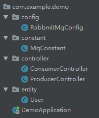

## springboot + rabbmitmq

---


### 1.安装erlang
rabbmitmq依赖于erlang语言，需要先安装erlang环境

    下载地址：http://www.erlang.org/downloads
 
**注意**  版本不能过高，推荐`19.3`

下载安装完成后，添加到path变量，然后cmd命令行执行 `erl`   测试是否成功


### 2.安装rabbmitmq

    下载地址：http://www.rabbitmq.com/download.html
   
安装完成后，在`rabbmitmq/sbin`  目录下执行 `rabbitmq-plugins enable rabbitmq_management`  安装插件

插件安装成功后，登录 [http://localhost:15672](http://localhost:15672)

    账户：guest   
    密码：guest

### 3.创建springboot项目

`pom.xml`依赖如下：
```xml
    <dependencies>
        <!--mq-->
        <dependency>
            <groupId>org.springframework.boot</groupId>
            <artifactId>spring-boot-starter-amqp</artifactId>
        </dependency>
        
        <!--web-->
        <dependency>
            <groupId>org.springframework.boot</groupId>
            <artifactId>spring-boot-starter-web</artifactId>
        </dependency>
        
        <!--lombok-->
        <dependency>
            <groupId>org.projectlombok</groupId>
            <artifactId>lombok</artifactId>
            <version>1.16.18</version>
            <scope>provided</scope>
        </dependency>
        
        <dependency>
            <groupId>org.springframework.boot</groupId>
            <artifactId>spring-boot-starter-test</artifactId>
            <scope>test</scope>
        </dependency>
    </dependencies>
```

目录结构如下：



项目要创建两个mq,一个是String类型，一个是实体类类型

mq配置代码：

RabbmitMqConfig.java:

```java
@Configuration
public class RabbmitMqConfig {

    @Bean
    public Queue text() {
        return new Queue(MqConstant.QUEUE_TEXT);
    }

    @Bean
    public Queue user() {
        return new Queue(MqConstant.QUEUE_USER);
    }
}
```

mq名称

MqConstant.java:

```java
public class MqConstant {
    /**
     * 文本格式mq
     */
    public static final String QUEUE_TEXT = "text";

    /**
     * 实体类格式mq
     */
    public static final String QUEUE_USER = "user";
}
```

生产者

ProducerController.java:

```java
@RestController
public class ProducerController {


    @Autowired
    private AmqpTemplate amqpTemplate;

    @RequestMapping("/text")
    public String send() {
        String context = "hello";
        amqpTemplate.convertAndSend(MqConstant.QUEUE_TEXT, context);
        return context;
    }

    @RequestMapping("/user")
    public User sendUser() {
        User user = new User();
        user.setAge(10);
        user.setName("test");
        amqpTemplate.convertAndSend(MqConstant.QUEUE_USER, user);
        return user;
    }
}
```

消费者

ConsumerController.java:

```java
@Slf4j
@Component
public class ConsumerController {

    
    @RabbitListener(queues = MqConstant.QUEUE_TEXT)
    @RabbitHandler
    public void receiver(String msg){
        log.debug(msg);
    }


    @RabbitListener(queues = MqConstant.QUEUE_USER)
    @RabbitHandler
    public void receiverUser(User user){
        log.debug(user.toString());
    }
}


```

实体类，需要序列化，并复写toString()

User.java:

```java
@Data
public class User implements Serializable {
    private static final long serialVersionUID = 1L;

    private Integer age;
    private String name;
}
```


properties 配置：

```properties
# log
logging.level.com.example.demo=debug

# rabbmitmq
spring.rabbitmq.host=127.0.0.1
spring.rabbitmq.port=5672
spring.rabbitmq.username=guest
spring.rabbitmq.password=guest
```


做完以上操作，启动项目，然后分别请求

    http://localhost:8080/text
    http://localhost:8080/user

    
查看日志：

```log
2018-10-25 18:33:25.771  INFO 8784 --- [nio-8080-exec-1] o.a.c.c.C.[Tomcat].[localhost].[/]       : Initializing Spring FrameworkServlet 'dispatcherServlet'
2018-10-25 18:33:25.772  INFO 8784 --- [nio-8080-exec-1] o.s.web.servlet.DispatcherServlet        : FrameworkServlet 'dispatcherServlet': initialization started
2018-10-25 18:33:25.793  INFO 8784 --- [nio-8080-exec-1] o.s.web.servlet.DispatcherServlet        : FrameworkServlet 'dispatcherServlet': initialization completed in 21 ms
2018-10-25 18:33:25.883 DEBUG 8784 --- [cTaskExecutor-1] c.e.demo.controller.ConsumerController   : hello
2018-10-25 18:33:36.518 DEBUG 8784 --- [cTaskExecutor-1] c.e.demo.controller.ConsumerController   : User(age=10, name=test)
```


说明可以发送并接收mq。

---


以上。