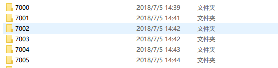
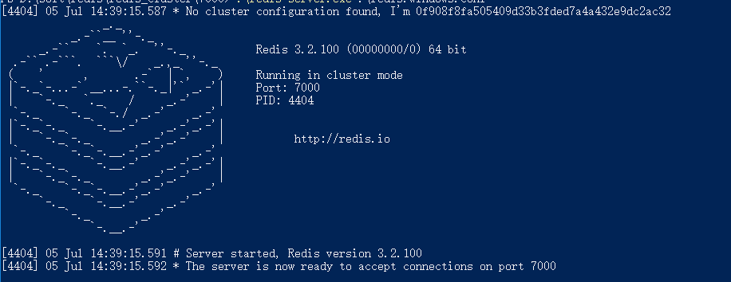
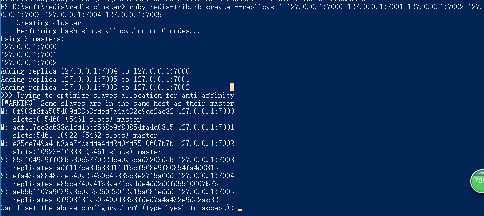

## springboot + redis_cluster

---


## 1.windows下搭建redis集群

*redis集群启动需要redis-trib.rb脚本，所以先需要配置ruby环境*

### 1)安装ruby环境


下载地址：[https://rubyinstaller.org/downloads/](https://rubyinstaller.org/downloads/)


安装后,添加到path环境，然后在命令行执行`ruby`命令，确认是否安装成功


    >ruby --version
    
    ruby 2.5
    
    >gem --version
    
    2.7.6


`ruby`安装`redis`扩展：
    
    gem install redis
    
### 2)下载安装redis

下载地址：[https://github.com/MicrosoftArchive/redis/releases](https://github.com/MicrosoftArchive/redis/releases)

下载安装后，创建集群

集群工作至少有三个节点，现配置三主三从，六个节点

创建六个文件夹，每个节点文件内保留 `redis-server`  和 `redis.windows.conf`:



打开`7000`文件夹下的`redis.windows.conf`：

按照如下方式修改：

```config
port  7000

bind 127.0.0.1

cluster-enabled yes

cluster-config-file nodes-7000.conf

cluster-node-timeout 15000

appendonly yes
```


其他文件夹依次按照上述配置，只需修改`port` 和 `cluster-config-file`

修改完成后，分别进入每个文件夹启动redis服务：
    
    >> redis-server.exe    redis.windows.conf


启动后，信息如下：




### 2)下载 redis-trib.rb


做完上述后，每个服务只是独立启动，需要作为集群互相通信

集群创建需要 `redis-trib.rb` ,  windows安装的redis不含这个文件，需要自主下载


下载地址：[https://raw.githubusercontent.com/antirez/redis/unstable/src/redis-trib.rb](https://raw.githubusercontent.com/antirez/redis/unstable/src/redis-trib.rb)

打开地址，复制代码内容，新建文件`redis-trib.rb`并保存，然后执行以下命令：

    >> ruby redis-trib.rb create --replicas 1 127.0.0.1:7000 127.0.0.1:7001 127.0.0.1:7002 127.0.0.1:7003 127.0.0.1:7004 127.0.0.1:7005
    

其中`1`表示创建`一主一从`节点，后面地址代表三个`master`和三个`slave`


如果一切正常，会看到以下内容：



然后输入`yes`并稍等，然后启动成功，集群创建完成

登录并试验:


```bash
redis-cli -c -p 7000

127.0.0.1:7000> set name test
-> Redirected to slot [5798] located at 127.0.0.1:7001
OK
127.0.0.1:7001> get name
"test"
```


## 2.springboot配置redis集群

新建项目，`pom.xml`：

```xml
    <dependencies>
        <dependency>
            <groupId>org.springframework.boot</groupId>
            <artifactId>spring-boot-starter-data-redis</artifactId>
        </dependency>
        <dependency>
            <groupId>org.springframework.boot</groupId>
            <artifactId>spring-boot-starter-web</artifactId>
        </dependency>
        <dependency>
            <groupId>org.projectlombok</groupId>
            <artifactId>lombok</artifactId>
            <version>1.16.18</version>
            <scope>provided</scope>
        </dependency>
        <dependency>
            <groupId>org.springframework.boot</groupId>
            <artifactId>spring-boot-starter-test</artifactId>
            <scope>test</scope>
        </dependency>
    </dependencies>
```


配置集群节点：

```properties
# log
logging.level.com.example.demo=debug

# redis_cluster
spring.redis.cluster.nodes=127.0.0.1:7000,127.0.0.1:7001,127.0.0.1:7002,127.0.0.1:7003,127.0.0.1:7004,127.0.0.1:7005
```


定义一个实体类：

RequestDTO.java


```java
@Data
public class RequestDTO {

    private String name;
}

```


测试set、get:


RedisController.java

```java
import com.example.demo.dto.RequestDTO;
import lombok.extern.slf4j.Slf4j;
import org.springframework.beans.factory.annotation.Autowired;
import org.springframework.data.redis.core.StringRedisTemplate;
import org.springframework.web.bind.annotation.*;


@Slf4j
@RestController
public class RedisController {

    @Autowired
    private StringRedisTemplate redisTemplate;

    @GetMapping("/redis")
    public String get(@RequestParam String key){
        String value = redisTemplate.opsForValue().get(key);
        log.debug("key:{},value:{}" ,key, value);
        return value;
    }

    @PostMapping("/redis")
    public RequestDTO  set(@RequestBody RequestDTO request){
        log.debug("key:name,value:{}" , request.getName());
        redisTemplate.opsForValue().set("name", request.getName());
        return request;
    }
}
```


发送post请求：

    http://localhost:8080/redis
    
    {
    	"name":"test"
    }
    
发送get请求：

    http://localhost:8080/redis?key=name
    

然后查看日志与返回：

```log
2018-10-29 17:07:43.618  INFO 9812 --- [nio-8080-exec-3] o.a.c.c.C.[Tomcat].[localhost].[/]       : Initializing Spring FrameworkServlet 'dispatcherServlet'
2018-10-29 17:07:43.618  INFO 9812 --- [nio-8080-exec-3] o.s.web.servlet.DispatcherServlet        : FrameworkServlet 'dispatcherServlet': initialization started
2018-10-29 17:07:43.633  INFO 9812 --- [nio-8080-exec-3] o.s.web.servlet.DispatcherServlet        : FrameworkServlet 'dispatcherServlet': initialization completed in 15 ms
2018-10-29 17:07:43.692 DEBUG 9812 --- [nio-8080-exec-3] c.e.demo.controller.RedisController      : key:name,value:test
2018-10-29 17:07:43.766  INFO 9812 --- [nio-8080-exec-3] io.lettuce.core.EpollProvider            : Starting without optional epoll library
2018-10-29 17:07:43.767  INFO 9812 --- [nio-8080-exec-3] io.lettuce.core.KqueueProvider           : Starting without optional kqueue library
2018-10-29 17:07:52.582 DEBUG 9812 --- [nio-8080-exec-8] c.e.demo.controller.RedisController      : key:name,value:test
```

说明配置成功。

---

以上