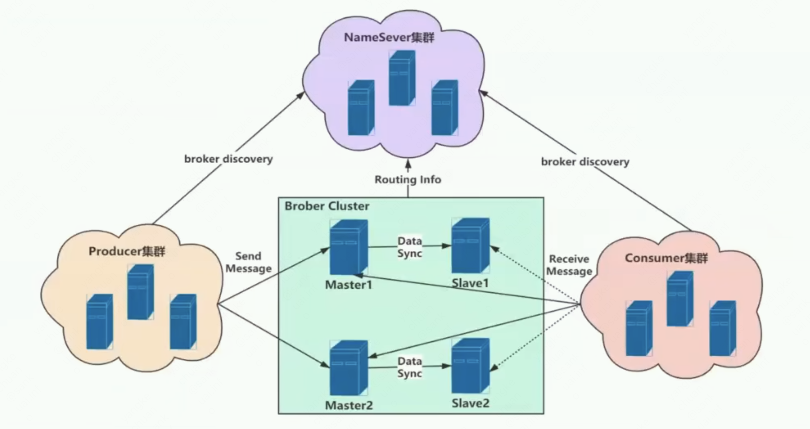
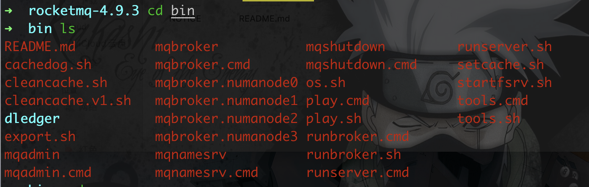
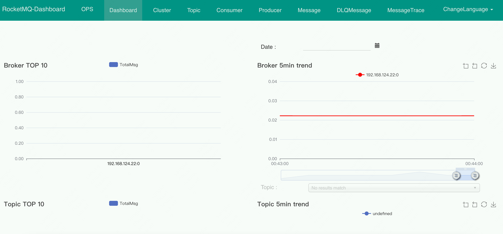

##  rocketmq 安装和启动

---

            环境：
            
            MAC 系统 10.15.6
            Java Version ：1.8.0_202
            rocketmq Version: 4.9.3
            node version: v16.15.1
            yarn version: 1.22.19
---


### 0.基本信息

- 参考视频：https://www.bilibili.com/video/BV1g3411V73X
- rocketmq 官网：https://rocketmq.apache.org/
- rocketmq github 指南：https://github.com/apache/rocketmq/tree/master/docs/cn


### 1.基本概念

rocketmq 角色：




#### 1.1 消息模型（Message Model）

RocketMQ主要由 Producer、Broker、Consumer 三部分组成，其中Producer 负责生产消息，Consumer 负责消费消息，Broker 负责存储消息。
Broker 在实际部署过程中对应一台服务器，每个 Broker 可以存储多个Topic的消息，每个Topic的消息也可以分片存储于不同的 Broker。
Message Queue 用于存储消息的物理地址，每个Topic中的消息地址存储于多个 Message Queue 中。
ConsumerGroup 由多个Consumer 实例构成。

#### 1.2 消息生产者（Producer）

负责生产消息，一般由业务系统负责生产消息。
一个消息生产者会把业务应用系统里产生的消息发送到broker服务器。
RocketMQ提供多种发送方式，同步发送、异步发送、顺序发送、单向发送。
同步和异步方式均需要Broker返回确认信息，单向发送不需要。

#### 1.3 消息消费者（Consumer）

负责消费消息，一般是后台系统负责异步消费。
一个消息消费者会从Broker服务器拉取消息、并将其提供给应用程序。
从用户应用的角度而言提供了两种消费形式：拉取式消费、推动式消费。


#### 1.4 主题（Topic）

表示一类消息的集合，每个主题包含若干条消息，每条消息只能属于一个主题，是RocketMQ进行消息订阅的基本单位。


#### 1.5 代理服务器（Broker Server）

消息中转角色，负责存储消息、转发消息。
代理服务器在RocketMQ系统中负责接收从生产者发送来的消息并存储、同时为消费者的拉取请求作准备。
代理服务器也存储消息相关的元数据，包括消费者组、消费进度偏移和主题和队列消息等。


#### 1.6 名字服务（Name Server）


名称服务充当路由消息的提供者。
生产者或消费者能够通过名字服务查找各主题相应的Broker IP列表。
多个Namesrv实例组成集群，但相互独立，没有信息交换。


#### 1.7 拉取式消费（Pull Consumer）

Consumer消费的一种类型，应用通常主动调用Consumer的拉消息方法从Broker服务器拉消息、主动权由应用控制。
一旦获取了批量消息，应用就会启动消费过程。


#### 1.8 推动式消费（Push Consumer）

Consumer消费的一种类型，该模式下Broker收到数据后会主动推送给消费端，该消费模式一般实时性较高。


#### 1.9 生产者组（Producer Group）

同一类Producer的集合，这类Producer发送同一类消息且发送逻辑一致。
如果发送的是事务消息且原始生产者在发送之后崩溃，则Broker服务器会联系同一生产者组的其他生产者实例以提交或回溯消费。


#### 1.10 消费者组（Consumer Group）


同一类Consumer的集合，这类Consumer通常消费同一类消息且消费逻辑一致。
消费者组使得在消息消费方面，实现负载均衡和容错的目标变得非常容易。
要注意的是，消费者组的消费者实例必须订阅完全相同的Topic。
RocketMQ 支持两种消息模式：集群消费（Clustering）和广播消费（Broadcasting）。


#### 1.11 集群消费（Clustering）

集群消费模式下,相同Consumer Group的每个Consumer实例平均分摊消息。


#### 1.12 广播消费（Broadcasting）

广播消费模式下，相同Consumer Group的每个Consumer实例都接收全量的消息。


#### 1.13 普通顺序消息（Normal Ordered Message）

普通顺序消费模式下，消费者通过同一个消息队列（ Topic 分区，称作 Message Queue） 收到的消息是有顺序的，
不同消息队列收到的消息则可能是无顺序的。


#### 1.14 严格顺序消息（Strictly Ordered Message）

严格顺序消息模式下，消费者收到的所有消息均是有顺序的。


#### 1.15 消息（Message）

消息系统所传输信息的物理载体，生产和消费数据的最小单位，每条消息必须属于一个主题。
RocketMQ中每个消息拥有唯一的Message ID，且可以携带具有业务标识的Key。
系统提供了通过Message ID和Key查询消息的功能。


#### 1.16 标签（Tag）

为消息设置的标志，用于同一主题下区分不同类型的消息。
来自同一业务单元的消息，可以根据不同业务目的在同一主题下设置不同标签。
标签能够有效地保持代码的清晰度和连贯性，并优化RocketMQ提供的查询系统。
消费者可以根据Tag实现对不同子主题的不同消费逻辑，实现更好的扩展性。


### 2.下载

- 下载地址1：https://rocketmq.apache.org/release_notes/release-notes-4.9.3/
- 下载地址2：https://github.com/apache/rocketmq/releases/tag/rocketmq-all-4.9.3


可以下载 `source` 文件，然后本地构建使用，也可以直接下载 `bin` 文件，直接使用。


### 3.启动


到 `bin` 目录下，可以看到相关可执行文件





#### 3.1 修改配置文件
首先，修改启动的配置文件，因为默认启动时，占用内存过大，本地 `demo` 运行，可以调小一些。

修改 `mqnamesrv`:

路径地址： `pathto/rocketmq-4.9.3/bin/runserver.sh` ，找到类似 `JAVA_OPT="${JAVA_OPT} -server -Xms512m -Xmx512m -Xmn512m -XX:Metaspace    Size=128m -XX:MaxMetaspaceSize=320m"` 的配置，然后调小内存占用。


再修改 `mqbroker`:

路径地址： `pathto/rocketmq-4.9.3/bin/runbroker.sh` ，找到类似 `JAVA_OPT="${JAVA_OPT} -server -Xms512m -Xmx512m"`的配置，然后调小内存占用。


#### 3.2 启动服务

先启动 `mqnamesrv`:

```
➜  bin ./mqnamesrv
Create RAMDisk /Volumes/RAMDisk for gc logging on Darwin OS.
Java HotSpot(TM) 64-Bit Server VM warning: Using the DefNew young collector with the CMS collector is deprecated and will likely be removed in a future release
Java HotSpot(TM) 64-Bit Server VM warning: UseCMSCompactAtFullCollection is deprecated and will likely be removed in a future release.
Java HotSpot(TM) 64-Bit Server VM warning: MaxNewSize (524288k) is equal to or greater than the entire heap (524288k).  A new max generation size of 524224k will be used.
The Name Server boot success. serializeType=JSON
```


再启动 `broker`：

```
➜  bin ./mqbroker -n 127.0.0.1:9876 autoCreateTopicEnable=true
The broker[192.168.124.22, 192.168.124.22:10911] boot success. serializeType=JSON and name server is 127.0.0.1:9876
```


此时服务已经正常启动，但是不方便查看，于是，可以通过 `dashboard` 查看。


#### 3.3 dashboard


`dashboard` 是 `rocketmq` 的控制台，但是不在主项目里面，需要单独下载使用。

下载地址：https://github.com/apache/rocketmq-dashboard


下载到本地后，执行构建，并启动：

**注意: 本地构建时，需要有 node 环境，版本大于 v16。 yarn 版本大于 v1.22**

```shell
mvn clean package -Dmaven.test.skip=true
java -jar target/rocketmq-dashboard-1.0.1-SNAPSHOT.jar
```

如果没有报错，则启动正常。然后访问地址：


        http://localhost:8080


可以看到以下内容，说明控制台启动正常。




---

以上。


