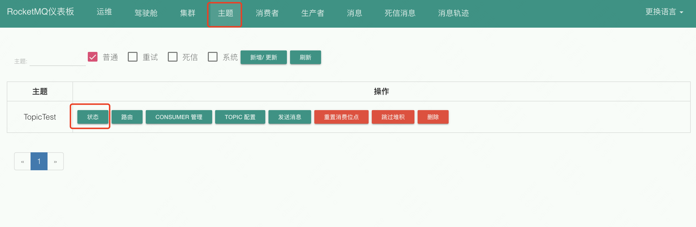
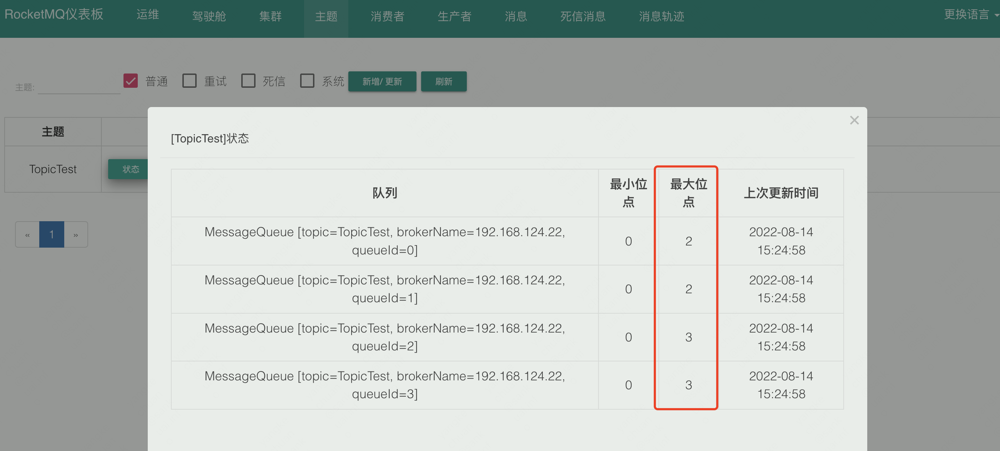
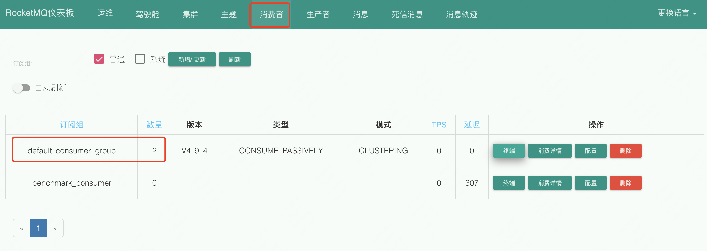

## rocketmq java client 发送、消费消息

---

            环境：
            
            MAC 系统 10.15.6
            Java Version ：1.8.0_202
            rocketmq Version: 4.9.3
            rocketmq client Version:4.9.4
---


### 0.创建项目


首先，创建一个 `maven` 项目，导入`rocketmq-client`:

```
        <dependency>
            <groupId>org.apache.rocketmq</groupId>
            <artifactId>rocketmq-client</artifactId>
            <version>4.9.4</version>
        </dependency>
```

同时，在本地启动 `mqnamesrv` 和 `broker`，并启动 `dashboard`。


### 1.发送消息

#### 1.1 发送同步消息

同步消息，是指消息发送后，需要等待返回结果后，然后再发送下一条，相当于顺序执行，没有并发。

代码如下：
```java
package example.rocketmq;

import org.apache.rocketmq.client.exception.MQClientException;
import org.apache.rocketmq.client.producer.DefaultMQProducer;
import org.apache.rocketmq.client.producer.SendResult;
import org.apache.rocketmq.common.message.Message;

import java.nio.charset.StandardCharsets;

public class Producer {

    public static void main(String[] args) throws MQClientException{

        /*
         * 发送同步消息
         */
        DefaultMQProducer producer = new DefaultMQProducer("defaultProducer");
        // 配置 nameServer 地址，rocketmq 官方样例中没有，但是这里需要显示配置地址，否则报错
        producer.setNamesrvAddr("127.0.0.1:9876");
        producer.start();

        // 循环发送十条
        for (int i = 0; i < 10; i++) {
            Message msg = new Message("TopicTest",
                    "TagA",
                    "testKey",
                    "Hello world".getBytes(StandardCharsets.UTF_8));

            try {
                // 发送消息
                SendResult result = producer.send(msg);
                System.out.printf("%s%n", result);

            } catch (Exception e) {
                throw new RuntimeException(e);
            }
        }
        producer.shutdown();

    }
}

```

执行以上代码，然后查看输出结果：

```
endResult [sendStatus=SEND_OK, msgId=7F000001217718B4AAC2464181790000, offsetMsgId=C0A87C1600002A9F00000000CD491ED4, messageQueue=MessageQueue [topic=TopicTest, brokerName=192.168.124.22, queueId=2], queueOffset=0]
SendResult [sendStatus=SEND_OK, msgId=7F000001217718B4AAC2464181840001, offsetMsgId=C0A87C1600002A9F00000000CD491F9B, messageQueue=MessageQueue [topic=TopicTest, brokerName=192.168.124.22, queueId=3], queueOffset=0]
SendResult [sendStatus=SEND_OK, msgId=7F000001217718B4AAC2464181870002, offsetMsgId=C0A87C1600002A9F00000000CD492062, messageQueue=MessageQueue [topic=TopicTest, brokerName=192.168.124.22, queueId=0], queueOffset=0]
SendResult [sendStatus=SEND_OK, msgId=7F000001217718B4AAC24641818A0003, offsetMsgId=C0A87C1600002A9F00000000CD492129, messageQueue=MessageQueue [topic=TopicTest, brokerName=192.168.124.22, queueId=1], queueOffset=0]
SendResult [sendStatus=SEND_OK, msgId=7F000001217718B4AAC24641818D0004, offsetMsgId=C0A87C1600002A9F00000000CD4921F0, messageQueue=MessageQueue [topic=TopicTest, brokerName=192.168.124.22, queueId=2], queueOffset=1]
SendResult [sendStatus=SEND_OK, msgId=7F000001217718B4AAC2464181900005, offsetMsgId=C0A87C1600002A9F00000000CD4922B7, messageQueue=MessageQueue [topic=TopicTest, brokerName=192.168.124.22, queueId=3], queueOffset=1]
SendResult [sendStatus=SEND_OK, msgId=7F000001217718B4AAC2464181930006, offsetMsgId=C0A87C1600002A9F00000000CD49237E, messageQueue=MessageQueue [topic=TopicTest, brokerName=192.168.124.22, queueId=0], queueOffset=1]
SendResult [sendStatus=SEND_OK, msgId=7F000001217718B4AAC2464181970007, offsetMsgId=C0A87C1600002A9F00000000CD492445, messageQueue=MessageQueue [topic=TopicTest, brokerName=192.168.124.22, queueId=1], queueOffset=1]
SendResult [sendStatus=SEND_OK, msgId=7F000001217718B4AAC24641819A0008, offsetMsgId=C0A87C1600002A9F00000000CD49250C, messageQueue=MessageQueue [topic=TopicTest, brokerName=192.168.124.22, queueId=2], queueOffset=2]
SendResult [sendStatus=SEND_OK, msgId=7F000001217718B4AAC24641819C0009, offsetMsgId=C0A87C1600002A9F00000000CD4925D3, messageQueue=MessageQueue [topic=TopicTest, brokerName=192.168.124.22, queueId=3], queueOffset=2]
2022-08-14 15:24:58.156 [NettyClientSelector_1] INFO  RocketmqRemoting [Slf4jLoggerFactory.java : 95] - closeChannel: close the connection to remote address[192.168.124.22:10911] result: true
2022-08-14 15:24:58.161 [NettyClientSelector_1] INFO  RocketmqRemoting [Slf4jLoggerFactory.java : 95] - closeChannel: close the connection to remote address[127.0.0.1:9876] result: true
```

通过日志信息，可以看到，消息发送正常。同时，可以在 `dashboard` 查看：






可以看到，消息发送成功，`TopicTest` topic 创建四个队列处理，当前一共有十条消息。


#### 1.2 发送异步消息


发送异步消息，相当于发送请求后，不需要等待返回，就可以继续发送下一条消息。具体返回通过回调函数异步处理。

代码如下：

```java
package example.rocketmq;

import org.apache.rocketmq.client.exception.MQClientException;
import org.apache.rocketmq.client.producer.DefaultMQProducer;
import org.apache.rocketmq.client.producer.SendCallback;
import org.apache.rocketmq.client.producer.SendResult;
import org.apache.rocketmq.common.message.Message;
import org.apache.rocketmq.remoting.exception.RemotingException;
import java.nio.charset.StandardCharsets;
import java.util.concurrent.TimeUnit;

/**
 * 生产者 -- 异步发送
 */
public class AsyncProducer {

    public static void main(String[] args) throws MQClientException, RemotingException, InterruptedException {

        // 实例化生产者 producer
        DefaultMQProducer producer = new DefaultMQProducer("defaultProducer");
        // 配置 nameServer 地址
        producer.setNamesrvAddr("127.0.0.1:9876");
        // 启动 producer 实例
        producer.start();

        for (int i = 0; i < 10; i++) {

            // 创建消息
            Message msg = new Message("TopicTest",
                    "TagA",
                    "testKey",
                    "Hello world".getBytes(StandardCharsets.UTF_8));

            // sendCallback 设置回调
            final int index = i;
            producer.send(msg, new SendCallback() {
                @Override
                public void onSuccess(SendResult sendResult) {
                    System.out.printf("%s%n", msg);
                }

                @Override
                public void onException(Throwable throwable) {
                    System.out.printf("%-10d Exception %s %n", index, throwable);
                }
            });
        }

        TimeUnit.SECONDS.sleep(3);

        // 关闭生产者实例
        producer.shutdown();

    }
}
```

执行以上代码，输出日志如下：

```
Message{topic='TopicTest', flag=0, properties={KEYS=testKey, UNIQ_KEY=7F000001244418B4AAC2464FB63D0000, WAIT=true, TAGS=TagA}, body=[72, 101, 108, 108, 111, 32, 119, 111, 114, 108, 100], transactionId='null'}
Message{topic='TopicTest', flag=0, properties={KEYS=testKey, UNIQ_KEY=7F000001244418B4AAC2464FB6450005, WAIT=true, TAGS=TagA}, body=[72, 101, 108, 108, 111, 32, 119, 111, 114, 108, 100], transactionId='null'}
Message{topic='TopicTest', flag=0, properties={KEYS=testKey, UNIQ_KEY=7F000001244418B4AAC2464FB63D0001, WAIT=true, TAGS=TagA}, body=[72, 101, 108, 108, 111, 32, 119, 111, 114, 108, 100], transactionId='null'}
Message{topic='TopicTest', flag=0, properties={KEYS=testKey, UNIQ_KEY=7F000001244418B4AAC2464FB63F0003, WAIT=true, TAGS=TagA}, body=[72, 101, 108, 108, 111, 32, 119, 111, 114, 108, 100], transactionId='null'}
Message{topic='TopicTest', flag=0, properties={KEYS=testKey, UNIQ_KEY=7F000001244418B4AAC2464FB63D0002, WAIT=true, TAGS=TagA}, body=[72, 101, 108, 108, 111, 32, 119, 111, 114, 108, 100], transactionId='null'}
Message{topic='TopicTest', flag=0, properties={KEYS=testKey, UNIQ_KEY=7F000001244418B4AAC2464FB6430004, WAIT=true, TAGS=TagA}, body=[72, 101, 108, 108, 111, 32, 119, 111, 114, 108, 100], transactionId='null'}
Message{topic='TopicTest', flag=0, properties={KEYS=testKey, UNIQ_KEY=7F000001244418B4AAC2464FB6470007, WAIT=true, TAGS=TagA}, body=[72, 101, 108, 108, 111, 32, 119, 111, 114, 108, 100], transactionId='null'}
Message{topic='TopicTest', flag=0, properties={KEYS=testKey, UNIQ_KEY=7F000001244418B4AAC2464FB6470006, WAIT=true, TAGS=TagA}, body=[72, 101, 108, 108, 111, 32, 119, 111, 114, 108, 100], transactionId='null'}
Message{topic='TopicTest', flag=0, properties={KEYS=testKey, UNIQ_KEY=7F000001244418B4AAC2464FB64C0008, WAIT=true, TAGS=TagA}, body=[72, 101, 108, 108, 111, 32, 119, 111, 114, 108, 100], transactionId='null'}
Message{topic='TopicTest', flag=0, properties={KEYS=testKey, UNIQ_KEY=7F000001244418B4AAC2464FB6540009, WAIT=true, TAGS=TagA}, body=[72, 101, 108, 108, 111, 32, 119, 111, 114, 108, 100], transactionId='null'}
2022-08-14 15:40:31.757 [NettyClientSelector_1] INFO  RocketmqRemoting [Slf4jLoggerFactory.java : 95] - closeChannel: close the connection to remote address[192.168.124.22:10911] result: true
2022-08-14 15:40:31.766 [NettyClientSelector_1] INFO  RocketmqRemoting [Slf4jLoggerFactory.java : 95] - closeChannel: close the connection to remote address[127.0.0.1:9876] result: true

```


#### 1.3 发送单向消息


单向消息，是指只发送，没有任何返回结果，代码如下：


```java
package example.rocketmq;

import org.apache.rocketmq.client.exception.MQClientException;
import org.apache.rocketmq.client.producer.DefaultMQProducer;
import org.apache.rocketmq.common.message.Message;
import org.apache.rocketmq.remoting.exception.RemotingException;

import java.nio.charset.StandardCharsets;

/**
 * 生产者 -- 发送单向消息
 */
public class OneWayProducer {

    public static void main(String[] args) throws MQClientException, RemotingException, InterruptedException {

        // 实例化生产者 producer
        DefaultMQProducer producer = new DefaultMQProducer("defaultProducer");
        // 配置 nameServer 地址
        producer.setNamesrvAddr("127.0.0.1:9876");
        // 启动 producer 实例
        producer.start();

        for (int i = 0; i < 10; i++) {
            // 创建消息
            Message msg = new Message("TopicTest",
                    "TagA",
                    "testKey",
                    "Hello world".getBytes(StandardCharsets.UTF_8));

            // 发送单向消息，没有任何返回结果
            producer.sendOneway(msg);
        }

        producer.shutdown();
    }
}

```


日志如下：

```
2022-08-14 21:10:17.235 [NettyClientSelector_1] INFO  RocketmqRemoting [Slf4jLoggerFactory.java : 95] - closeChannel: close the connection to remote address[192.168.124.22:10911] result: true
2022-08-14 21:10:17.243 [NettyClientSelector_1] INFO  RocketmqRemoting [Slf4jLoggerFactory.java : 95] - closeChannel: close the connection to remote address[127.0.0.1:9876] result: true

```

因为是单向，并没有返回结果，所以，在日志中，并不知道是否发送成功，但是速度是最快。
一般用于日志收集等场景，即使丢失一两条消息，对于整体影响也不大。


### 2.接收消息

#### 2.1 集群消费模式

集群消费模式，是指消费者是一个集群，有多个消费者。 但是，同一条消息，只会让某一个消费者消费。 不会出现多个消费者消费同一条消息。

该消费模式下，消费进度是放在服务端，即使客户端挂掉，重启以后，可以继续按照正常进度消费。通常都是使用该消费模式。


代码如下：

```java
package example.rocketmq;

import org.apache.rocketmq.client.consumer.DefaultMQPushConsumer;
import org.apache.rocketmq.client.consumer.listener.ConsumeConcurrentlyContext;
import org.apache.rocketmq.client.consumer.listener.ConsumeConcurrentlyStatus;
import org.apache.rocketmq.client.consumer.listener.MessageListenerConcurrently;
import org.apache.rocketmq.client.exception.MQClientException;
import org.apache.rocketmq.common.message.MessageExt;
import org.apache.rocketmq.common.protocol.heartbeat.MessageModel;

import java.nio.charset.StandardCharsets;
import java.util.List;

public class BalanceConsumer {


    public static void main(String[] args) throws MQClientException {

        // 实例化消费者
        DefaultMQPushConsumer consumer = new DefaultMQPushConsumer("default_consumer_group");
        // 指定 nameServer
        consumer.setNamesrvAddr("127.0.0.1:9876");

        // 订阅 topic ，消费 TopicTest 下的所有 Tag
        consumer.subscribe("TopicTest", "*");

        // 集群消费模式
        consumer.setMessageModel(MessageModel.CLUSTERING);

        // 注册回调函数，处理消息
        consumer.registerMessageListener(new MessageListenerConcurrently() {
            @Override
            public ConsumeConcurrentlyStatus consumeMessage(List<MessageExt> list, ConsumeConcurrentlyContext consumeConcurrentlyContext) {

                try {
                    for (MessageExt msg: list){
                        String topic = msg.getTopic();
                        String body = new String(msg.getBody(), StandardCharsets.UTF_8);
                        String tags = msg.getTags();
                        System.out.printf("收到消息：topic: %s , body: %s, tags: %s%n", topic, body, tags);

                    }
                }catch (Exception ex){
                    ex.printStackTrace();
                    return ConsumeConcurrentlyStatus.RECONSUME_LATER;
                }
                return ConsumeConcurrentlyStatus.CONSUME_SUCCESS;
            }
        });

        consumer.start();
//        consumer.shutdown();

    }
}

```

以上代码启动，如果生产者的消息之前没有被消费，代码启动后，会自动消费历史消息，日志大致如下：

```
收到消息：topic: TopicTest , body: Hello world, tags: TagA
收到消息：topic: TopicTest , body: Hello world, tags: TagA
收到消息：topic: TopicTest , body: Hello world, tags: TagA
收到消息：topic: TopicTest , body: Hello world, tags: TagA
收到消息：topic: TopicTest , body: Hello world, tags: TagA
收到消息：topic: TopicTest , body: Hello world, tags: TagA
```

同时，可以新建另一个消费者 `BalanceConsumer2`，拷贝同样的代码，并启动，这样，有两个消费者在运行中。
然后再使用生产者发送消息，会看到两个消费者分别消费消息(消费过程不一定是轮询，但是不会重复消费)。并且，在 `dashboard` 也可以看到两个消费者





#### 2.2 广播消费模式

广播消费，指的是，对于同一条消息，每一个消费者，都会消费一次，这样会存在重复消费的情况。

**注意：这种场景下，消费进度，不会存在 broker 中，只会存在每个消费者本地，因为当前消费进度，只和该消费者有关，不会影响其他消费者。
而且消费者重启后，对于该消费者，重启期间的消息会丢失。所以一般不会使用该消费模式。**


代码如下，与集群消费模式不同的点，只有配置的消费模式不同，其余逻辑一致：

```java
package example.rocketmq;

import org.apache.rocketmq.client.consumer.DefaultMQPushConsumer;
import org.apache.rocketmq.client.consumer.listener.ConsumeConcurrentlyContext;
import org.apache.rocketmq.client.consumer.listener.ConsumeConcurrentlyStatus;
import org.apache.rocketmq.client.consumer.listener.MessageListenerConcurrently;
import org.apache.rocketmq.client.exception.MQClientException;
import org.apache.rocketmq.common.message.MessageExt;
import org.apache.rocketmq.common.protocol.heartbeat.MessageModel;

import java.nio.charset.StandardCharsets;
import java.util.List;

public class BroadcastConsumer {


    public static void main(String[] args) throws MQClientException {

        // 实例化消费者
        DefaultMQPushConsumer consumer = new DefaultMQPushConsumer("default_consumer_group");
        // 指定 nameServer
        consumer.setNamesrvAddr("127.0.0.1:9876");

        // 订阅 topic ，消费 TopicTest 下的所有 Tag
        consumer.subscribe("TopicTest", "*");

        // 集群消费模式，指定消费方式为广播模式
        consumer.setMessageModel(MessageModel.BROADCASTING);

        // 注册回调函数，处理消息
        consumer.registerMessageListener(new MessageListenerConcurrently() {
            @Override
            public ConsumeConcurrentlyStatus consumeMessage(List<MessageExt> list, ConsumeConcurrentlyContext consumeConcurrentlyContext) {

                try {
                    for (MessageExt msg: list){
                        String topic = msg.getTopic();
                        String body = new String(msg.getBody(), StandardCharsets.UTF_8);
                        String tags = msg.getTags();
                        System.out.printf("收到消息：topic: %s , body: %s, tags: %s%n", topic, body, tags);

                    }
                }catch (Exception ex){
                    ex.printStackTrace();
                    return ConsumeConcurrentlyStatus.RECONSUME_LATER;
                }
                return ConsumeConcurrentlyStatus.CONSUME_SUCCESS;
            }
        });

        consumer.start();
//        consumer.shutdown();

    }
}

```

与集群消费模式测试场景一致，再建一个 `BroadcastConsumer2` 文件，并启动代码，这样，同时有两个广播模式的消费者。
然后，启动生产者，发送消息，会发现，两个消费者，都会收到全部的消息。

---


以上。


