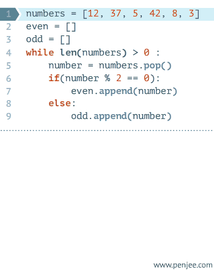

# Python教程


*author =  夜微凉*
*email  =  907148778@qq.com*

[ 基础 ] [ 入门 ] [ Markdown ]


---

>人生苦短，我用Python

---


## 1.下载安装
    
下载地址：[https://www.python.org/](https://www.python.org/)

* mac平台一般自带python，但是可能版本过低，自行查看版本，下载适合自己的版本
* 安装过程省略

安装完成后，查看本机Python版本号，验证是否安装成功：
 * 该教程使用3.5版本，2.\*版本与3.\*版本存在一些语法差异和一些库的兼容问题，请注意
	
		python  --version
		3.5
	
	
## 2.初步使用


###1）交互模式

接下来要做的，国际惯例，先打印出`hello world`

python可以在交互模式下运行，进入方式很简单，直接在命令行下输入：`python`

	
	python
	>>>

如果可以看到命令行是`>>>`状态，则表示已经进入交互环境

接下来，准备输入`print('hello world')`

	>>>print('hello world')
	hello world


如果出现以上信息，说明第一步已经成功。

现在退出交互模式:`exit()`
	
	>>>exit()


### 2）文件模式

Python文件的后缀是`.py`

新建一个文件，`hello.py`，输入内容：
``` python
print('hello world')
```
保存，然后在命令行下输入：`python hello.py`

会得到：`hello world`

获取输入：`input()`
`input()`函数用来获取输入内容，例如：

```python
>>>name = input()
Teemo
>>>name
'Teemo'
```
在刚刚文件中添加代码：

``` python
name = input()
print(name)
```

然后运行`python hello.py`，与交互模式结果一致

## 3.基础

### 1）基础了解

Python语法采用缩进方式，与其他语言不同，使用`#`作为单行注释，`'''`或者`"""`作为多行注释，并注意后面的`:`使用规则

```python
'''
这里是多行注释
'''
# p这里是单行注释
a = 10
if a > 0:
	print(a)
else:
	print(-a)
```


### 2）变量类型

Python变量不需要声明变量类型，直接赋值即可，以下是Python的基本变量类型

- Numbers（数字）
	- `age = 10`
- String（字符串）
	- `string = "python"`
- List（列表）
	- `list = [ 'python', 786 , 2.23, 'john', 70.2 ]`
- Tuple（元组）
	- `tuple = ( 'python', 786 , 2.23, 'john', 70.2 )`
- Dictionary（字典）
	- `dict = {'name': 'john','age':18, 'desc': 'guest'}`	

---

####  - Numbers
python 有整型、长整型、浮点型、复数不同的数值类型

`int:1`	`float:2.3`	`long:123L` `complex:45.j`

常用函数：	

| 函数       |     意义		| 
| :-------- | -------------:| 
| `int(2.4)`|   转成整数 	|
| `str(2)`  |   转成字符串	| 
|`abs(-1)`	|	返回绝对值	|
|`...`		| ...			|


-----

#### - String

字符串内容一般用`'`或者`"`来创建

取字符串的某一位：
```python
>>>string = 'hello world'
>>>print(string[0])     
'h'
```
取某一部分（切片）
```python
>>>string = 'hello world'
>>>print(string[0:3])     
'hell'
```
判断字符串是否包含某字符：

```python
>>>string = 'hello world'
>>>'h' in string     
True
```

字符串拼接：
```python
>>>string1 = 'hello'
>>>string2 = ' world'     
>>>string1 + string2
'hello world'
```

---

#### - List

列表类似于其他语言的数组，由索引和值构成，索引从`0`开始

```python
list1 = ['physics', 'chemistry', 1997, 2000];
```

 * 列表和字符串一样，可以进行截取，合并等操作，也可以获取单个值 
 * python根据索引获取值时还可以倒序获取


```python
list = ['physics', 'chemistry', 1997, 2000];

print(list[0])
print(list[1:3])
print(list[-1])
```

以上内容输出：
`physics`
`[chemistry, 1997, 2000]`
`2000`


 * 可以更新删除或者添加

```python
list = ['physics', 'chemistry', 1997, 2000];

list[0] = 'math'
del list[1]
list.append('test')
print(list)
```
以上内容输出

`['math', 1997, 2000, 'test']`

---

#### - Tuple

元组和列表很相似，但是元组的元素确定后，就不能再修改，元组用`()`包围
	* 如果元组只有一个元素时，需要在最后多写一个`,`不然会当成字符串或者整数
	* 操作与列表基本一致

```python
tup1 = ('physics', 'chemistry', 1997, 2000);

tup2 = (10,)
```


#### - Dictionary

字典使用键-值`（key-value）`存储，速度很快
 * 字典对同一个key重复赋值的话，只会保存最后一次的修改


```python
>>> d = {'Michael': 95, 'Bob': 75, 'Tracy': 85}
>>> d['Michael']
95
```


##4条件语句和循环


### 1）if 
基本形式：


```python
if 判断条件：
    执行语句……
else：
    执行语句……
```

```python
num = 10
if num >= 10:
	print(num)
else:
	print(-num)
```

### 2） for


python 属于高级语言，`for`循环的效果是遍历，举个例子

```python
names = ['Michael', 'Bob', 'Tracy']
for name in names:
    print(name)
```

以上输出：`Michael` `Bob` `Tracy`

`name`变量会遍历出`names`中的每一个值

更抽象的用法举例：

```python
str = 'abc'
for a in str:
	print(a)
```

以上输出：`a` `b` `c`

还可以多个变量进行迭代：

```python
>>> for x, y in [(1, 1), (2, 4), (3, 9)]:
...     print(x, y)
...
1 1
2 4
3 9
```

循环打印`1 ~ 10`
`range()`函数是用来进行迭代的，区间左开右闭，当只有一个参数时，默认从0开始迭代

```python
for i in range(1, 11):
	print(i)
```

###3） while

```python
while 判断条件：
    执行语句……
```





### 4） break  \ continue  \ pass

`break` 会跳出当前循环，`continue` 会跳过循环剩余部分，进行下一次循环，`pass`起占位作用，不做任何事情
```python
str = 'hello world'
for i in str:
	if i == 'w':
		break
	if i == 'o':
		continue
	print(i)
	pass
```

以上输出：`hell`


## 5.函数

###1）基本函数

函数是组织好的，可重复使用的，用来实现单一，或相关联功能的代码段，之前提到的`int()`  `abs()`  `append()`等是内建函数，当然，也可以自定义函数

基本函数：

```python
def  add(x, y):
	'''
	计算两个数相加之和
	'''
	return x + y
```
调用方式：`add(x = 1, y = 2)`
  - *其中`x` `y`参数可以省略*
  - *可以不按照传值顺序，例如：`add(y = 1, x = 2)`*

---

包含默认变量：

```python
def  add(x, y = 1):
	'''
	计算两个数相加之和
	'''
	return x + y
```
`y`值可以不传入，默认为1

---
可变参数：

参数的个数不固定，例如，我们要计算所有参数的和：

```python
def	Sum(*args):
	s = 0 
	for i in args:
		s = s + i
	return s
```
有两种方式去调用：
```python
>>>Sum([1, 2, 3])
6

#或者

>>>L = [1, 2, 3]
>>>Sum(*L)
6
```

---

关键字参数:
和可变参数类似，你可以传入不确定的字典类型的参数
* name和age是必选参数

```python
def person(name, age, **kwargs):
    print("name:", name, "age:", age, "other:", kwargs)
```

调用方式：

```python

>>>person('test', 10, city='beijing')
name: test age: 10 other: {'city': 'beijing'}

#或者

>>> extra = {'city': 'Beijing', 'job': 'Engineer'}
>>> person('Jack', 24, **extra)
name: Jack age: 24 other: {'city': 'Beijing', 'job': 'Engineer'}
```

利用可变参数和关键字参数，可以接收任意的参数


---

###2）高级函数

变量可以指向函数

```python
>>> f = abs
>>> f(-10)
10
```


函数名也可以作为一个变量来用，举个例子：

```python
def add(x, y, f):
    return f(x) + f(y)
```

当调用方式为：`print(add(1, -2, abs))`，可以得到`3`


---

##6.模块

###1）内建模块
python 有很多内建模块可供使用，例如`sys` `os`

获取当前文件路径：
```python
import os

print(os.getcwd())
```


###2）第三方模块
也可以自行下载第三方模块使用，常用模块例如：

网络请求库：[`requests`](https://github.com/kennethreitz/requests)
中文分词：[`jieba`](https://github.com/fxsjy/jieba)
微框架：[`flask`](https://github.com/pallets/flask)
全栈框架[`django`](https://github.com/django/django)
爬虫框架[`scrapy`](https://github.com/scrapy/scrapy)
web框架[`tornado`](https://github.com/tornadoweb/tornado)

下载方式：`pip install requests`


---


##7.面向对象

###1）类基本使用
Python通过`class`关键字来定义类

```python
class Student(object):
	pass
```

`object`表示要继承的类，默认为object

可以给类实例化后自由绑定属性，不管类里面有没有这个属性
实例化一个类并设定属性：

```python
S = Student()
S.name = 'Jack'
print(S.name)
```

以上输出：`Jack`

可以实例化时设定一些必传的属性，即创建构造函数

```python
class Student(object):

	class_name = 'student'

    def __init__(self, name, age):
        self.name = name
        self.age = age

    def get_msg(self):
        print("name:", self.name, "age:", self.age)
        
S = Student('Jack', 20)
S.get_msg()
```

`self`属性为默认，类似其他语言的`this`，实例化时不需要传递该属性的值；`get_msg` 为类中的方法:`class_name` 为类中的属性

以上输出：`name: Jack age: 20`

---

###2）访问限制

设置私有属性或方法：

在属性或者类之前加`_`或者`__`

```python

class Student(object):

    def __init__(self, name, age):
        self.__name = name
        self.__age = age

    def __get_msg(self):
        print("name:", self.__name, "age:", self.__age)
S = Student('test', 10)
```

此时，不能用`S.name` 或者`S.__name`去访问，会提示错误

###3）继承

我们可以写一个基类：

```python
class Animal(object):
    def run(self):
        print('Animal is running...')
```

然后再写其他的类去继承：

```python

class Dog(Animal):
    pass

class Cat(Animal):
    pass
```
`Dog`和`Cat`都继承于`Animal`，所以，它们都可以使用`run`方法

```python
dog = Dog()
dog.run()

cat = Cat()
cat.run()
```

也可以复写父类方法并增加自己的方法：

```python
class Dog(Animal):

    def run(self):
        print('Dog is running...')

    def eat(self):
        print('Eating meat...')
```


###4）类方法

Python有实例化方法，静态类方法，类方法集中不同


```python
class Test(object):
    """区分实例化方法、类方法、静态方法
    method只能在实例化后调用，staticmethod、classmethod可以直接调用
    method和classmethod可以获取类中的属性，staticmethod不可以
    @classmethod和@staticmethod为修饰符
    """
    name = 'Jack'

    def method(self):
        print(self.name)

    @classmethod
    def classmethod(cls):
        print(cls.name)

    @staticmethod
    def staticmethod():
        print('staticmethod')


C = Test()

C.method()
C.classmethod()
C.staticmethod()
Test.classmethod()
Test.staticmethod()
```


以上输出：

`Jack`		`Jack`		`staticmethod`		`Jack`   `staticmethod`

---

参考：

 - [廖雪峰Python](http://www.liaoxuefeng.com/wiki/0014316089557264a6b348958f449949df42a6d3a2e542c000)
 - [菜鸟教程Python](http://www.runoob.com/python/python-tutorial.html)


