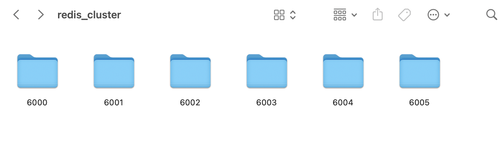
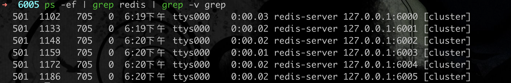
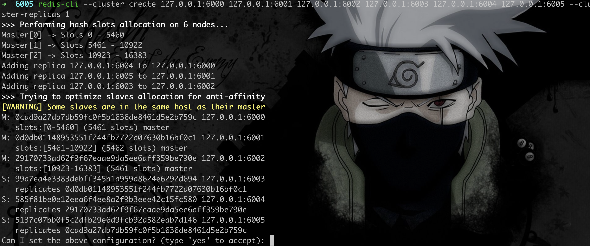
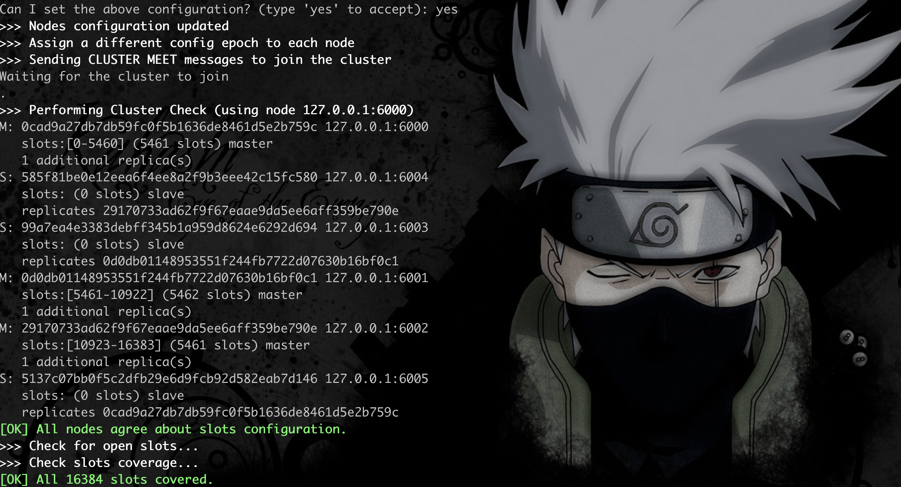

# redis 集群配置

---

    MacOS       version: 13.6
    Redis       version: 7.0.2

--- 

### 0.前言

以前低版本的 `Redis` ，创建集群时，是需要 `ruby` 脚本去配置的，相对来说，较为繁琐，在 `Redis 5.0` 版本以上，支持通过 `redis-cli` 创建集群。

需要提前检查，某个端口是否被占用，否则服务启动，创建集群都会失败。

### 1. 文件准备

1. 新建一个文件夹 `redis_cluster`。然后再创建 6 个子文件夹。分别存放每个节点的配置，节点信息从 `6000 ~ 6005`.
2. 新建配置文件 `redis-6000.conf `，分别放到每个子文件夹中

`redis-6000.conf` 的核心配置如下：

        port 6000
        cluster-enabled yes
        cluster-config-file nodes-6000.conf
        cluster-node-timeout 5000
        protected-mode no
        daemonize yes
        logfile ./redis-6000.log      

参数说明：
1. `port`: 指定 Redis 实例监听的端口.
2. ` cluster-enabled yes`：启用集群模式。
3. `cluster-config-file`：指定集群节点配置文件的名称
4. `cluster-node-timeout`：指定节点超时时间，单位为毫秒。
5. `protected-mode no`: 关闭保护模式
6. `daemonize yes`: 后台运行（可选）
7. `logfile` : 日志文件

每个 `redis-600*.conf` ，需要更改对应的文件名， `port` ， `cluster-config-file`， `logfile`。

文件结构如下：

### 2. 服务启动 + 集群配置

分别启动每个单机服务：

        # 示例：单机启动 6 个端口
        redis-server /path/to/6000/redis-6000.conf
        redis-server /path/to/6001/redis-6001.conf
        ...（依此类推至6005）

每个服务启动后，查看是否正常启动：

执行命令：

        redis-cli --cluster create 127.0.0.1:6000 127.0.0.1:6001 127.0.0.1:6002 127.0.0.1:6003 127.0.0.1:6004 127.0.0.1:6005 --cluster-replicas 1

- --cluster create：指定创建集群的操作。
- 127.0.0.1:6000 127.0.0.1:6001 ...：指定参与集群的 Redis 实例地址和端口。
- --cluster-replicas 1：指定每个主节点的从节点数量为 1。

执行上述命令后，`redis-cli` 会输出集群节点的分配信息，询问你是否确认创建集群，输入 yes 并回车即可完成集群创建

当看到 `[OK] All 16384 slots covered` 的信息时，说明成功。

**注意：** 如果执行完 `redis-cli --cluster create` 命令后，一直 hang 住，说明之前的配置有问题，导致集群创建失败。

### 3. 验证

使用以下命令连接到集群中的任意一个节点，并验证集群是否正常工作：

        redis-cli -c -h 127.0.0.1 -p 6000

`-c` 代表集群模式，需要正常传入。

        ➜  ~ redis-cli -c -p 6000
        127.0.0.1:6000> set name test
        -> Redirected to slot [5798] located at 127.0.0.1:6001
        OK
        127.0.0.1:6001> get name
        "test"
        127.0.0.1:6001>

可以看到，写入和读取都是正常的。

---

以上。