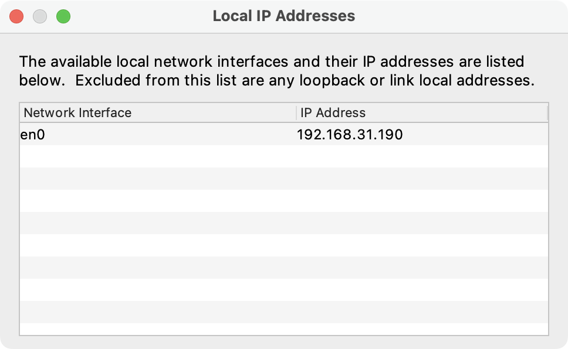

# charles 常规使用

    环境信息：
    Mac 环境    version: 13.6   intel 芯片
    java       version: java 17.0.7

---

主要演示通过 `charles` 抓包 `app` 的过程，以及 `charles` 的常用功能。

---

## 0. 下载安装

下载地址：

    https://www.charlesproxy.com/download/

截止当前，最新版本为 `v4.6.7`。

下载后，直接本地安装。然后打开。

演示版本为 `v4.6.1`，功能与UI基本无差异。

## 1. 验证安装是否成功

首次打开时，可以选择 `Proxy` --> `MacOS Proxy`。该选项表示抓取电脑上的数据流量。如果只想抓取 app 上的数据，可以取消勾选。

首次配置时，会有如下的提示，直接选择 `Grant Privileges` 。配置权限。选择后，一般需要输入本机密码。然后配置成功。

这时候，打开浏览器，输入任意网址，就可以在 `charles` 上看到请求信息。

普通 `http` 请求，可以直接抓取，如果是 `https` 请求，需要安装对应证书才可以解析请求，否则只能看到请求，但是无法解析。

1. 开启 `MacOS Proxy` 后，如果网页是 `https` ，可能会导致无法正常请求网页。
2. 如果不需要对 `Mac` 本机抓包，只是对手机 `APP` 抓包，可以关闭。

## 2. 配置 Mac 与手机端证书

以手机端抓包为例，演示 `https` 请求解析过程。

测试机以 `小米14` 为例，不同安卓机型，安装证书方式大同小异。

### 2.1 连接手机

需要先保证，手机和电脑，使用的是同一个 `wifi`, 并且在同一个网段中。

查看电脑 `IP` 的方式：

打开 `charles` 的 `Help` --> `Local Ip Address`，可以展示电脑 `IP` ：

然后打开手机 `设置` --> `WALN`，点击设置当前网络，

1. 设置代理为 `手动`
2. 填写主机名为电脑的 `IP`
3. 端口号默认 `8888`

设置完后，进行保存。保存完成后，在 `charles` 会有一个弹窗提示，如下图所示：

点击 `「Allow」` 同意。

这时候，手机的请求，就会被 `charles` 代理，请求信息，会在 `charles` 上看到。但如果是 `https` 加密请求，则无法正常解析。
需要安装证书，才可以解析 `https` 请求。

### 2.2 安装证书

在安装证书之前，需要保证 `charles` 的 `SSL Proxying` 是开启状态:

配置位置 ：  `Proxy` --> `SSL Proxy Settings...`

`enable SSL Proxying` 需要勾选，同时在 `include` 需要添加代理的地址和端口，这里支持通配符，也可以单独添加。

**需要先在电脑上安装证书：**

点击 `charles` 的 `Help` --> `SSL Proxy` --> `Install Charles Root Certificate`

安装位置是 `系统钥匙串` --> `系统`。

安装完成后，搜到该证书，目前是未信任状态，需要双击打开详情，设置成 「始终信任」。关闭窗口后，需要输入密码进行确认更改。

---

**然后在手机端安装证书，先下载证书：**

在手机连接上电脑的代理后，使用浏览器访问：

    http://chls.pro/ssl

如果访问该地址一直失败，而且配置又没有问题的情况下，可以尝试请求另外一个备用地址：

    http://charlesproxy.com/getssl
    

正常情况下，会有一个文件可以下载，默认后缀是 `pem`，然后下载到手机本地。

**需要注意的是：**

1. 在某些安卓机型上，例如 `小米` ，需要更改文件后缀为 `crt`。然后再下载
2. 如果是苹果手机，下载安装证书后，还需要找到安装的证书，进行信任操作。

下载完成后，在设置中，找到 `CA证书`，然后选择下载的文件，进行安装，具体步骤，如图所示：

以上操作完成后，可以对 `https` 进行抓包请求。

---

**但是需要注意的是！！！**

**但是需要注意的是！！！**

**但是需要注意的是！！！**

_即使安装完成证书后，抓取一些手机上的正式包 APP ,也可能导致解析失败。这是因为，开发者会做一些安全措施，比如「证书固定」。
只信任自己的证书，不信任用户自行安装的证书。_

所以，一般抓包，都是用来验证公司测试环境的 app 包。除非开发者没有做限制。

**Mac 端与手机端证书安装完成后，建议重启一次 `charles` 。**

## 3. https 抓包演示

我以手机上的某个 `APP` 为例，调用接口后，可以在 `charles` 上看到请求信息和响应。
如果接口请求过多，可以在 `1` 位置进行过滤。然后点击 `2` 处的接口，会在右侧展示接口详情。

这里是以豆瓣的一个 `https` 接口为例，展示了豆瓣的热门电影数据，并返回。

然后在 `app` 端，可以看到接口数据被正常展示。

---

## 4. charles 功能讲解。

介绍一些常用的功能。

主界面顶部，有一些快捷按钮：

1. 扫帚图标（Clear Session）
   - 作用：清空当前所有抓包记录
2. 红色/灰色圆圈（Record/Stop）
   - 作用：启动或停止抓包。红色表示正在录制，灰色表示暂停
3. 锁图标（SSL Proxying）
   - 作用：启用或禁用 HTTPS 解密功能
4. 乌龟图标（Throttling）
   - 作用：开启限速功能，模拟弱网环境
5. 六边形图标（Breakpoints）
   - 作用：启用断点调试功能，红色表示已激活
6. 钢笔图标（Edit/Compose）
   - 作用：编辑或创建新请求，修改参数后重新发送
7. 旋转箭头（Repeat）
   - 作用：重复发送选中的请求，支持设置重复次数和并发数
8. 齿轮图标（Proxy Settings）
   - 作用：配置代理端口（默认 8888）、监听 IP 等参数

---

#### 4.1  Copy cURL Request

有这样一个场景：你发现了某个接口有 `bug` ，告知开发后，开发想自己复现，这时候可以把接口以及信息发给他。

选中某个接口之后，然后右键，选择 `Copy cURL Request`，会自动复制该请求的所有信息，然后直接发送给开发。就是一个 `cURL` 请求。
复制的信息，可以直接请求，或者放到 `postman` 之类的工具上，进行接口请求复现。

#### 4.2  断点调试 Breakpoints

如果我们在发送某个请求时，想修改请求的 `Request` 或者 `Response`。可以使用该功能。

操作步骤：

还是以刚才的豆瓣接口为例

1. 先查看顶部的六边形图标（Breakpoints），保持开启状态。该状态是开启全局的断点调试开关。
2. 在 `charles` 上，选中该接口，然后右键选择 `Breakpoints`。表示对该接口进行断点调试。
3. 在 `Proxy` --> `Breakpoint Settings...` 可以看到被添加的接口。
   1. 双击该接口，去除参数信息，只对 `Path` 部分进行匹配，防止每次调用请求，参数会变化。
4. 从 `App` 端重新请求该接口，这时，就会进入调试状态。
   1. `App` 端自动等待接口返回
   2. `charles` 端进入调试状态
5. 从 `charles` 端选择 `Edit Request`，可以对请求参数进行修改，例如，修改请求数量为  `count = 2` 
   1. 直接双击，可以对参数，也可以对参数值进行修改
   2. 可以增加或者减少参数
6. 修改完成后，点击 `Execute`,
7. 执行完成后，对请求参数已做修改

执行完成后，可以看到数据已经返回，然后可以对响应进行修改
1. 从 `charles` 端选择 `Edit Response`，可以对请求响应进行修改。
2. 例如修改第一条电影的名称为：`测试`。
3. 修改完成后，点击 `Execute`。
4. 执行完成后，对请求响应已做修改，从接口返回和 App 上，都能看到数据被修改。

**注意：断点调试，是每次请求都需要重新调试和修改参数，如果想固定参数，重复使用，可以使用 `Map remote` 或者 `Map local`。**

#### 4.3  Map remote

假如有这样一个场景，如果我们有一个内测包，可以用来抓包，发现线上地址 `A` 有一个服务端 `bug`, 开发已经改完，
并且已部署到测试地址 `B`。 我们想从 App 测验证一下 `B`地址上的数据和展示效果。就可以使用 `Map remote` 的重定向功能。

_这里只是举个例子，一般情况下，内测包自己也会提供切换域名的功能，不一定用 charles 实现。_

配置方式：

1. 选择 `Tools` -->  `Map remote...` ，然后勾选 `Enable Map remote`。
2. 选择 `Add` 按钮，添加规则。
3. 按照提示，填写原始地址以及需要重定向的地址信息。支持通配符匹配(* / ?)。
4. 配置完成后，再次请求原始地址，会发现，可以正常重定向。

#### 4.3  Map Local

如果我们想让某个接口的返回，暂时固定下来，比如一些配置接口，想按照我们想要的结构返回，如果是断点方式，每次请求都需要修改，很繁琐。

就可以采用 `Map Local` 的方式。让接口返回指定为本地的某个 `json` 文件。

还是以刚才的豆瓣接口为例：

1. 我们第一次请求，有返回之后，可以把响应复制下来，存储到本地的 `json` 文件当中，然后按照自己的诉求，对 `json` 进行修改。
2. 选择 `Tools` -->  `Map Local...` ，然后勾选 `Enable Map Local`。
3. 选择 `Add` 按钮，添加规则。
4. 按照提示，填写原始的请求信息，支持通配符匹配(*)。
5. 然后选择本地的 `json` 文件地址(前提是接口返回 `json` 格式)。 
6. 配置完成后，再次请求原始地址，会发现，接口按照本地文件的 `json` 格式返回。

#### 4.4  Rewrite

有这样一个场景，公司线上环境，有正式数据和测试数据，在数据库中有打标字段，默认情况下，真实用户只会看到正式数据。
如果我们作为技术人员，想看到自己的测试数据，每次请求可以通过加一些标签的方式，比如增加 `header : is_test=1` ，加完之后，服务端获取到标签，接口返回数据时，
就会带上测试数据一起返回。 这样，可以通过标签的方式，做好测试隔离。

`Rewrite`  就可以提供一个这样的功能，当我们请求特定的域名或者接口时，我们就可以：

1. 对请求或者响应进行修改。
2. 可以追加/修改/移除头信息。
3. 可以追加/修改/移除参数。

虽然这里面部分功能， `Map remote` 也可以实现，但是这个场景下，`Rewrite` 更加强大和灵活。

操作方式：
1. 选择 `Tools` -->  `Rewrite...` ，然后勾选 `Enable Rewrite`。
2. 先点击左侧的 `「add」`，设置一个名称，例如 `test`，这里表示新增一个配置，可以添加多个配置，也可以一个或者多个配置同时生效。
3. 再点击右上方的 `「add」`, 表示配置一个地址，这里也是支持通配符的。
4. 最后点击右下方的 `「add」`，表示设置重写的规则，例如，可以新增一个 `Header`。
   1. 类型选择 `Add Header`。
   2. 在  `New` 一类，`Name` 填写 `is_test`, `value` 填写 `1`。
   3. 然后选择 `Replace All`
5. 确认保存配置

配置完成后，大概如下图所示，记得勾选相关配置，才能生效：

验证：

最后，`App` 端重新请求该域名，会发现，自动带上 `Header` 参数。

---

以上。