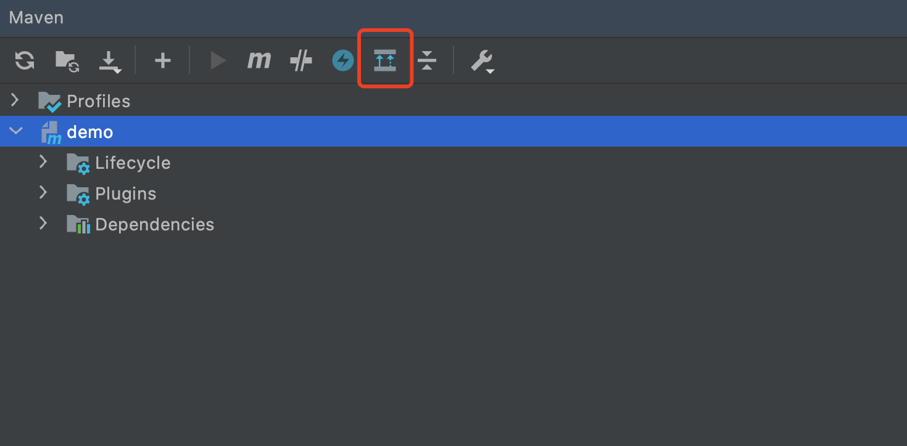
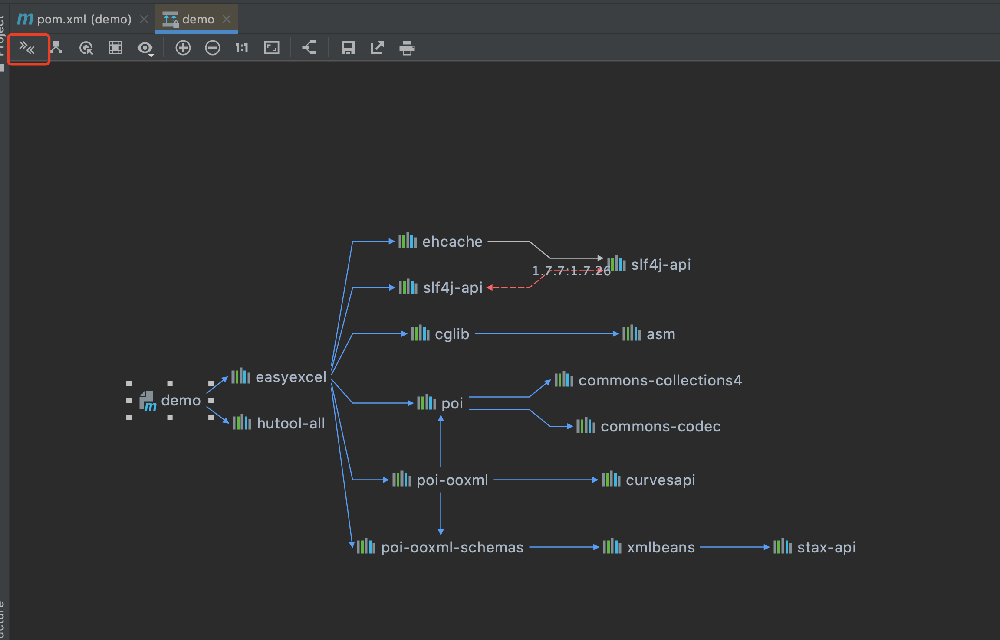
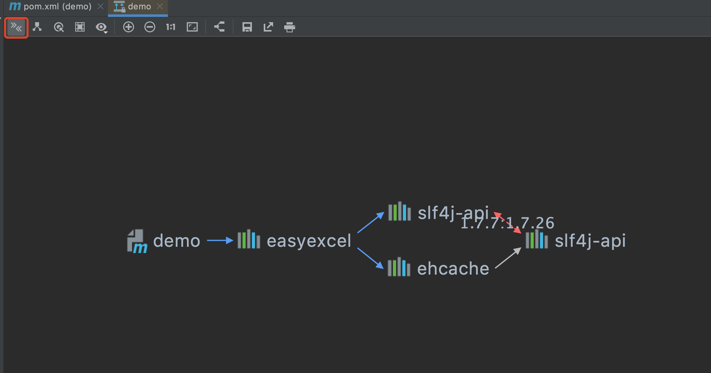
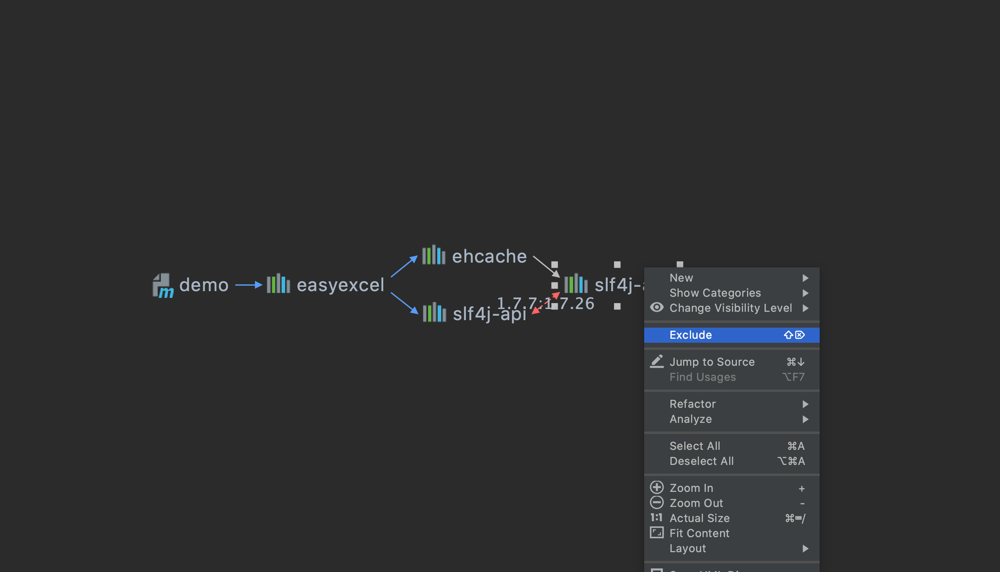
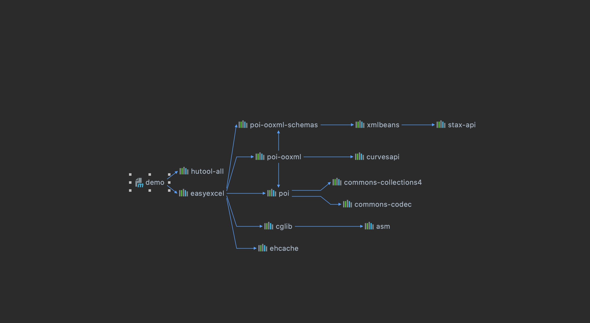
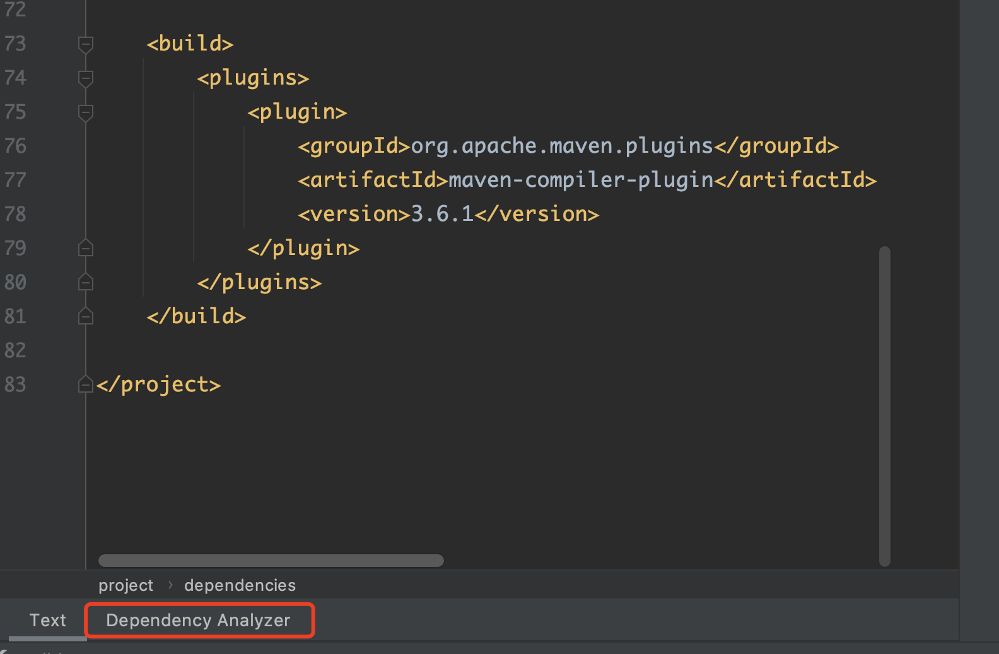
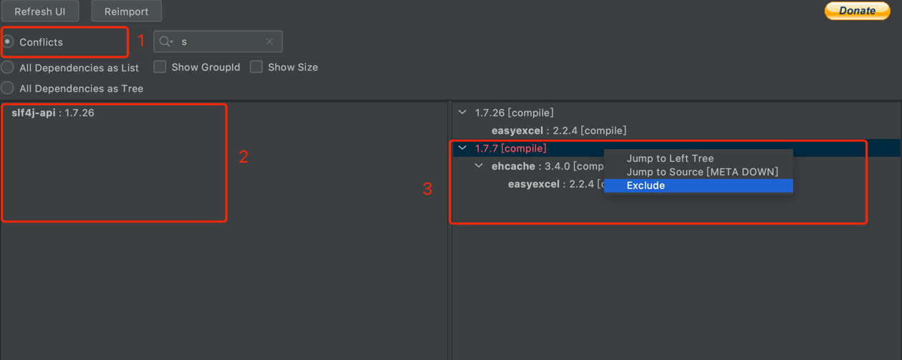

## 如何通过 maven helper 插件解决依赖冲突

    jar 冲突不一定会造成运行失败。

    如果有冲突，建议使用直接依赖。而且最好间接依赖都排除


### 1. maven 依赖原则

- 版本锁定原则：当前项目下，`dependencyManagement` 标签内的依赖优先级最高。
- 最短路径优先：一个项目 `Demo` 依赖了两个 `jar` 包，其中 `A-B-C-X(1.0)` ， `A-D-X(2.0)`。由于 `X(2.0)` 路径最短，所以项目使用的是 `X(2.0)`
- pom文件中申明顺序优先：如果 `A-B-X(1.0)` ，`A-C-X(2.0)` 这样的路径长度一样怎么办呢？这样的情况下，`maven` 会根据 `pom` 文件声明的顺序加载，如果先声明了B，后声明了C，那就最后的依赖就会是 `X(1.0)`
- 覆盖优先：子 `pom` 内声明的优先于父 `pom` 中的依赖。


### 2. idea 自带 maven 插件

新建一个 `pom` 项目 :`demo` ，导入以下两个 `jar`：

```pom.xml
        <dependency>
            <groupId>com.alibaba</groupId>
            <artifactId>easyexcel</artifactId>
            <version>2.2.4</version>
        </dependency>
        
        <dependency>
            <groupId>cn.hutool</groupId>
            <artifactId>hutool-all</artifactId>
            <version>5.6.5</version>
        </dependency>
```

在 `idea` 右侧边栏打开 `maven`，点击选中当前项目 `demo` ，第一个按钮可以重新导入 `maven` 依赖。每次修改 `pom.xml` 文件后，都需要重新导入刷新。

然后点击红框选中的按钮，可以看到依赖关系。

- `A --> B` 表示  A 依赖 B，即 A 项目中导入了 B。 
- 红色虚线表示存在冲突







点击红色按钮，可以只查看存在冲突的内容:




然后单击选中要删除的 `jar` 包，再右键选择 `exclude`




然后刷新 `pom` 文件，查看 `pom.xml`, 可以看到已排除冲突，依赖关系图中也不再展示冲突。

```pom.xml
        <dependency>
            <groupId>com.alibaba</groupId>
            <artifactId>easyexcel</artifactId>
            <version>2.2.4</version>
            <exclusions>
                <exclusion>
                    <artifactId>slf4j-api</artifactId>
                    <groupId>org.slf4j</groupId>
                </exclusion>
            </exclusions>
        </dependency>
        
        <dependency>
            <groupId>cn.hutool</groupId>
            <artifactId>hutool-all</artifactId>
            <version>5.6.5</version>
        </dependency>
```



### 3. maven helper

如果依赖过多时，关系图看着会非常乱。可以用 `maven helper`。

需要先安装 `Maven helper` 插件，然后打开 `pom.xml` 文件，选择左下角的 `Dependency Analyzer`。这样会以树状结构展示。





- 在位置 `1` 选择第一个，可以只查看有冲突的依赖。并且可以根据关键字搜索具体的包名。
- 冲突的包数据会实时展示到 `2` 的位置。
- 在 `3` 位置，可以选中，然后右键排除不想要的包。
- 每次排除后，需要 `Refresh UI` 。否则数据不会刷新。




---
 
以上。