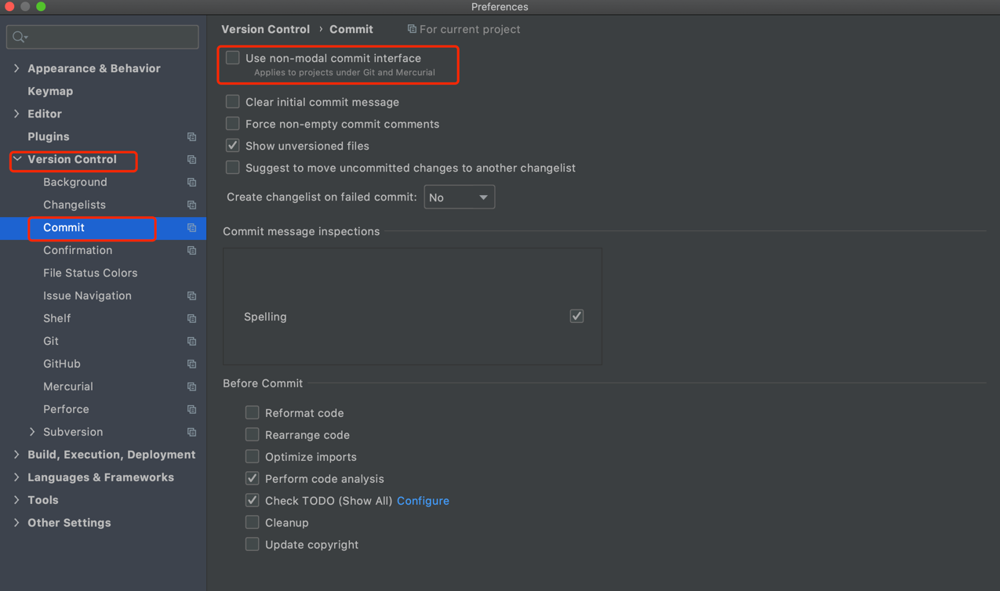
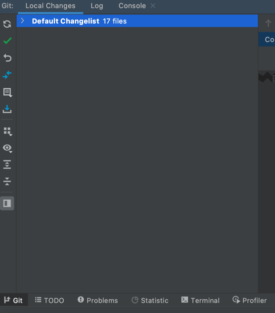

## idea 使用小技巧

    记录使用过程中好用的功能点，持续更新。。。

### 1. 查看 git 本地文件修改

如果本地文件修改，会有颜色提示，但是如果项目比较大。路径较多，查看比较困难。通过 idea 只有在提交代码的时候才能看到哪些文件被修改。很不方便。

通过命令行 `git status` 也可以，但是查看修改内容又不太方便。

可以通过配置 `idea` 来快速查看修改文件：

    测试版本：idea v2020.3
    旧版本本身就有该功能，v2020.1 以后，需要手动配置

打开 `Preferences`  -->  `Version control` -->  `commit`。取消 `Use non-modal commit interface` 的勾选：

然后保存，回到 `idea` 主页，在左下角点击 `Git` , 可以看到 `Local Changes` ，展开即可看到本地修改内容。
