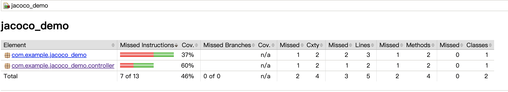
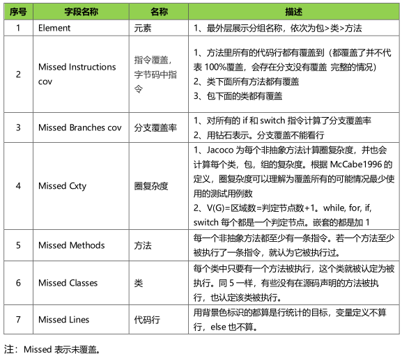
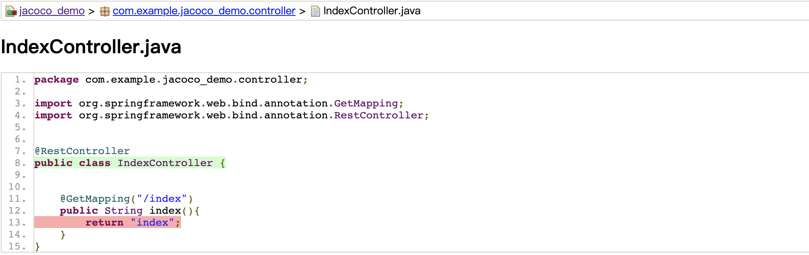

## jacoco coverage


    jacoco 查看代码覆盖率：

    1.查看单元测试覆盖率
    2.查看接口流量覆盖率

    环境信息：
    Mac 环境
    java version: 1.8.0_271
    springboot version: 2.6.0
    maven version：3.3.9


### 1.查看单元测试覆盖率

### 1.1) 新建项目


新建 `springboot` 项目，然后修改 `pom.xml`。主要增加一个 `jacoco` 依赖，并增加 `jacoco` 的扩展，用来生成测试报告：


```xml

<dependencies>
    <dependency>
        <groupId>org.springframework.boot</groupId>
        <artifactId>spring-boot-starter-web</artifactId>
    </dependency>

    <dependency>
        <groupId>org.springframework.boot</groupId>
        <artifactId>spring-boot-starter-test</artifactId>
        <scope>test</scope>
    </dependency>

    <dependency>
        <groupId>org.jacoco</groupId>
        <artifactId>jacoco-maven-plugin</artifactId>
        <version>0.8.4</version>
    </dependency>

</dependencies>

<build>
<plugins>
    <plugin>
        <groupId>org.springframework.boot</groupId>
        <artifactId>spring-boot-maven-plugin</artifactId>
    </plugin>
    <plugin>
        <groupId>org.jacoco</groupId>
        <artifactId>jacoco-maven-plugin</artifactId>
        <version>0.8.4</version>
        <executions>
            <execution>
                <goals>
                    <goal>prepare-agent</goal>
                </goals>
            </execution>
            <!-- attached to Maven test phase -->
            <execution>
                <id>report</id>
                <phase>test</phase>
                <goals>
                    <goal>report</goal>
                </goals>
            </execution>
        </executions>
    </plugin>
</plugins>
</build>

```

### 1.2) 创建单元测试用例


创建单测用例这里不再细说，根据每个人的场景，给项目增加单测试用例。

可以选择要测试的文件，然后右键 `go to` --> `test` 的方式，快速创建测试用例。这里可以是 `junit` ，也可以是 `testng`。根据个人需求处理。


**注意：**

1. `spring-boot-starter-test` 已经集成 `junit`
2. 如想使用 `testng`，需要导入相关依赖，同时每个测试类需要继承 `AbstractTestNGSpringContextTests`。
3. 如果测试类用到了 `springBoot` 相关的注解。在测试类上方需要使用 `@SpringBootTest` 注解。这样会作为一个 `springboot` 项目启动测试。


```xml
<!-- https://mvnrepository.com/artifact/org.testng/testng -->
<dependency>
    <groupId>org.testng</groupId>
    <artifactId>testng</artifactId>
    <version>6.14.3</version>
    <scope>test</scope>
</dependency>

```

```java
@SpringBootTest
class IndexControllerTest extends AbstractTestNGSpringContextTests{}
```


### 1.3) 生成测试报告

在命令行执行命令： `mvn clean test` ， 可以看到日志：

```log
[INFO] Tests run: 1, Failures: 0, Errors: 0, Skipped: 0, Time elapsed: 0.008 s - in com.example.jacoco_demo.controller.IndexControllerTest
[INFO] 
[INFO] Results:
[INFO] 
[INFO] Tests run: 2, Failures: 0, Errors: 0, Skipped: 0
[INFO] 
[INFO] 
[INFO] --- jacoco-maven-plugin:0.8.4:report (report) @ jacoco_demo ---
[INFO] Loading execution data file /java/jacoco_demo/target/jacoco.exec
[INFO] Analyzed bundle 'jacoco_demo' with 2 classes
[INFO] ------------------------------------------------------------------------
[INFO] BUILD SUCCESS
[INFO] ------------------------------------------------------------------------
[INFO] Total time: 7.206 s
[INFO] Finished at: 2021-11-26T17:27:59+08:00
[INFO] Final Memory: 39M/392M
[INFO] ------------------------------------------------------------------------

```

主要看到

```log
[INFO] Loading execution data file /java/jacoco_demo/target/jacoco.exec
[INFO] Analyzed bundle 'jacoco_demo' with 2 classes
```

这两行，说明生成测试报告。


在当前项目 `target/site/jacoco/` 下会生成响应文件，打开 `target/site/jacoco/index.html` 文件，可以看到测试报告。


### 1.4) 查看覆盖率





每一列，分别代表：

- Element : 元素，指当前的 `包 --> 类 --> 方法`
- Missed instructions cov : 指令覆盖
- Missed Branches cov : 分支覆盖率
- Miss Cxty ：圈复杂度
- Missed Methods ： 方法
- Missed Classes : 类
- Missed Lines : 代码行
  




可以点击进入到代码内查看：




说明一下颜色的意义：

- 绿色–测试或覆盖代码。
- 红色–未测试或覆盖代码。
- 黄色–代码已部分测试或覆盖。


### 2.查看接口流量覆盖率

// TODO