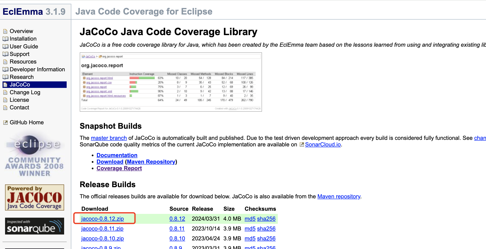
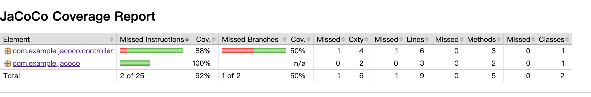

## jacoco coverage api test


    jacoco 查看代码覆盖率：

    查看接口流量测试覆盖率

    环境信息：
    Mac 环境
    java version: java 17.0.7
    springboot version: 3.3.9
    maven version：3.9.9


### 1.查看接口流量测试覆盖率


如果有这一个场景，开发部署服务后，测试开始介入，然后调用接口，进行测试，等功能测试通过后，想查看一下代码覆盖率有多少。可以通过接口流量覆盖的方式。

这种方式，是通过 `jacoco agent` 方式，在 `java` 项目启动时，指定 `jacoco agent` 的 `jar` 包。动态获取覆盖率。


### 2. 新建项目


新建 `springboot` 项目：

```xml
 <dependencies>
        <dependency>
            <groupId>org.springframework.boot</groupId>
            <artifactId>spring-boot-starter-web</artifactId>
        </dependency>

        <dependency>
            <groupId>org.projectlombok</groupId>
            <artifactId>lombok</artifactId>
            <optional>true</optional>
        </dependency>
        <dependency>
            <groupId>org.springframework.boot</groupId>
            <artifactId>spring-boot-starter-test</artifactId>
            <scope>test</scope>
        </dependency>
    </dependencies>

    <build>
        <plugins>
            <plugin>
                <groupId>org.springframework.boot</groupId>
                <artifactId>spring-boot-maven-plugin</artifactId>
            </plugin>
        </plugins>
    </build>
```


然后创建一个 `controller` 类：

```java
@Slf4j
@RestController
public class IndexController {
    
    @GetMapping(value = {"", "/index"})
    public String index(@RequestParam(required = false) String message) {
        log.info("request index");
        if (StringUtils.hasLength(message)){
            return message;
        }
        return "jacoco";
    }
}
```


### 3. 构建项目

执行 `mvn package` 命令，构建项目。

然后为了方便查看覆盖率，可以新建一个文件夹 `jacoco`。然后把项目中的 `src` 、 `target`目录，放到 `jacoco` 下面。
并把构建好的 `jar` 文件，放到 `jacoco` 下面。


### 4. 下载配置 jacoco agent


下载地址：https://www.jacoco.org/jacoco/




这里以 `jacoco-0.8.12.zip` 版本为例，下载后，解压，主要使用其中的 `jacocoagent.jar`、`jacococli.jar` 两个 `jar` 包。

把这两个 `jar` 包，放到 `jacoco` 文件夹下面。


- `jacocoagent.jar`：用于注入 `Java Agent` 的代理文件
- `jacococli.jar` ：用于生成覆盖率报告的 `CLI` 工具


此时， `jacoco` 文件夹下面应该是这样的：


### 5. 启动项目

在 `jacoco` 文件夹路径下执行：


        java -javaagent:jacocoagent.jar=output=tcpserver,port=6300,address=localhost -jar springboot-jacoco-0.0.1-SNAPSHOT.jar


命令说明：
1. -javaagent： 后面跟的是 `jacocoagent.jar` 路径地址，表示要使用 `agent` 。
2. output=tcpserver 表示使用的是 tcp 服务模式，这样可以方便的随时拉取最新报告
3. port=6300,address=localhost  表示的是 tcp 服务器的地址和端口信息，和 `java` 的项目端口不一致
4. -jar 后面，跟的是要启动的服务 `Jar` 包


启动项目后，可以调用一下接口 ： 
    
    http://localhost:8080/index


等接口有返回信息后，表示接口和服务均正常。该接口应该会被测试覆盖。


### 6. 获取报告


在 `jacoco` 目录下，执行命令：

    java -jar jacococli.jar dump --address localhost --port 6300 --destfile ./report/jacoco.exec


命令说明：
1. 使用 `jacococli.jar` `dump` 远程的 `jacoco` 文件，`dump` 到本地 `report` 目录下。
2. `report` 目录，如果不存在，会自动创建，无需人工创建。


命令执行后，可以看到新增的 `report/jacoco.exec`。

### 7. 解析报告


在生成  `jacoco.exec` 文件后，在 `jacoco` 目录下，执行命令：

    java -jar jacococli.jar report ./report/jacoco.exec \
    --classfiles ./target/classes \
    --sourcefiles ./src/main/java \
    --html ./report


命令说明：
1. 使用 `jacococli.jar` 生成 `html` 报告。
2. 需要指定 `jacoco.exec` 的位置。
3. `--classfiles`  需要指定被测项目编译后的 `classes` 路径。
   1.  该参数是必传项，并需要保证正确性。
4. `--sourcefiles` 需要指定被测项目的源码路径。
   1. 需要保证，运行中的 `jar` 包代码与当前指定的源码信息一致，否则会有警告。
   2. 源码路径需要指定，否则报告中，无法提现出哪些代码行被覆盖。


### 8. 查看 html 报告

在 `jacoco/report` 目录下，打开 `index.html` ，可以看到覆盖率信息。





---

以上。
