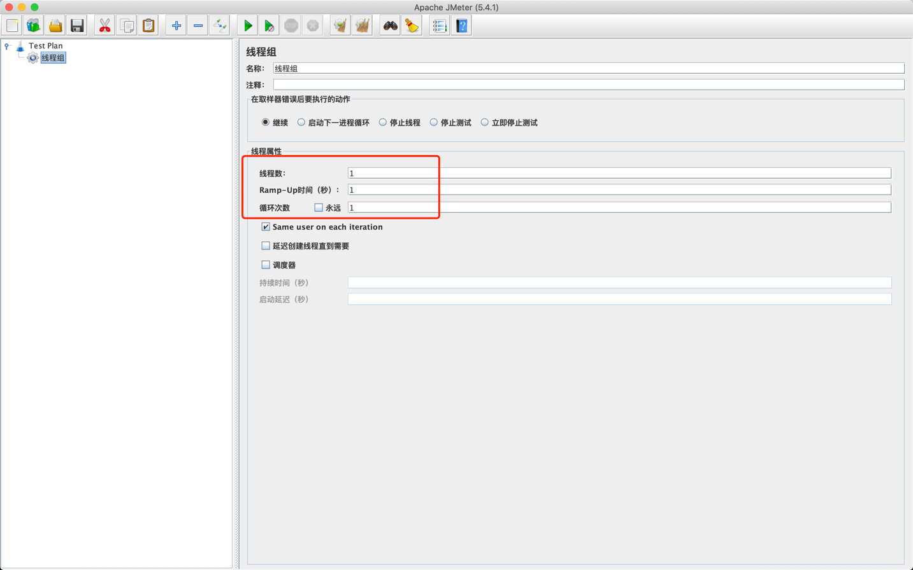
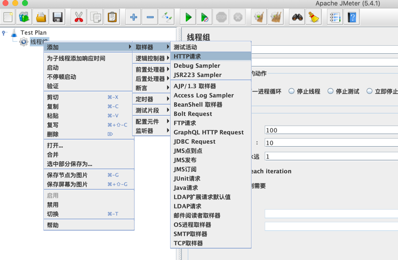

# jmeter 压测 #

---

    环境信息：
    Mac 环境
    java version: 1.8.0_271
    jmeter version: 5.4.1


    
## 1. 安装

### 1.1 官网下载

官方下载地址：https://jmeter.apache.org/download_jmeter.cgi

可以通过官网下载，可以看到有两个版本

- [Binaries](https://dlcdn.apache.org//jmeter/binaries/apache-jmeter-5.4.1.tgz)
- [Source](https://dlcdn.apache.org//jmeter/source/apache-jmeter-5.4.1_src.tgz)

网上的流行说法：

- `Binaries` 是可执行版，下载压缩后，可以直接运行。
- `Source` 是源代码版，需要自己编译。


如果直接解压 `Source` 版本，然后在 `yourpath/bin` 目录下执行 `./jmeter`，会发现提示：`Error: Unable to access jarfile ./ApacheJMeter.jar`。

但是 `Binaries` 版本解压后，可以正常启动。实际是因为`Source` 版本，在 `yourpath/lib `下，没有相关的 `jar` 包。所以报错。

**所以，直接下载 `Source` 版本即可。**

### 1.2 brew 方式下载


因为是 `Mac` 环境，用 `brew` 更方便，直接 `brew install jmeter` 即可。


安装完成后，可以用 `jmeter -version` 查看是否安装完成。


## 2. 启动

### 2.1 命令行启动
`brew` 安装方式，会自动增加到 `path` , 可以直接执行 `jmeter` 来启动。

如果是压缩包下载方式，需要自行增加到 `path` 下。

顺便说一句，`mac` 命令行一定要使用 [oh my zsh](https://ohmyz.sh/) , 绝对提效。


启动图如下：


### 2.2 切换语言
如果想切换语言，可以通过以下方式：

选择 `Options` --> `Choose Language` --> `Chinese (simplified)`, 切换到简体中文。


### 2.3 创建线程组
选中 `Test Plan`, 右键，选择 `添加` --> `线程(用户)` --> `线程组`，先创建一个线程组。


创建完线程组后，可以配置线程组：

- 线程数: 一个用户占一个线程
- Ramp-Up 时间(秒)： 设置线程需要多长时间全部启动。如果线程数为200 ，准备时长为10 ，那么需要1秒钟启动20个线程。也就是每秒钟启动20个线程
- 循环次数：每个线程发送请求的次数。如果线程数为200 ，循环次数为10 ，那么每个线程发送10次请求。总请求数为200*10=2000 。如果勾选了“永远”，那么所有线程会一直发送请求，直到选择停止运行脚本



可以根据各自需要配置。


### 2.4 增加 http 请求

选中 `线程组`，右键，选择 `添加` --> `取样器` --> `HTTP请求`。





比如要请求: http://localhost:8080/user/list 接口，可以按照下图进行配置：


### 2.4 增加监听

如果想知道请求状态和压测效果，需要增加监听:

选中 `HTTP请求`，右键，选择 `添加` --> `监听器`。按照图中样例，分别添加 `查看结果树`、`汇总报告`、`聚合报告`。

- 查看结果树：查看请求和响应相关
- 汇总报告：主要查看请求 qps、请求时间相关
- 聚合报告：主要对压测结果进行汇总


### 2.4 启动压测

点击顶部的绿色三角按钮，开始启动。

如果出现如图所示的弹窗，说明所配置的压测，需要保存为文件，如果想保存，直接 `yes` 即可，然后选择要保存的路径,方便下次直接使用。


### 2.4 查看执行结果

首先选择 `查看结果树`，在 `1` 位置，可以选择不同的文本类型，默认为 `text`。然后根据右侧的 `响应数据`，可以查看请求结果。


在 `1` 下方位置，展示所有请求，如果请求成功是绿色，失败是红色


查看 `汇总报告`，可以看到 http 的最大、最小、平均请求时间，以及 qps。


查看 `聚合报告`。可以看到中位数，90% 、95%、99% 这些项。

    例如有一组排好序的数： 1，2，3，4，5，6，7，8，9

    中位数表示正中间的值，也就是5。
    90% 则表示的是在数组 90% 位置的那个值，以此类推。

    90% 对应的值，表示有 90% 的数小于这个值。并非是 90% 的用户平均响应时间


### 2.5 输出 html 测试报告

执行以下命令：

```shell
jmeter -n -t ~/Desktop/HTTP请求.jmx -l ~/Desktop/HTTP请求.jtl -e -o ~/Desktop/jmeterReport
```

以上命令，表示执行  `HTTP请求.jmx` 文件，然后生成 `HTTP请求.jtl` 压测报告，再根据 `HTTP请求.jtl` 压测报告，生成 `html` 报告。

- `HTTP请求.jmx` 为当前已保存的压测文件。
- `HTTP请求.jtl` 不能已存在，表示 执行完 `HTTP请求.jmx` 后的测试结果，`html` 测试报告需要根据该文件生成。
- `jmeterReport` 需要是空文件。

执行完成后，会在桌面生成 `jmeterReport` 文件夹，打开文件夹里面的 `index.html` 文件，可以看到网页版报告：


## 附录
- [清华大学 brew 源](https://mirrors.tuna.tsinghua.edu.cn/help/homebrew/)
- [Jmeter 90%line 的含义](https://blog.csdn.net/xuanfengofo/article/details/88972416)

---

以上。