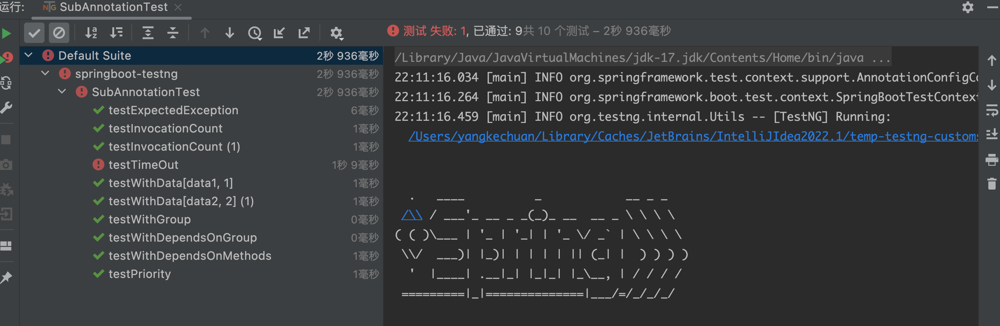
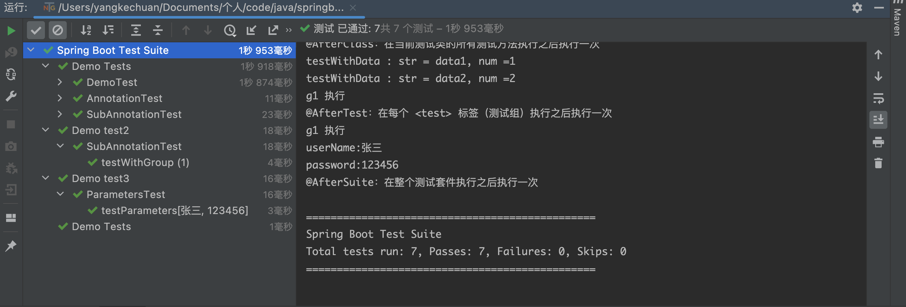

# springboot 使用 testng

---

    springboot version: 3.3.9
    testng     version: 7.8.0


---
   
testng 执行主要有两种方式：
1. 一种是通过给测试类增加注解，比如 `@Test`。然后 `testng` 会自动搜索符合文件命令规则的测试类，然后执行。
2. 一种是通过配置 `xml` 文件，在 `xml` 文件中，配置对应的测试规则，然后执行该文件。会按照规则去执行测试。


## 1.  pom.xml 配置


 pom.xml 核心配置如下：


```xml
<?xml version="1.0" encoding="UTF-8"?>
<project xmlns="http://maven.apache.org/POM/4.0.0" xmlns:xsi="http://www.w3.org/2001/XMLSchema-instance"
         xsi:schemaLocation="http://maven.apache.org/POM/4.0.0 https://maven.apache.org/xsd/maven-4.0.0.xsd">
    <modelVersion>4.0.0</modelVersion>
    <parent>
        <groupId>org.springframework.boot</groupId>
        <artifactId>spring-boot-starter-parent</artifactId>
        <version>3.3.9</version>
        <relativePath/> <!-- lookup parent from repository -->
    </parent>
    <groupId>com.example</groupId>
    <artifactId>springboot-testng</artifactId>
    <version>0.0.1-SNAPSHOT</version>
    <name>springboot-testng</name>
    <description>springboot-testng</description>

    <properties>
        <java.version>17</java.version>
        <!--    这里只是默认值，可以通过命令行传参方式需改    -->
        <xmlFileName>test.xml</xmlFileName>
    </properties>

    <dependencies>
        <dependency>
            <groupId>org.springframework.boot</groupId>
            <artifactId>spring-boot-starter-web</artifactId>
        </dependency>

        <dependency>
            <groupId>org.projectlombok</groupId>
            <artifactId>lombok</artifactId>
            <optional>true</optional>
        </dependency>

        <dependency>
            <groupId>org.springframework.boot</groupId>
            <artifactId>spring-boot-starter-test</artifactId>
            <scope>test</scope>
            <exclusions>
                <!--  排除依赖，否则 testng 配置无效-->
                <exclusion>
                    <artifactId>junit-jupiter</artifactId>
                    <groupId>org.junit.jupiter</groupId>
                </exclusion>
                <exclusion>
                    <artifactId>mockito-junit-jupiter</artifactId>
                    <groupId>org.mockito</groupId>
                </exclusion>
            </exclusions>
        </dependency>

        <!-- testng -->
        <dependency>
            <groupId>org.testng</groupId>
            <artifactId>testng</artifactId>
            <version>7.8.0</version>
            <scope>test</scope>
        </dependency>

    </dependencies>

    <build>
        <plugins>
            <plugin>
                <groupId>org.apache.maven.plugins</groupId>
                <artifactId>maven-surefire-plugin</artifactId>
                <version>3.0.0-M7</version>
                <configuration>
                    <useFile>true</useFile>
                    <suiteXmlFiles>src/test/resources/${xmlFileName}</suiteXmlFiles>
                </configuration>
            </plugin>
            <plugin>
                <groupId>org.springframework.boot</groupId>
                <artifactId>spring-boot-maven-plugin</artifactId>
            </plugin>
        </plugins>
    </build>

</project>

```


配置需要注意以下几点：

1. `springboot` 默认继承的 `junit` 需要完全排除，否则在执行 `mvn test` 时，可能会触发 `junit` 的方式。
2. `<build>` 标签中, `suiteXmlFiles` 可以指定具体的文件和路径。这样在执行 `mvn test` 时，会根据指定的文件触发
    1. 其中，如果有多个文件，可以作为变量的方式传入，这样可以分场景，去执行不同的 `xml` 任务。例如：`mvn test -DxmlFileName=test.xml`


## 2. 注解方式执行自动化

如果没有配置 `xml` 文件，可以通过编写测试类，然后再执行 `mvn test` 方式，会自动扫描所有符合的测试方法，然后执行。

符合条件：
1. **命名规范**：测试类名需匹配 *Test.java（如 DemoTest.java）
2. **位置正确**：测试类应位于 src/test/java 下，包路径与主代码一致

例如,可以新建一个测试类 `DemoTest`。测试类需要注意两点：
1. 如果需要使用到 `springboot` 的功能，比如需要启动 `springboot` ，使用其中的某个 `@service` ,则需要在每个测试类上，添加注解：`@SpringBootTest`
2. 使用 testng 的话，每个测试方法需要继承类：`AbstractTestNGSpringContextTests`。

```java
package com.example.testng;

import org.springframework.boot.test.context.SpringBootTest;
import org.springframework.test.context.testng.AbstractTestNGSpringContextTests;
import org.testng.annotations.Test;

@SpringBootTest
public class DemoTest extends AbstractTestNGSpringContextTests {

    @Test
    public void testMethod() {
        System.out.println("TestNG 测试运行成功！");
    }
}

```

以上测试类，我们在 `IDEA` 开发工具，直接点击三角箭头执行，或者通过命令行执行命令 `mvn test` 执行后，可以看到输出日志：

```log
TestNG 测试运行成功！

===============================================
Default Suite
Total tests run: 1, Passes: 1, Failures: 0, Skips: 0
===============================================


进程已结束,退出代码0
```

以上日志，说明正常执行成功。


### 2.1 常用的注解

可以通过一个样例，了解 testng 中，经常会用到的注解。

新建一个测试类 `AnnotationTest`，使用常用注解：

```java
package com.example.testng;

import org.springframework.boot.test.context.SpringBootTest;
import org.springframework.test.context.testng.AbstractTestNGSpringContextTests;
import org.testng.annotations.*;

@SpringBootTest
public class AnnotationTest extends AbstractTestNGSpringContextTests {


    @Test
    public void testMethod() {
        System.out.println("@Test：用于标记一个方法作为测试方法");
    }

    @BeforeSuite
    public void beforeSuite() {
        System.out.println("@BeforeSuite：在整个测试套件（suite）执行之前执行一次");
    }

    @AfterSuite
    public void afterSuite() {
        System.out.println("@AfterSuite：在整个测试套件执行之后执行一次");
    }

    @BeforeTest
    public void beforeTest() {
        System.out.println("@BeforeTest：在每个 <test> 标签（测试组）执行之前执行一次");
    }

    @AfterTest
    public void afterTest() {
        System.out.println("@AfterTest：在每个 <test> 标签（测试组）执行之后执行一次");
    }

    @BeforeClass
    public void beforeClass() {
        System.out.println("@BeforeClass：在当前测试类的所有测试方法执行之前执行一次");
    }

    @AfterClass
    public void afterClass() {
        System.out.println("@AfterClass：在当前测试类的所有测试方法执行之后执行一次");
    }

    @BeforeMethod
    public void beforeMethod() {
        System.out.println("@BeforeMethod：在每个测试方法执行之前执行一次");
    }

    @AfterMethod
    public void afterMethod() {
        System.out.println("@AfterMethod：在每个测试方法执行之后执行一次");
    }
}


```

然后执行以上文件，通过核心日志查看，执行顺序如下：
```log
@BeforeSuite：在整个测试套件（suite）执行之前执行一次
@BeforeTest：在每个 <test> 标签（测试组）执行之前执行一次
@BeforeClass：在当前测试类的所有测试方法执行之前执行一次
@BeforeMethod：在每个测试方法执行之前执行一次
@Test：用于标记一个方法作为测试方法
@AfterMethod：在每个测试方法执行之后执行一次
@AfterClass：在当前测试类的所有测试方法执行之后执行一次
@AfterTest：在每个 <test> 标签（测试组）执行之后执行一次
@AfterSuite：在整个测试套件执行之后执行一次
```

根据日志先后顺序，可以了解每个注解执行时机。


### 2.2 @Test 常用参数

`@Test` 注解中，有多个参数可以配置，可以新建一个文件，然后演示功能：


```java
package com.example.testng;


import org.springframework.boot.test.context.SpringBootTest;
import org.springframework.test.context.testng.AbstractTestNGSpringContextTests;
import org.testng.annotations.DataProvider;
import org.testng.annotations.Test;

import java.util.concurrent.TimeUnit;

@SpringBootTest
public class SubAnnotationTest extends AbstractTestNGSpringContextTests {

    // 主要演示 @Test 注解中不同参数的使用方式
    @DataProvider(name = "testData")
    public Object[][] provideData() {
        return new Object[][]{
                {"data1", 1},
                {"data2", 2}
        };
    }

    /**
     * 对于 @DataProvider 方法，会根据 testData 中的数据量，分别执行多次测试
     */
    @Test(dataProvider = "testData")
    public void testWithData(String str, Integer num) {
        System.out.println("testWithData : str = " + str + ", num =" + num);
    }


    // 分组的场景，可以设置不同的组，比如不同的业务线，或者不同的 case 等级。
    @Test(groups = "g1")
    public void testWithGroup(){
        System.out.println("g1 执行");
    }

    // 该配置表示，只有依赖的所有组的方法都执行成功后，才会执行下面的方法，否则跳过执行
    @Test(dependsOnGroups = {"g1"})
    public void testWithDependsOnGroup(){
        System.out.println("testWithDependsOnGroup 需要依赖 g1 测试组完全执行");
    }

    // 该配置表示，只有依赖的所有方法都执行成功后，才会执行下面的方法，否则跳过执行
    @Test(dependsOnMethods = {"testWithGroup"})
    public void testWithDependsOnMethods(){
        System.out.println("testWithDependsOnMethods 需要依赖 testWithGroup 方法执行完成");
    }

    // 该配置表示，当前 case 会自动跳过，不会执行
    @Test(enabled = false)
    public void testEnableFalse(){
        System.out.println("testEnableFalse 自动跳过执行");
    }

    // 用于指定测试方法的执行优先级。优先级值越小，测试方法越先执行。
    // 默认情况下，所有测试方法的优先级为 0
    @Test(priority = 100)
    public void testPriority(){
        System.out.println("testPriority");
    }

    // 用于指定测试方法的调用次数。默认值为 1，表示测试方法只执行一次。
    // 使用场景：测试一个并发处理的接口，需要多次调用该接口来模拟高并发场景
    @Test(invocationCount = 2)
    public void testInvocationCount(){
        System.out.println("testInvocationCount");
    }

    // 用于指定测试方法的最大执行时间（以毫秒为单位）。
    // 如果测试方法的执行时间超过了指定的时间，测试将失败
    @Test(timeOut = 1000L)
    public void testTimeOut() throws InterruptedException {
        TimeUnit.SECONDS.sleep(2);
        System.out.println("testTimeOut");
    }

    // 用于指定测试方法预期抛出的异常类型。如果测试方法抛出了指定类型的异常，测试将通过；
    // 若未抛出指定类型的异常或抛出了其他类型的异常，测试将失败
    @Test(expectedExceptions = {RuntimeException.class})
    public void testExpectedException(){
        throw new RuntimeException();
    }
}
```

以上测试类，在创建完成后，可以执行，执行结果如下,可以看到，按照预期正常执行。




## 3. xml 方式执行自动化

如果 `pom` 文件中，配置了 `xml` 的方式。可以通过 `mvn test` 命令，自动触发执行对应文件中的 `xml` 任务。

xml 方式的优点：

1. 测试配置和代码分离，便于对测试计划进行整体的调整和维护。
2. 可以灵活地组织测试套件、测试类和测试方法，支持分组、排序等复杂的测试执行策略。
3. 适合大型项目或需要多人协作的测试场景，不同的测试人员可以分别负责代码编写和测试配置。


可以在 `src/test/java/resources` 下，新建一个 `test.xml` 文件。
这里是可以有多个 `*.xml` 文件的，在执行时，传入具体要执行的文件即可。
比如 测试组 `A`可以新建 `A.xml`, 测试组 `B` 新建 `b.xml`。
这样，每个组去触发自己的自动化逻辑，互不影响。


这里我们新建一个测试类 `ParametersTest.java`，会用来验证 `xml` 传参的场景


```java
package com.example.testng;

import org.springframework.boot.test.context.SpringBootTest;
import org.springframework.test.context.testng.AbstractTestNGSpringContextTests;
import org.testng.annotations.Parameters;
import org.testng.annotations.Test;

@SpringBootTest
public class ParametersTest extends AbstractTestNGSpringContextTests {

   @Test
   @Parameters({"userName", "password"})
   public void testParameters(String userName, String password) {
      System.out.println("userName:" + userName);
      System.out.println("password:" + password);
   }
}

```


`test.xml` 配置信息如下：


```xml
<!DOCTYPE suite SYSTEM "https://testng.org/testng-1.0.dtd">
<suite name="Spring Boot Test Suite">


    <!--该标签代表一个测试，一个测试套件可以包含多个测试。每个测试可以有自己独立的测试类、测试方法和配置-->
    <test name="Demo Tests">
        <!--   在当前测试下，指定有哪些测试类，默认按照添加顺序执行     -->
        <classes>
            <class name="com.example.testng.DemoTest"/>
            <class name="com.example.testng.AnnotationTest"/>
            <class name="com.example.testng.SubAnnotationTest">
                <methods>
                    <!--   如果一个类中有多个方法，可以指定执行某几个方法   -->
                    <include name="testWithData"/>
                    <include name="testWithGroup"/>

                    <!--   同样的，也可以指定排除某几个方法，一般不会和 include 标签共存   -->
                    <exclude name="testTimeOut"/>
                </methods>
            </class>
        </classes>
    </test>

    
    <!--  case 2  -->
    <test name="Demo test2">
        <!--   这个示例里面，可以指定要运行的组和要排除的组     -->
        <groups>
            <run>
                <include name="g1"/>
                <exclude name="g2"/>
            </run>
        </groups>
        <classes>
            <class name="com.example.testng.SubAnnotationTest"/>
        </classes>
    </test>
    
    <!--  case3  -->
    <test name="Demo test3">
        <!--   给 ParametersTest 构造好参数  -->
        <parameter name="userName" value="张三"/>
        <parameter name="password" value="123456"/>
        <classes>
            <class name="com.example.testng.ParametersTest"/>
        </classes>
    </test>


</suite>

```

配置完成后，执行 ： `mvn test`。可以看到执行结果如下。说明按照预期执行。




## 4. 监听器的使用

在 TestNG 中，listeners（监听器）是一种强大的机制，它允许你在测试执行的不同阶段插入自定义逻辑。监听器可以监听测试方法、测试类、测试套件等的生命周期事件，例如测试开始、测试结束、测试通过、测试失败等。

TestNG 提供了多种类型的监听器接口，常见的有：
1. ITestListener：监听测试方法的生命周期事件，如测试开始、结束、通过、失败等。
2. ISuiteListener：监听测试套件的生命周期事件，如套件开始和结束。


### 4.1 实现 ITestListener 监听器

新建一个 `DemoTestListener.java` 文件，实现 `ITestListener` 监听器

```java
package com.example.testng;

import org.testng.ITestContext;
import org.testng.ITestListener;
import org.testng.ITestResult;

public class DemoTestListener implements ITestListener {

    @Override
    public void onTestStart(ITestResult result) {
        System.out.println("Test " + result.getName() + " started.");
    }

    @Override
    public void onTestSuccess(ITestResult result) {
        System.out.println("Test " + result.getName() + " passed.");
    }

    @Override
    public void onTestFailure(ITestResult result) {
        System.out.println("Test " + result.getName() + " failed.");
    }

    @Override
    public void onTestSkipped(ITestResult result) {
        System.out.println("Test " + result.getName() + " skipped.");
    }

    @Override
    public void onTestFailedButWithinSuccessPercentage(ITestResult result) {
        // 处理部分失败但仍在成功百分比内的情况
    }

    @Override
    public void onStart(ITestContext context) {
        System.out.println("Test suite " + context.getName() + " started.");
    }

    @Override
    public void onFinish(ITestContext context) {
        System.out.println("Test suite " + context.getName() + " finished.");
    }

}

```

从方法名称中，可以看到 `ITestListener` 的监听器，可以监听测试方法的生命周期。


### 4.2 实现 ISuiteListener 监听器


新建 `DemoSuiteListener.java` 文件，实现 `ISuiteListener` 监听器。


```java
package com.example.testng;

import org.testng.ISuite;
import org.testng.ISuiteListener;
import org.testng.ISuiteResult;

import java.util.Map;

public class DemoSuiteListener implements ISuiteListener {

    // 测试 suite 开始
    @Override
    public void onStart(ISuite suite) {
        System.out.println(suite.getName() + " suite start");
    }


    // suite 完成后的一些自定义方法，比如可以用来统计所有的成功数量，失败数量，跳过数量等。
    private static int totalPassCount = 0;
    private static int totalSkipCount = 0;
    private static int totalFailCount = 0;

    @Override
    public void onFinish(ISuite suite) {
        Map<String, ISuiteResult> resultMap = suite.getResults();
        for (Map.Entry<String, ISuiteResult> entry : resultMap.entrySet()) {
            String testName = entry.getKey();

            ISuiteResult suiteResult = entry.getValue();
            int passCount = suiteResult.getTestContext().getPassedTests().size();
            int skipCount = suiteResult.getTestContext().getSkippedTests().size();
            int failCount = suiteResult.getTestContext().getFailedTests().size();

            // Map 中的 key , 对应不同的测试组，每一组都有一个单独的测试结果
            System.out.printf("testName ：%s, passCount = %s, skipCount = %s , failCount = %s \n", testName, passCount, skipCount, failCount);

            totalPassCount += passCount;
            totalSkipCount += skipCount;
            totalFailCount += failCount;
        }

        System.out.println("-----------------------");
        System.out.println("本次 suite 测试汇总数据如下：");
        System.out.println("totalPassCount :" + totalPassCount);
        System.out.println("totalSkipCount :" + totalSkipCount);
        System.out.println("totalFailCount :" + totalFailCount);
    }
}

```

`DemoSuiteListener` 可以监听测试套件的生命周期。例如在 `onFinish` 完成后，可以统计测试结果。

### 4.3  监听器在注解方式上使用

以上面的 `DemoTest.java` 为例，可以通过 `@Listeners` 注解方式，使用监听器, 支持配置多个监听器。

```java
package com.example.testng;


import org.springframework.boot.test.context.SpringBootTest;
import org.springframework.test.context.testng.AbstractTestNGSpringContextTests;
import org.testng.annotations.Listeners;
import org.testng.annotations.Test;

@SpringBootTest
@Listeners({DemoTestListener.class, DemoSuiteListener.class})
public class DemoTest extends AbstractTestNGSpringContextTests {

    @Test
    public void testMethod() {
        System.out.println("TestNG 测试运行成功！");
    }
}

```

执行测试方法，查看核心日志如下：

```log
Test testMethod started.
TestNG 测试运行成功！
Test testMethod passed.
Test suite springboot-testng finished.
testName ：springboot-testng, passCount = 1, skipCount = 0 , failCount = 0 
-----------------------
本次 suite 测试汇总数据如下：
totalPassCount :1
totalSkipCount :0
totalFailCount :0
```

### 4.3  监听器在 xml 文件方式上使用


以上面的 `test.xml` 文件为例，在最后追加监听器标签，需要注意的是， `listeners` 只能在 `suite` 子层级：

```xml
<!DOCTYPE suite SYSTEM "https://testng.org/testng-1.0.dtd">
<suite name="Spring Boot Test Suite">


    <!--该标签代表一个测试，一个测试套件可以包含多个测试。每个测试可以有自己独立的测试类、测试方法和配置-->
    <test name="Demo Tests">
        <!--   在当前测试下，指定有哪些测试类，默认按照添加顺序执行     -->
        <classes>
            <class name="com.example.testng.DemoTest"/>
            <class name="com.example.testng.AnnotationTest"/>
            <class name="com.example.testng.SubAnnotationTest">
                <methods>
                    <!--   如果一个类中有多个方法，可以指定执行某几个方法   -->
                    <include name="testWithData"/>
                    <include name="testWithGroup"/>

                    <!--   同样的，也可以指定排除某几个方法，一般不会和 include 标签共存   -->
                    <exclude name="testTimeOut"/>
                </methods>
            </class>
        </classes>
    </test>


    <!--  case 2  -->
    <test name="Demo test2">
        <!--   这个示例里面，可以指定要运行的组和要排除的组     -->
        <groups>
            <run>
                <include name="g1"/>
                <exclude name="g2"/>
            </run>
        </groups>
        <classes>
            <class name="com.example.testng.SubAnnotationTest"/>
        </classes>
    </test>

    <!--  case3  -->
    <test name="Demo test3">
        <!--   给 ParametersTest 构造好参数  -->
        <parameter name="userName" value="张三"/>
        <parameter name="password" value="123456"/>
        <classes>
            <class name="com.example.testng.ParametersTest"/>
        </classes>
    </test>


    <listeners>
        <listener class-name="com.example.testng.DemoSuiteListener"/>
        <listener class-name="com.example.testng.DemoTestListener"/>
    </listeners>

</suite>

```


核心日志如下：

```log
testName ：Demo Tests, passCount = 5, skipCount = 0 , failCount = 0 
testName ：Demo test2, passCount = 1, skipCount = 0 , failCount = 0 
testName ：Demo test3, passCount = 1, skipCount = 0 , failCount = 0 
-----------------------
本次 suite 测试汇总数据如下：
totalPassCount :7
totalSkipCount :0
totalFailCount :0
```

如果有多个测试标签时，会统计多次的测试结果。

---

以上。