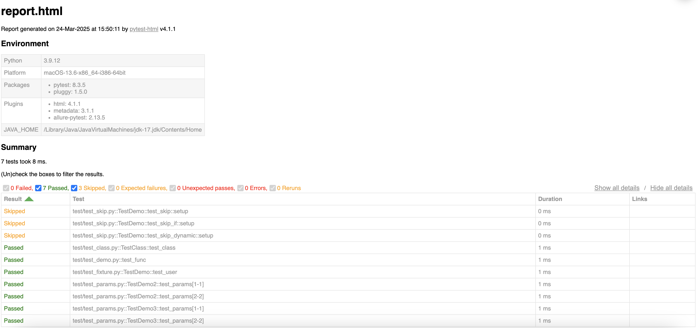

# pytest 常规使用

---

如果使用 `python` 编写自动化脚本，通常可以结合 `pytest` 来使用。

---


    python version: 3.9.12
    pytest version: 8.3.5

    pytest 官方文档：https://docs.pytest.org/en/stable/getting-started.html#our-first-test-run

---


## 1. 安装 pytest

假设已经安装好了 python 环境，直接使用 pip 安装 pytest 即可.

```bash
pip install pytest
```

查看是否安装成功：

     ➜  ~ pytest --version
     pytest 8.3.5


---


## 2. 编写测试用例


**测试用例基本结构：**

1. 文件命名：`test_*.py` 或 `*_test.py`
2. 函数命名：以 `test_` 开头
3. 类命名：以 `Test` 开头，且不包含 __init__ 方法


执行 `pytest` 的几种方式：
1. 执行当前目录下的所有测试用例：`pytest`
2. 执行指定目录下的所有测试用例：`pytest <directory>`
3. 执行指定文件下的所有测试用例：`pytest <file>`
4. 执行指定测试用例：`pytest <file>::<test_name>`
5. 执行指定测试类：`pytest <file>::<TestClass>`
6. 执行指定测试方法：`pytest <file>::<TestClass>::<test_method>`
7. 执行指定测试方法：`pytest <file>::<test_method>`


### 2.1 测试函数

如果测试文件中，只有测试方法， pytest 会自动扫描并执行所有测试方法。


1. 新建一个 `Demo` 项目，并在项目下面，新建 `test` 包，把所有的 `case` 都放在下面.
2. 在 `test` 目录下，新建 `test_demo.py` 文件，编写测试用例.


文件结构：
    
    Demo
    ├── test
        └── test_demo.py


```python
def test_func():
    assert 1 == 1
```

然后，在命令行下执行 `pytest` 命令，即可执行测试用例.

执行后，可以看到日志大概如下：

```log
➜  demo pytest
========================================================= test session starts =========================================================
platform darwin -- Python 3.9.12, pytest-8.3.5, pluggy-1.5.0
plugins: html-4.1.1, metadata-3.1.1, allure-pytest-2.13.5
collected 1 item                                                                                                                      

test/test_demo.py .                                                                                                             [100%]

========================================================== 1 passed in 0.04s ==========================================================
➜  demo 

```


### 2.2 测试类

如果按照规则创建一个测试类， `pytest` 会自动执行类下面的所有测试方法。

1. 在 `test` 目录下，新建 `test_class.py `文件，编写测试类.

文件结构：

    Demo
    ├── test
        └── test_demo.py
        └── test_class.py


```python

class TestClass:
    params = [(1, 1), (2, 2)]

    def test_class(self):
        assert 1 == 1
```
然后，在命令行下执行 `pytest` 命令，即可执行测试用例.


执行后，可以看到日志大概如下：
```log
➜  demo pytest
========================================================= test session starts =========================================================
platform darwin -- Python 3.9.12, pytest-8.3.5, pluggy-1.5.0
plugins: html-4.1.1, metadata-3.1.1, allure-pytest-2.13.5
collected 2 items                                                                                                                     

test/test_class.py .                                                                                                            [ 50%]
test/test_demo.py .                                                                                                             [100%]

========================================================== 2 passed in 0.03s ==========================================================
➜  demo 
```

可以看到，`pytest` 会自动执行所有测试用例。

---

## 3. 进阶用法

除了最基本的使用之外， `pytest` 还支持很多高级用法。


### 3.1 参数化

参数化可以让测试用例更加灵活，方便测试不同的场景。

在 `test_class.py` 下，新增方法，格式如下：


```python
class TestClass:
    params = [(1, 1), (2, 2)]

    @pytest.mark.parametrize("input, expected", params)
    def test_params(self, input, expected):
        """
        验证数据参数化场景
        """
        assert input == expected
```

当前 `params` 有两套参数，分别是 `(1, 1)` 和 `(2, 2)`，`pytest` 会自动执行这两套参数，生成两个测试用例。

**注意：因为当前方法是在测试类下面，所以第一个参数需要显示指定为 `self` ，如果是测试函数，则不用加 `self` 。**


除了作用于方法，还可以作用于类，方便不同方法使用：

```python
import pytest

params = [(1, 1), (2, 2)]


@pytest.mark.parametrize("input, expected", params)
class TestDemo:

    def test_params(self, input, expected):
        """
        验证数据参数化场景
        """
        assert input == expected
```


同时，也可以作为一个全局变量来使用，需要注意的是: 
1. 全局变量，只能命名为 `pytestmark`。
2. 如果使用了全局变量，则不能再通过类或者方法赋值相同的变量，否则会冲突


```python
import pytest

params = [(1, 1), (2, 2)]

# 注意，这里只能命名为 pytestmark ，这样 pytest 才能找到对应的参数
pytestmark = pytest.mark.parametrize("input, expected", params)


class TestDemo:

    def test_params(self, input, expected):
        """
        验证数据参数化场景
        """
        assert input == expected

```


### 3.2 前置、后置操作

类似于 `testng` 中的 `@BeforeMethod` 和 `@AfterMethod` ， `pytest` 也支持前置、后置操作。

1. 一般用来预处理数据，或者清理数据，或者操作数据库等场景。
2. 支持函数、方法、类、模块级别的操作。
3. 支持类方法，也支持函数方法。


**示例：**
```python


class TestClass:

    def setup_module(self):
        """
        模块级别前置操作，每个模块执行一次
        :return:
        """
        pass

    def teardown_module(self):
        """
        模块级别后置操作，每个模块执行一次
        :return:
        """
        pass

    @classmethod
    def setup_class(cls):
        """
        类级别前置操作，每个类执行一次
        :return:
        """
        cls.params = 0

    @classmethod
    def teardown_class(cls):
        """
        类级别后置操作，每个类执行一次
        :return:
        """
        pass

    def setup_method(self):
        """
        方法级别前置操作，每个方法执行一次
        :return:
        """
        pass

    def teardown_method(self):
        """
        方法级别后置操作，每个方法执行一次
        :return:
        """
        pass

    def setup_function(self):
        """
        函数级别前置操作，每个函数执行一次
        :return:
        """
        pass

    def teardown_function(self):
        """
        函数级别后置操作，每个函数执行一次
        :return:
        """
        pass

    def test_class(self):
        assert 1 == 1

```


### 3.3 用例跳过


在一些场景下，用例可能不会被执行，需要跳过，比如：
1. 用例还没有实现
2. 用例执行失败
3. 用例执行时间过长
4. 用例执行环境不支持


pytest 支持跳过用例，有几种方式：
1. 跳过整个类
2. 跳过整个方法
3. 有条件的跳过


**注意：pytestmark 为 pytest 默认全局变量，变量名不可修改。**

示例：

```python
import pytest
import sys

# 无条件跳过(模块级别)
pytestmark = pytest.mark.skip("模块所有用例暂不执行") 
# 或按条件跳过(模块级别)
pytestmark = pytest.mark.skipif(sys.version_info < (3, 8), reason="需 Python 3.8+")

@pytest.mark.skip(reason='跳过整个测试类')
class TestDemo:

    @pytest.mark.skip(reason='跳过该用例')
    def test_skip(self):
        """
        验证跳过用例场景
        :return:
        """
        pass

    version = 3

    @pytest.mark.skipif(version > 1, reason='跳过该用例')
    def test_skip_if(self):
        """
        条件跳过用例场景
        :return:
        """
        pass

    def test_skip_dynamic(self):
        """
        动态跳过用例场景
        :return:
        """
        if self.version > 1:
            pytest.skip('跳过该用例')
)

```


### 3.4 fixture

与 setup 场景类型， 如果我们想在测试用例中，使用一些前置数据，或者操作一些数据，我们可以使用 `fixture` 来实现。


示例：

```python
import pytest


class TestDemo:
    user = {
        "name": "test"
    }

    @pytest.fixture
    def setup(self):
        """
        模拟前置操作
        """
        return self.user

    def test_user(self, setup):
        """
        验证用户场景
        setup 可以作为入参，作用于不同的方法中
        """
        assert setup["name"] == "test"

```


## 4. 美化报告


可以使用 `pytest-html` 插件，完成报告 `HTML` 化。

    
        安装插件：`pip install pytest-html`


1. 执行命令：`pytest --html=reports/report.html`
2. 执行完成后，在当前 `reports` 目录下，会生成一个 `report.html` 文件，浏览器打开即可查看报告.
3. 每次执行会覆盖上一次结果，可以在命令行指定时间，方便区分：


        pytest --html=reports/report_$(date +%Y%m%d).html


示例：


---

以上。