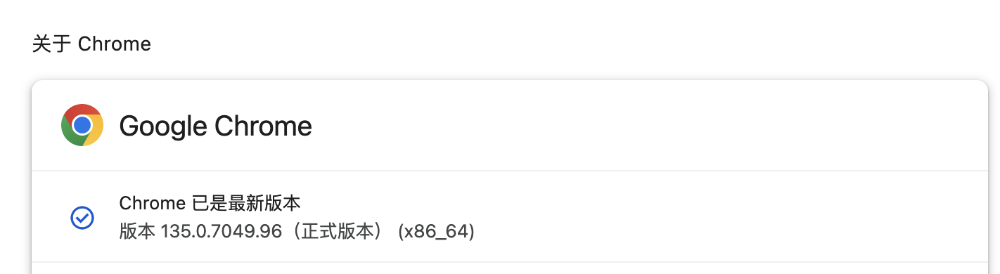
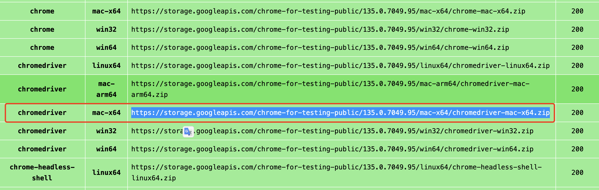

# selenium 常规使用

---
        
        MacOS   version: 13.6
        python  version: 3.9.12
        


---


## 1. 安装 selenium

假设已经安装好 python 环境，直接在命令行下执行：

```bash
pip install selenium
```

如果没有报错信息，说明安装成功。


## 2. 下载驱动

需要先查看，本机的 `chrome` 版本，驱动需要和 `chrome` 版本一致。

        打开 chrome 浏览器，输入 chrome://settings/help ，查看 chrome 版本。





我当前本机是 `v135` 版本，需要下载对应的驱动：

驱动下载地址：

        旧版本(只到 v114 )：https://registry.npmmirror.com/binary.html?path=chromedriver/
        新版本(当前最新 v135)：https://googlechromelabs.github.io/chrome-for-testing/#stable


搜索 `chromeDriver`，然后根据本机的系统，下载对应的驱动，比如我的本机是 `mac Intel` 系统，需要下载该版本：




下载完成后，将驱动解压到一个目录下，比如：`/Users/xxx/Downloads/chromedriver-mac-arm64`


## 3. 编写自动化代码

先写一个最简单的功能，比如：打开百度首页，然后搜索 `selenium` 关键字，然后点击搜索按钮:


```python
from selenium import webdriver
from selenium.webdriver.common.keys import Keys
from selenium.webdriver.common.by import By

if __name__ == '__main__':
    # 初始化一个 Chrome 浏览器驱动实例，指定 ChromeDriver 的路径
    driver = webdriver.Chrome('/Users/xxx/Documents/software/chrome/chromedriver')

    # 打开百度网站
    driver.get('http://www.baidu.com')
    # 通过元素的 ID 定位到百度搜索框
    search_box = driver.find_element(By.ID, 'kw')
    # 在搜索框中输入关键词 "selenium"
    search_box.send_keys('selenium')
    # 模拟按下回车键进行搜索
    search_box.send_keys(Keys.RETURN)

```


## 4. 常用 API


### 4.1 浏览器相关


```python

from selenium import webdriver


if __name__ == '__main__':
    # 初始化一个 Chrome 浏览器驱动实例，指定 ChromeDriver 的路径
    driver = webdriver.Chrome('/Users/xxx/Documents/software/chrome/chromedriver')

    # 打开一个网页
    driver.get("http://baidu.com")

    # 返回上一页
    driver.back()

    # 前进到下一页
    driver.forward()

    # 刷新当前页面
    driver.refresh()

    # 关闭浏览器
    driver.quit()
```

### 4.2 定位元素相关


```python

from selenium import webdriver
from selenium.webdriver.common.by import By

if __name__ == '__main__':
    # 初始化一个 Chrome 浏览器驱动实例，指定 ChromeDriver 的路径
    driver = webdriver.Chrome('/Users/xxx/Documents/software/chrome/chromedriver')

    # 通过 id 定位
    element = driver.find_element(By.ID, 'kw')
    # 通过 name 定位
    element = driver.find_element(By.NAME, 'wd')
    # 通过 class_name 定位
    element = driver.find_element(By.CLASS_NAME, 'class_name')
    # 通过 tag_name 定位
    element = driver.find_element(By.TAG_NAME, 'tag_name')
    # 通过 link_text 定位
    element = driver.find_element(By.LINK_TEXT, '新闻')
    # 通过 partial_link_text 定位
    element = driver.find_element(By.PARTIAL_LINK_TEXT, '新')
    # 通过 xpath 定位
    element = driver.find_element(By.XPATH, '//*[@id="kw"]')
    # 通过 css_selector 定位
    element = driver.find_element(By.CSS_SELECTOR, '#kw')
        
```


### 4.2 元素操作相关

```python
from selenium import webdriver
from selenium.webdriver.common.keys import Keys
from selenium.webdriver.common.by import By

if __name__ == '__main__':
    # 初始化一个 Chrome 浏览器驱动实例，指定 ChromeDriver 的路径
    driver = webdriver.Chrome('/Users/yangkechuan/Documents/software/chrome/chromedriver')

    # 通过 id 定位
    element = driver.find_element(By.ID, 'kw')

    # 输入文本
    element.send_keys('selenium')
    # 模拟按下回车键
    element.send_keys(Keys.RETURN)
    # 清空输入框中的内容
    element.clear()
    # 获取元素的属性值
    class_name = element.get_attribute('class')
    # 获取元素的文本内容
    value = element.text

```


## 4.3 等待操作


```python
from selenium import webdriver
from selenium.webdriver.common.by import By
from selenium.webdriver.support.ui import WebDriverWait
from selenium.webdriver.support import expected_conditions as EC

if __name__ == '__main__':
    # 初始化一个 Chrome 浏览器驱动实例，指定 ChromeDriver 的路径
    driver = webdriver.Chrome('/Users/xxx/Documents/software/chrome/chromedriver')

    # 通过 id 定位
    element = driver.find_element(By.ID, 'kw')
    # 1. 隐式等待, 设定全局等待 10s
    driver.implicitly_wait(10)

    # 2. 显示等待, 设定局部等待 10s
    wait = WebDriverWait(driver, 10)
    # 等待元素可见
    wait.until(EC.visibility_of_element_located((By.ID, 'kw')))

```


---

以上。